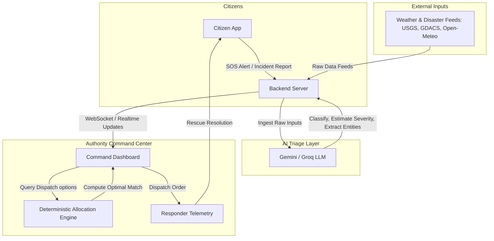

# SALVUS

### AI-Powered Disaster Intelligence & Rescue Coordination Platform

**Salvus is a real-time disaster coordination ecosystem that bridges the critical communication gap between citizens stranded in emergencies and response authorities by combining live geospatial mapping, automated AI triage, and deterministic resource allocation.**

[](https://github.com/pritesh-4/SIH-2026---SALVUS/actions)
[](#license)
[](#tech-stack)

---

## The Problem

When a crisis strikes, response failures are rarely caused by a shortage of physical rescue personnel. Instead, the primary bottleneck is a critical **coordination gap** in the first crucial hours. 

During emergencies, decision-makers struggle with fragmented information, losing precious time attempting to verify:
* **Severity & Priority:** Who requires immediate life-saving assistance versus who requires non-critical aid?
* **Locality & Tracking:** Where exactly are victims located when traditional addresses are obscured or destroyed?
* **Resource Optimization:** Which responder team is closest, has the necessary equipment/capability, and is not already overloaded?
* **Infrastructure Viability:** Which paths are impassable, and which shelters have available capacity?

This lack of structured, prioritized data leads to delayed responses, misallocated assets, and avoidable loss of life.

---

## The Solution

Salvus closes the coordination gap by introducing an end-to-end synchronized disaster management platform consisting of:

1. **Citizen Emergency Portal:** A lightweight, high-performance web interface designed to operate under low-bandwidth conditions, allowing citizens to transmit geo-tagged SOS alerts, report localized hazards, and receive personalized safety routes.
2. **Authority & Responder Dashboard:** A unified, real-time command center mapping all incidents, active responders, and shelters, powered by an automated AI ingestion pipeline and a transparent dispatch engine.

---

## Why Salvus? (Key Differentiators)

Salvus is not a generic disaster visualization dashboard or a wrapper around an LLM chat widget. It is built as a reliable operational tool defined by key engineering differentiators:

* **Automated AI Triage:** Citizen reports are structured instantly by LLMs to determine incident classification, estimate severity, and provide confidence metrics.
* **Deterministic Allocation Engine:** Dispatch decisions are computed using a predictable, weighted algorithm rather than opaque AI models, ensuring all resource allocation is auditable and predictable.
* **Live Operational Mapping:** Utilizes interactive Leaflet maps mapped with OpenStreetMap data to track live incidents, shelter capacities, and active responder locations.
* **Real-Time Synchronized State:** Powered by WebSockets and Supabase Realtime to push updates instantly across all active command dashboards without page refetches.
* **Real Routing & ETA Computations:** Integrates routing engines (OSRM) to calculate true travel times and path viability.
* **Demo-Mode Simulation Layer:** Features a simulated telemetry generator for responder movement and hazard updates, allowing testing of the platform under realistic conditions when real-world APIs are unavailable.

---

## How It Works



---

## Core Features

### 1. Citizen Experience
* **Single-Tap SOS:** Instantly broadcasts user coordinates and emergency status to the authority dashboard.
* **Geo-Tagged Incident Reporting:** Allows reporting of blockages, flooding, and fires with exact GPS locations and media uploads.
* **Active Risk Monitoring:** Displays local weather advisories and global disaster notifications.
* **Interactive Shelter Guide:** Recommends closest evacuation centers based on current distance and shelter vacancy.

### 2. Authority & Responder Dashboard
* **Dynamic Incident Queue:** Filters incoming emergencies by AI-assessed severity (Critical, High, Moderate, Low).
* **Live Responder Tracking:** Visualizes active rescue assets, their current statuses (Idle, En Route, Busy), and paths.
* **Resource Directory:** Monitors real-time occupancy, water reserves, medical supplies, and power grids across active shelters.
* **Human-in-the-Loop Control:** Requires authority approval for all dispatch orders, maintaining manual override capabilities.

### 3. AI Intelligence Layer
* **Entity Extraction:** Parses unstructured conversational text from citizen reports to identify critical keywords (e.g., "trapped under debris", "medical emergency").
* **Multi-Modal Severity Hints:** Analyzes submitted photos to flag severe architectural or flood damage.
* **Situation Synthesis:** Aggregates regional incident logs into concise, bulleted briefs for incoming shift supervisors.

---

## Rescue Allocation Algorithm

To maintain trust and predictability in emergency operations, Salvus deliberately rejects LLM-driven dispatch decisions. Instead, the **Responder Allocation Engine** ranks personnel using a deterministic weighted scoring system:

$$\text{Score} = (w_1 \cdot \text{Severity}) - (w_2 \cdot \text{Distance}) - (w_3 \cdot \text{ETA}) + (w_4 \cdot \text{Capability Match}) - (w_5 \cdot \text{Current Workload})$$

### Rationale for Deterministic Design
1. **Auditability:** Every dispatch recommendation can be traced mathematically. There is no risk of AI hallucinating resource availability.
2. **Predictability:** Given the exact same inputs (proximity, capabilities, workload), the algorithm will always produce the exact same order of recommendations.
3. **Safety Override:** Emergency dispatchers can view the exact weight calculations and choose to manually override the recommendation.

---

## Real-Time Data Matrix

| Data Stream | Type | Source | Purpose |
| :--- | :--- | :--- | :--- |
| **Global Disaster Alerts** | Live | [GDACS API](https://www.gdacs.org/) | Monitors international flood, cyclone, and volcanic activity. |
| **Seismic Activity** | Live | [USGS Earthquake API](https://earthquake.usgs.gov/) | Tracks local and global earthquake magnitude and depth. |
| **Local Weather & Warnings** | Live | [Open-Meteo API](https://open-meteo.com/) | Real-time weather, wind speed, and precipitation levels. |
| **Geocoding & Location** | Live | [Nominatim](https://nominatim.org/) / [OSRM](http://project-osrm.org/) | Computes coordinates to addresses and paths. |
| **Telemetry & Sensor Data** | Simulated | Internal Seed Scripts | Simulates responder GPS movements and flood sensor levels. |

---

## Tech Stack

| Layer | Technology | Role |
| :--- | :--- | :--- |
| **Frontend** | React, Vite, Tailwind CSS | High-performance, responsive UI |
| **State & Fetching** | Zustand, React Query, Axios | Lightweight global state & caching |
| **Mapping** | Leaflet, OpenStreetMap | Interactive, custom raster mapping |
| **Backend (Planned)** | Node.js, Express, Socket.io | Core server and WebSocket management |
| **Database (Planned)** | Supabase, PostgreSQL, PostGIS | Relational database, geospatial queries, and real-time triggers |
| **AI Processing** | Gemini (Primary), Groq (Fallback) | Classification, severity appraisal, summaries |

---

## Project Structure

```
salvus/
├── .github/
│   └── workflows/
│       └── ci.yml               # Automated validation pipeline (lint, build)
├── .husky/                      # Local pre-commit Git hooks
├── docs/
│   └── GITHUB_SETUP.md          # Branch protection & workflow guide
├── src/
│   ├── assets/                  # Public static assets
│   ├── lib/
│   │   └── utils.js             # Tailwind CSS className helper utility
│   ├── App.jsx                  # Base router & layout wrapper
│   ├── index.css                # Tailwind CSS imports & global styles
│   └── main.jsx                 # Application entrypoint & Router config
├── .env.example                 # Template for required environment keys
├── eslint.config.js             # Flat ESLint configuration rules
├── package.json                 # Project manifest & dependency locks
└── vite.config.js               # Vite plugin settings (React, Tailwind)
```

---

## Getting Started

### Prerequisites
* **Node.js:** version `20.x LTS` or higher
* **npm:** version `10.x` or higher

### Current Setup (Vite Application Only)
To run and inspect the current frontend scaffold:

1. Clone the repository:
   ```bash
   git clone https://github.com/pritesh-4/SIH-2026---SALVUS.git
   cd SIH-2026---SALVUS
   ```

2. Install dependencies:
   ```bash
   npm ci
   ```

3. Setup environment variables:
   ```bash
   cp .env.example .env
   ```
   *(Configure mock values inside `.env` to satisfy build utilities).*

4. Run the development server:
   ```bash
   npm run dev
   ```

5. Validate linting rules:
   ```bash
   npm run lint
   ```

6. Build for production:
   ```bash
   npm run build
   ```

### Planned Setup (Full Stack Deployment)
Once backend services are introduced, the initialization workflow will expand to include:
* Migrating databases using PostgreSQL & PostGIS scripts.
* Running Node.js server daemons via `npm run dev:server`.

---

## Environment Variables

The project requires the following environment variables. Set them in a local `.env` file (refer to [`.env.example`](.env.example)):

```ini
# Backend Gateway
VITE_API_BASE_URL=http://localhost:5000/api

# AI Integrations
VITE_GEMINI_API_KEY=your_gemini_key_here
VITE_GROQ_API_KEY=your_groq_key_here

# Map Tile Configuration
VITE_MAPBOX_TOKEN=your_mapbox_token_here

# Supabase Authentication & Realtime
VITE_SUPABASE_URL=your_supabase_url_here
VITE_SUPABASE_ANON_KEY=your_supabase_anon_key_here
```

---

## Development Workflow

We enforce quality gates on all commits and pull requests:
1. **Feature Branch:** Create branches prefixed with `feature/`, `fix/`, or `feat/`.
2. **Local Commit Verification:** Running `git commit` triggers Husky to run `lint-staged`. If there are any ESLint errors in your changes, the commit is blocked until resolved.
3. **CI Validation:** Opening a PR to `main` executes the [GitHub Actions CI Pipeline](#how-it-works).
4. **Approval Requirement:** Merging is blocked until the PR is approved by at least one maintainer and CI passes.

*For detailed instructions on configuring branch protection, see [`docs/GITHUB_SETUP.md`](docs/GITHUB_SETUP.md).*

---

## Testing Strategy

* **Local Verification:** Lint rules and build stability are verified on every commit and PR.
* **Component Testing (Planned):** Vitest and React Testing Library will be set up as development progress commences to test route handling and alert components.
* **Integration Testing (Planned):** Verification of WebSocket payloads and Supabase connection statuses.

---

## Planned Deployment

* **Frontend Hosting:** Vercel / Netlify (Continuous deployment connected to the `main` branch).
* **Backend Hosting:** Railway / Render (Dockerized Node.js service).
* **Database Hosting:** Supabase cloud database instance.

---

## 10-Day Development Strategy

* **Days 1–3: Core Views & Authentication** (Map integration, GPS tracking, and Supabase security policy setup).
* **Days 4–6: Live Ingestion & AI Pipeline** (Connecting GDACS/USGS API feeds and Gemini triage logic).
* **Days 7–8: Dispatch Algorithm & WebSockets** (Wiring the allocation algorithm and Socket.io tracking).
* **Days 9–10: System Integration, Load Simulation & Polishing** (Edge-case telemetry, UI optimization, and presentation preparation).

---

## 3-Minute Hackathon Demo Script

Our planned presentation follows this scenario path:
1. **Command Dashboard Load:** Show the Leaflet map populated with active shelters, resources, and idle responder icons.
2. **Citizen Distress Trigger:** A citizen opens the web portal on their phone, triggers an SOS, and submits a photo/message ("House flooded, need transport").
3. **AI Triage Ingestion:** The dashboard immediately receives the request. The AI classifies it as *Flood Rescue*, estimates *High Severity*, and shows extracted location entities.
4. **Resource Scoring:** The system calculates scores for all responders. The top-rated responder (closest, has watercraft, idle) is displayed.
5. **Dispatch & Tracking:** The dispatcher clicks "Approve". The responder icon starts moving along the computed OSRM route toward the citizen, displaying an updated ETA.
6. **Shelter Allocation:** The citizen is automatically assigned to the nearest high-capacity shelter with available beds.
7. **Resolution:** The responder completes the rescue, updates status, and the incident clears.

---

## Safety, Reliability & Limitations

### Core Limitations
* **No Direct Dispatch Integration:** This software is a prototype/proof-of-concept. It does not interface with official government PSAPs or 911 systems.
* **Connectivity Assumptions:** The system relies on WebSocket connection integrity. If cell towers are destroyed, SMS fallback options are required (marked as future work).
* **No Autonomous Actions:** Salvus will never dispatch rescue assets autonomously. It acts as an advisor, keeping human authority supervisors in the dispatch loop.

### Resilience Practices
* **AI Fallback:** If the primary Gemini API fails or encounters rate limits, requests fallback immediately to Groq API. If both fail, the platform falls back to a regex-based keyword parser.
* **Visual Safety Indicators:** All simulated telemetries and test events are highlighted with a prominent `[SIMULATION]` tag to ensure they are never confused with real disaster occurrences.

---

## Team

* **Pritesh** — Lead Platform Architect & DevOps Engineer
* *Additional Hackathon Team Contributors*

---

## License

This project is licensed under the terms of the **MIT License** (Pending team review).
