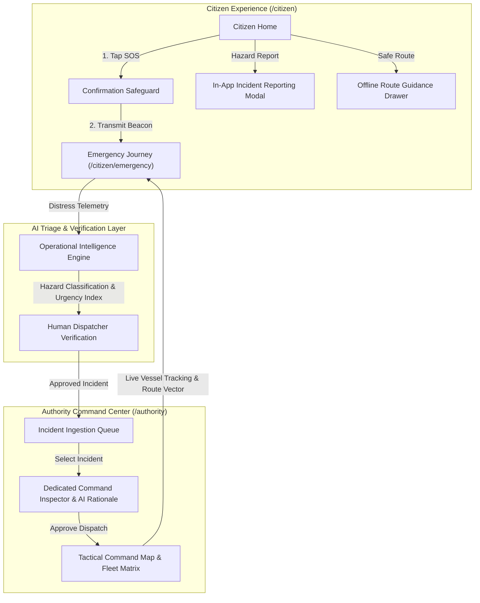

# SALVUS

### AI-Powered Disaster Intelligence & Rescue Coordination Platform

**Salvus is a real-time disaster coordination ecosystem that bridges the critical communication gap between citizens stranded in emergencies and response authorities by combining live geospatial intelligence, automated AI triage, deterministic resource allocation, and a state-focused progressive emergency experience.**

[](https://github.com/pritesh-4/SIH-2026---SALVUS/actions)
[](LICENSE)
[](#tech-stack)
[](#tech-stack)

---

## The Problem

When a crisis strikes, response failures are rarely caused by a shortage of physical rescue personnel. Instead, the primary bottleneck is a critical **coordination gap** in the first crucial hours.

During emergencies, decision-makers struggle with fragmented information, losing precious time attempting to verify:

- **Severity & Priority:** Who requires immediate life-saving assistance versus who requires non-critical aid?
- **Locality & Tracking:** Where exactly are victims located when traditional addresses are obscured or destroyed?
- **Resource Optimization:** Which responder team is closest, has the necessary equipment/capability (e.g. water rescue inflatable vs. high-clearance 4x4), and is available?
- **Infrastructure Viability:** Which paths are impassable, and which shelters have available bed and ration capacity?

This lack of structured, prioritized data leads to delayed responses, misallocated assets, and avoidable loss of life.

---

## The Solution

Salvus closes the coordination gap with a unified, dual-portal disaster intelligence platform:

1. **Citizen Safety Console (`/citizen`):** A lightweight, low-bandwidth personal safety console enabling citizens to transmit geo-tagged SOS beacons, report localized hazards in-app, inspect safe shelter flood-bypass routes, and follow a **Progressive Disclosure Emergency Journey** from SOS to safe resolution.
2. **Authority Command Center (`/authority`):** A high-density, calm operational cockpit for emergency dispatchers to monitor active crisis metrics, inspect real-time AI triage classifications, dispatch specialized rescue units with 1 click, and oversee fleet and shelter logistics.

---

## Key Differentiators

Salvus is built as an operational life-safety tool defined by key engineering differentiators:

- **Restrained Command Center Design & Strict Color Budget:** The Authority Command Center operates on an 85–90% neutral slate budget (`#080C12` base) where semantic colors communicate meaning only (Red = Critical/SOS, Amber = Triage/Warning, Blue = Selection/Active, Green = Resolved/Safe capacity). Eliminates dashboard fatigue and prioritizes calm intelligence during chaos.
- **State-Focused Progressive Disclosure:** Emergency UX is structured to eliminate cognitive overload during panic. Rather than rendering cluttered dashboards, the interface elevates only the single most important focal point per state (AI Triage in `TRIAGING`, Live Tracking Radar in `EN_ROUTE`, Proximity Action Signaling in `NEARBY`, Arrival Handoff in `ON_SCENE`, Safe Debrief in `RESOLVED`).
- **Automated AI Intelligence Triage:** Citizen reports and distress beacons are parsed instantly to classify hazard type, compute life-safety urgency indexes, and recommend optimal craft types with explicit AI confidence scores.
- **Human-in-the-Loop Safety Control:** While AI structures and ranks distress beacons, all life-safety dispatch orders require human dispatcher verification, ensuring zero autonomous dispatch risks.
- **Deterministic Allocation Engine:** Dispatch recommendations follow an auditable, weighted scoring formula based on proximity, capability match (e.g., Zodiac boat vs. ambulance), and workload.
- **In-App Hazard Reporting & Offline Safe Routing:** Citizens can submit geo-tagged hazard tickets directly in-app and view offline elevation-safe bypass routes to shelters.
- **Demo-Mode Simulation Layer & Network Resilience:** Integrated simulation controls support 1-click state transitions, auto-progression, speed multipliers, and network connectivity state simulation (`Grid Connected`, `Limited SMS`, `Offline Cache`).

---

## System Architecture & Data Flow



---

## Core Experiences & Features

### 1. Citizen Safety Console (`/citizen`)

- **Calm Safety Status:** Instant 2-second comprehension of personal safety level and local advisory status.
- **In-App Hazard Reporting:** 3-step reporting workflow with category tagging (Floods, Downed Lines, Debris, Trapped Persons), severity ranking, GPS tag, and photo upload simulation.
- **Interactive Situational Map (`/citizen/map`):** Radar canvas with flood inundation overlays, medical posts, and step-by-step **Offline Safe Route Guidance** to shelters.
- **Hazard Advisories (`/citizen/alerts`):** Categorized advisory feed (Critical, Warning, Watch) with actionable safety protocols and safe haven recommendations.
- **Emergency Readiness Profile (`/citizen/profile`):** Verified citizen identity, blood group, medical/allergy profile, speed-dial emergency contacts, siren tone testing, and offline emergency pass storage.

### 2. Complete Citizen Emergency Journey (`/citizen/emergency`)

- **`SOS_ACTIVE`:** Beacon transmitting live GPS telemetry (Ticket `#SV-2048`), high-ground protocol active.
- **`TRIAGING`:** Operational AI classification breakdown (`Flash Flood & Surge Inundation`, `Critical Tier 4`, `94% confidence`, `Zodiac Craft Required`).
- **`VERIFIED`:** Human-in-the-loop validation by Central Command Dispatcher (Kolkata Central Hub).
- **`ASSIGNED`:** NDRF Unit 4 (Capt. A. Roy) allocated with Zodiac Rescue Boat Mk-II and VHF Ch. 4 radio link.
- **`EN_ROUTE`:** Tactical Rescue Radar live tracking with animated vessel navigation, route corridor, distance (850m), and dynamic ETA countdown (4m).
- **`NEARBY` (<100m):** Urgent amber proximity beacon with visual/acoustic signaling instructions (torch pulse, bright cloth, boat horn detection).
- **`ON_SCENE`:** Arrival confirmation, life jacket fitting protocol, and crew boarding handoff.
- **`RESOLVED`:** Peaceful evacuation completion summary with total response time (8 min 42 sec) and shelter reception registry.
- **`CANCELLED`:** Stand-down safeguard confirmation for false alarms with instant re-trigger capability.

### 3. Authority Command Center (`/authority`)

- **Precise Operational Metrics Strip:** Active Incidents, Critical Threats (zero-state safe), Fleet Deployed ratio, Available Bed capacity, and Resolved Cases.
- **Priority Incident Queue:** Structured scan-friendly queue with severity tags, category labeling, location, time-elapsed, and category filter pills.
- **Tactical Geospatial Surface:** Full-screen Leaflet OpenStreetMap dark-theme tactical surface with semantic markers, layer toggles, and automatic viewport resizing.
- **Dedicated Command Inspector & Resource Tabs:**
  - **Inspector:** Detailed incident summary, coordinates, affected person count, reporter info, embedded AI situation intelligence, and primary lifecycle dispatch actions.
  - **Fleet Matrix:** Real-time craft status (`ASSIGNED`, `ON_SCENE`, `AVAILABLE`), team leads, and VHF radio frequencies.
  - **Shelter Logistics:** Evacuation facilities, available beds, single-tone clean capacity bars, and reserve rations.

---

## Tech Stack

| Layer             | Technology                              | Purpose                                                   |
| :---------------- | :-------------------------------------- | :-------------------------------------------------------- |
| **Frontend**      | React 19, Vite, Tailwind CSS v4         | Modern component architecture, instant HMR, dark theme    |
| **Backend**       | FastAPI, Python 3.11+, aiosqlite        | High-performance async REST API and SQLite WAL engine     |
| **Realtime**      | Socket.IO (Python & JS client)          | Bi-directional WebSocket events with room synchronization |
| **Mapping & GIS** | Leaflet, OpenStreetMap                  | Dark-themed geospatial tactical radar & live marker pins  |
| **Routing**       | React Router v7                         | SPA dual-portal routing (`/citizen` and `/authority`)     |
| **Code Quality**  | ESLint 10, Prettier, Husky, Lint-Staged | Automated code style and quality enforcement              |
| **CI/CD**         | GitHub Actions                          | Automated build, lint, and formatting validation pipeline |

---

## Project Directory Layout

```
salvus/
├── .github/workflows/ci.yml       # GitHub Actions CI validation workflow
├── backend/                       # Python FastAPI Backend
│   ├── app/
│   │   ├── db/                    # SQLite WAL database & migrations
│   │   ├── models/                # Pydantic v2 schemas
│   │   ├── realtime/              # Socket.IO event handlers & rooms
│   │   ├── routes/                # REST API routers (incidents, responders, shelters)
│   │   ├── services/              # Business logic & state machine
│   │   └── main.py                # ASGI application entrypoint
│   ├── .env.example               # Backend environment variables template
│   ├── .gitignore                 # Backend gitignore
│   └── requirements.txt           # Python dependencies
├── docs/                          # Architectural blueprints & guides
│   ├── AI_ARCHITECTURE.md         # Operational AI triage & verification model
│   ├── ARCHITECTURE.md            # System architecture and Mermaid diagrams
│   ├── DECISIONS.md               # Architecture Decision Records (ADRs)
│   ├── DEMO.md                    # Step-by-step hackathon pitch & judging script
│   ├── PRODUCT.md                 # Product strategy, personas, and workflows
│   ├── ROADMAP.md                 # Project milestones & feature tiers
│   └── TESTING.md                 # Verification processes and quality benchmarks
├── src/
│   ├── components/
│   │   ├── citizen/               # Citizen UI components & emergency suite
│   │   └── common/                # Shared Leaflet map, provenance badges & dev controls
│   ├── data/                      # Structured mock datasets & incident fixtures
│   ├── features/                  # Authority & citizen domain hooks
│   ├── layouts/                   # AuthorityLayout and CitizenLayout shells
│   ├── lib/                       # Realtime socket, geolocation & notifications
│   ├── pages/                     # SPA route views (Citizen & Authority)
│   └── services/                  # Frontend REST API client
├── package.json
└── vite.config.js
```

---

## Getting Started

### Prerequisites

- **Node.js:** `20.x LTS` or higher
- **npm:** `10.x` or higher
- **Python:** `3.11` or higher (for backend)

### 1. Frontend Setup

```bash
# 1. Install dependencies
npm ci

# 2. Setup environment configuration
cp .env.example .env

# 3. Start the Vite development server
npm run dev

# 4. Run quality checks
npm run lint
npm run format:check
npm run build
```

### 2. Backend Setup

```bash
# 1. Navigate to backend directory
cd backend

# 2. Create and activate virtual environment
python -m venv venv
# On Windows:
venv\Scripts\activate
# On Linux/macOS:
source venv/bin/activate

# 3. Install backend dependencies
pip install -r requirements.txt

# 4. Copy environment template
cp .env.example .env

# 5. Start the FastAPI + Socket.IO server
uvicorn app.main:combined_asgi_app --reload --host 0.0.0.0 --port 8000
```

---

## 3-Minute Hackathon Demo Script

| Timestamp       | Stage                                 | Action & Visuals                                                                                                                             | Narrated Script                                                                                                                                                                                                                                              |
| :-------------- | :------------------------------------ | :------------------------------------------------------------------------------------------------------------------------------------------- | :----------------------------------------------------------------------------------------------------------------------------------------------------------------------------------------------------------------------------------------------------------- |
| **0:00 - 0:45** | **Authority Command Center**          | Open `/authority`. Show quiet operational metrics, live tactical map, and priority flood incidents.                                          | _"Welcome to Salvus. In a disaster, response coordinators open the Authority Command Center to see real-time tactical intelligence, flood hydro-contours, and live incident queues sorted by AI urgency score."_                                             |
| **0:45 - 1:15** | **Citizen Safety Console**            | Click `[ 👤 Citizen Portal ]` in header. Show personal safety console, report a hazard via in-app modal, and open shelter safe route on map. | _"On the citizen side, users see a calm safety console. A citizen can log localized hazards or inspect offline safe-routing directions to nearby shelters that bypass flooded underpasses."_                                                                 |
| **1:15 - 2:00** | **SOS Beacon & AI Triage**            | Click "SEND SOS" on Citizen Home. Hold to confirm. Observe instant transition to Emergency Mode with Ticket `#SV-2048`.                      | _"When trapped by rising water, the citizen triggers SOS. Live GPS telemetry is established immediately. Our AI intelligence engine categorizes the threat as Tier 4 Flash Flood and recommends a Zodiac boat deployment."_                                  |
| **2:00 - 2:40** | **Dispatch & Live Tracking**          | Transition through `ASSIGNED` to `EN_ROUTE`. Observe Tactical Rescue Radar with moving vessel marker and dynamic ETA countdown (4m).         | _"A human coordinator verifies the dispatch, assigning NDRF Unit 4. As the boat navigates the flood corridor, the citizen sees live vessel telemetry, route vectors, and ETA countdowns on their rescue radar."_                                             |
| **2:40 - 3:00** | **Proximity Alert & Safe Resolution** | Transition through `NEARBY` (<100m torch pulse cue) to `ON_SCENE` and `RESOLVED` (total time 8m 42s).                                        | _"As responders arrive within 100 meters, Salvus provides torch and audio signaling guidance. Following safe evacuation to the stadium shelter, the incident resolves with full response audit metrics. Salvus bridges the coordination gap to save lives."_ |

---

## Team

- **Pritesh** — Lead Software & Systems Architect, Chief Full-Stack Engineer, DevOps & CI/CD Lead, AI Systems & Geospatial Integration Engineer
- _Additional Hackathon Team Contributors_

---

## License

This project is licensed under the terms of the **[MIT License](LICENSE)**.
