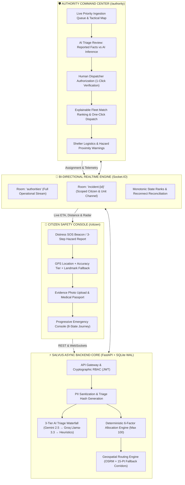
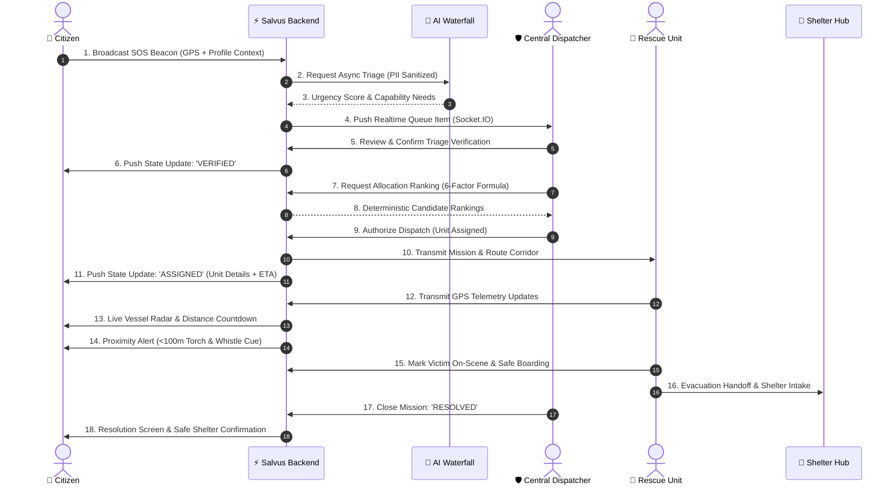
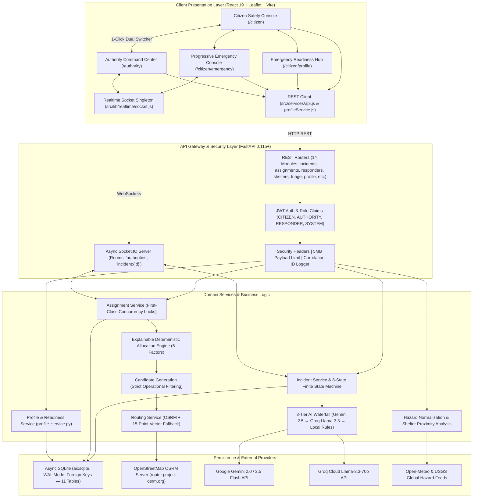

# SALVUS

### AI-Powered Disaster Intelligence & Emergency Rescue Coordination Platform

**From Awareness to Action.**  
_Turning scattered disaster signals into coordinated response._

Salvus is a mission-critical, full-stack disaster response and rescue coordination platform. It bridges the gap between citizens in acute distress and emergency management authorities through real-time geospatial telemetry, multi-tier AI triage decision-support, mathematically explainable deterministic resource allocation, persistent emergency readiness profiles, and a calm, state-focused emergency journey.

[](https://github.com/pritesh-4/SIH-2026---SALVUS/actions)
[](#testing--verification)
[](#testing--verification)
[](LICENSE)
[](#tech-stack)
[](#tech-stack)
[](#tech-stack)
[](#tech-stack)

---



---

## The Problem

During major crises—flash floods, cyclones, industrial collapses, and severe earthquakes—response failures are rarely caused by a shortage of physical rescue personnel. The catastrophic failure point is the **acute coordination gap** during the first 1 to 4 "golden hours."

Emergency coordinators, dispatchers, field responders, and citizens face severe operational bottlenecks:

```
[ Citizen Distress Signal ] ──► Fragmented across SMS, phone calls, social media without GPS
[ Authority Decision-Makers] ──► Overwhelmed by unstructured text, uncertain threat priorities
[ First Responder Fleets   ] ──► Dispatched without capability-to-hazard fit or live routing
[ Evacuation Shelters      ] ──► Overcrowded without real-time intake or ration visibility
─────────────────────────────────────────────────────────────────────────────────────────────
RESULT: Delayed response, asset misallocation, dispatcher burnout, citizen panic.
```

- **Fragmented Citizen Signals:** Distress calls and social media posts arrive without structure, verified coordinates, or severity classification.
- **Uncertain Threat Severity:** Dispatchers lose critical minutes trying to determine who is trapped in rising waters versus who requires routine transport.
- **Capability & Asset Mismatches:** Deploying an ambulance to a flooded street or an inflatable boat to a dry debris zone wastes finite rescue capacity.
- **Dynamic Environmental Hazards:** Rapidly shifting flood contours, downed high-voltage power lines, and structural collapses invalidate standard navigation.
- **Shelter Blind Spots:** Evacuees are directed to facilities that have already exceeded bed capacity or lack medical rations.
- **Citizen Panic & Cognitive Overload:** Victims in acute distress panic when left in the dark without ETA milestones, or when overwhelmed by cluttered dashboard interfaces.
- **Victim Vulnerability Blindness:** First responders enter hazard zones unaware of victim blood groups, pre-existing medical conditions (e.g., Asthma, Diabetes, mobility impairments), or designated next-of-kin.

---

## The Salvus Solution

Salvus closes the coordination gap through a synchronized, two-sided operational ecosystem connecting citizens, live environmental feeds, central dispatchers, and field responders into one unified lifecycle:

```
Citizen Distress SOS / Hazard Report
       │
       ▼
Automated PII Sanitization & Hash Deduplication
       │
       ▼
3-Tier AI Triage & Grounded Fact Extraction
       │
       ▼
Human Authority Verification & Approval (Command Safety Lock)
       │
       ▼
Explainable Deterministic Resource Allocation (6-Factor Scoring)
       │
       ▼
Tactical Geospatial Routing (OSRM + Resilient 15-Point Corridors)
       │
       ▼
Real-Time Telemetry & Proximity Beacons (Socket.IO <100m Cue)
       │
       ▼
Evacuation Shelter Reception, Intake & Safe Resolution
```

1. **Citizen Safety Console (`/citizen`):** A lightweight, low-bandwidth mobile-first interface for citizens to configure emergency readiness (persistent contacts, medical passport, offline pass), broadcast geo-tagged distress beacons, report localized hazards in-app with photo attachments, inspect elevation-safe shelter routes, and follow a **State-Focused Progressive Disclosure Emergency Journey** from SOS to safe resolution.
2. **Authority Command Center (`/authority`):** A high-density, low-cognitive-load operational cockpit for emergency coordinators to view real-time incident queues, inspect AI triage recommendations with confidence scores, calculate deterministic vehicle match rankings, dispatch specialized units with 1 click, inspect victim medical summaries, and oversee shelter logistics.

---

## What Makes Salvus Different

| Dimension                  | Traditional Systems                              | Salvus Platform                                                                                                                              |
| :------------------------- | :----------------------------------------------- | :------------------------------------------------------------------------------------------------------------------------------------------- |
| **Coordination Loop**      | Fragmented (Alert-only or Dispatch-only silos)   | **Closed-Loop:** Integrates Citizen $\leftrightarrow$ Core $\leftrightarrow$ Authority $\leftrightarrow$ Responder $\leftrightarrow$ Shelter |
| **Resource Allocation**    | Manual lookup or opaque "Black-Box" AI           | **Explainable & Deterministic:** 6-factor auditable mathematical formula (Max 100)                                                           |
| **AI Governance**          | Autonomous / Unchecked or completely manual      | **Human-in-the-Loop:** AI parses & triages; certified humans retain exclusive dispatch authority                                             |
| **AI Resilience**          | Single API dependency (Fails when API is down)   | **3-Tier Waterfall:** Gemini 2.5 Flash $\rightarrow$ Groq Llama-3.3-70b $\rightarrow$ Deterministic Heuristics                               |
| **Interface Aesthetics**   | Cluttered neon dashboards causing eye fatigue    | **Calm Intelligence:** 85–90% neutral slate budget (`#080C12`), semantic colors for meaning only                                             |
| **Emergency UX**           | Cluttered screens causing victim panic           | **Progressive Disclosure:** Renders strictly the single most critical focal point per lifecycle state                                        |
| **Pre-Disaster Readiness** | None; identity collected during chaos            | **Persistent Readiness Profile:** Server-authoritative ID (`SLV-CIT-XXXX`), medical passport, offline pass                                   |
| **Geospatial Routing**     | Standard commercial APIs (Fail on network drops) | **Hybrid OSRM + Vector Corridors:** Real-world OSRM routing with 15-waypoint quadratic Bézier fallback                                       |

### 1. Closed-Loop Emergency Coordination

Most emergency tools do one thing: push bulk SMS alerts, take 911 notes, or track vehicle GPS. Salvus connects the entire lifecycle into a synchronized operational circle: **Alert $\rightarrow$ Citizen $\rightarrow$ Incident $\rightarrow$ AI Triage $\rightarrow$ Authority Verification $\rightarrow$ Deterministic Allocation $\rightarrow$ Responder Telemetry $\rightarrow$ Citizen Tracking $\rightarrow$ Safe Shelter Reception $\rightarrow$ Resolution**.

### 2. Explainable Deterministic Resource Allocation Engine

Emergency dispatches should never depend on stochastic LLM outputs. Salvus computes recommendations using a mathematically auditable **6-factor formula** (Total Max = 100):

$$\text{Score} = S_{\text{Capability}} (30) + S_{\text{Availability}} (20) + S_{\text{Proximity}} (15) + S_{\text{ETA}} (15) + S_{\text{Workload}} (10) + S_{\text{SeverityFit}} (10)$$

Every recommendation provides dispatchers with an auditable checklist explaining _why_ a unit was recommended (e.g., `"Primary watercraft match (30/30) • Unit Available (20/20) • 1.2 km away (14/15) • ETA 4m (14/15)"`).

### 3. Human-in-the-Loop AI Governance

AI extracts unstructured telemetry, classifies hazard categories, flags victim vulnerabilities, and estimates urgency. **AI never dispatches responders autonomously.** Every dispatch order requires explicit human dispatcher verification.

### 4. Multi-Tier AI Provider Waterfall

If external cloud AI providers experience outages or rate limits during a regional disaster, Salvus degrades gracefully without interrupting emergency operations:

1. **Tier 1 (Primary):** Google Gemini 2.0 / 2.5 Flash (`AI TRIAGE — PRIMARY`, 3.0s timeout)
2. **Tier 2 (Failover):** Groq Cloud Llama-3.3-70b (`AI TRIAGE — FALLBACK`, 3.0s timeout)
3. **Tier 3 (Local Heuristic):** Deterministic Rule Engine (`RULE-BASED TRIAGE`, 100% offline uptime, zero external dependencies)

### 5. Calm Intelligence & State-Focused Progressive Disclosure

The Authority Command Center operates on an **85–90% neutral slate budget** (`#080C12` base) where high-contrast semantic colors represent operational meaning only (Red = Critical Threat, Amber = Triage Warning, Blue = Active Selection, Green = Resolved / Safe). On the citizen side, **Progressive Disclosure** eliminates panic by displaying only the single most actionable component for the current state.

### 6. Persistent Emergency Readiness & Offline Pass

Citizens prepare _before_ crises strike. Server-authoritative profiles with unique Emergency IDs (`SLV-CIT-XXXX`), single-primary emergency contacts, and medical passports automatically populate SOS beacons and cache locally for zero-connectivity triage desks.

---

## How Salvus Works (Operational Lifecycle)



1. **Detect:** Environmental hazards and weather anomalies are ingested from live feeds (Open-Meteo & USGS) and mapped onto tactical layers.
2. **Report:** Citizen triggers 1-touch SOS beacon or logs a 3-step structured hazard report with photo evidence.
3. **Triage:** Salvus sanitizes PII, computes a deduplication hash, and triggers the 3-tier AI triage waterfall.
4. **Verify:** Central dispatcher inspects reported facts vs. AI inferences and clicks **Verify Triage**.
5. **Allocate:** The 6-factor deterministic allocation engine scores and ranks all available fleet units.
6. **Dispatch:** Dispatcher reviews the explainable scoring breakdown and confirms unit assignment with 1 click.
7. **Track:** Real-time GPS telemetry streams along OSRM route corridors; citizen receives animated vessel radar, distance countdown, and a `<100m` proximity alert.
8. **Resolve:** Rescue team completes on-scene extraction, coordinates shelter intake, and closes the incident with a full audit log.

---

## Citizen Experience (`/citizen`)

```
┌────────────────────────────────────────────────────────────────────────┐
│                        CITIZEN SAFETY CONSOLE                          │
├────────────────────────────────────────────────────────────────────────┤
│ [ Home / Status ]  [ Interactive Map ]  [ Alerts ]  [ Readiness Hub ] │
├────────────────────────────────────────────────────────────────────────┤
│  ⚡ ACTIVE STATUS: SAFE (Advisory: Flash Flood Watch Sector 5)          │
│  📍 GPS Precision: ±8m (High Accuracy) • Sector 12 Community Hub       │
│                                                                        │
│  [ 🚨 SEND DISTRESS SOS ]  [ 📝 REPORT LOCAL HAZARD ]                 │
│                                                                        │
│  Nearby Emergency Facilities (Within 5km):                             │
│  • Salt Lake Stadium Shelter — 1.2km (142 beds available)             │
│  • Apollo Multi-Speciality Hospital — 2.4km (Trauma Tier 1)           │
│  • Bidhannagar Fire Station — 3.1km (Boat Unit Ready)                 │
└────────────────────────────────────────────────────────────────────────┘
```

### 1. Home / Safety Console (`/citizen`)

- **2-Second Safety Comprehension:** Instant personal safety status indicator and local municipal advisory banners.
- **Active Emergency Floating Banner:** Persistent status pill that immediately redirects active SOS victims back to their live emergency journey.
- **Nearby Places Carousel:** Auto-sorted emergency facilities (Shelters, Hospitals, Fire Stations, Pharmacies) within 10 km.

### 2. Defensive Geolocation & Landmark Fallback

- **Tiered Accuracy Classification:** Real-time rating of browser coordinates (`HIGH <=15m`, `GOOD <=50m`, `APPROXIMATE <=200m`, `LOW >200m`).
- **Regional Landmark Catalog:** If GPS is denied or blocked by concrete structures, citizens select from pre-calibrated regional centroids (e.g., _Sector 12 Community Hub_, _Karunamoyee Bus Terminus_, _Salt Lake Stadium Evacuation Gate_).

### 3. In-App 3-Step Hazard Reporting (`IncidentReportModal.jsx`)

- **Structured Categories:** Floods, Downed Power Lines, Structural Debris, Fire / Hazmat, Trapped Persons.
- **Evidence Photo Upload:** Client-side file validation (JPEG/PNG/WebP, max 5MB), SHA-256 checksum generation, secure thumbnail rendering, and full evidence lightbox preview.
- **Idempotency & Deduplication Lock:** Prevents accidental double-submissions during spotty cellular handshakes.

### 4. Interactive Situational Map (`/citizen/map`)

- **Dark-Mode Tactical Surface:** Filtered Leaflet OpenStreetMap tiles eliminating bright glare in low-light environments.
- **Nearby Emergency Facilities:** Live pins for verified shelters, trauma hospitals, fire stations, and local pharmacies.
- **Dynamic Shelter Routes:** Step-by-step walking or driving route polylines with turn-by-turn guidance and elevation safety indicators.

### 5. Categorized Alerts & Weather Intelligence (`/citizen/alerts`)

- **Normalized Disaster Feeds:** Live weather alerts and precipitation curves from Open-Meteo with local cached fallbacks.
- **Actionable Tier Badges:** Clear filtering by `CRITICAL THREAT`, `WARNING`, and `ADVISORY WATCH`.

### 6. Emergency Readiness Center (`/citizen/profile`)

- **Persistent User Identity:** Server-authoritative profile with unique Emergency ID (`SLV-CIT-XXXX`) bound to cryptographic JWT claims.
- **Designated Emergency Contacts:** Full CRUD with single-primary enforcement, priority ranking, and automatic promotion upon primary deletion.
- **Medical Passport:** Blood group with Rh factor, pre-existing conditions (Asthma, Diabetes, Cardiac), severe allergies, mobility protocols, and medication notes.
- **Deterministic Readiness Indicator:** Live `READY` vs `SETUP INCOMPLETE` scoring.
- **Offline Emergency Pass:** Local device caching with staleness detection (`SAVED`, `NEEDS_UPDATE`, `NOT_SAVED`) for zero-connectivity triage desks.
- **Web Audio Siren Tester:** Local 1.5s dual-tone synthesized pulse (880Hz / 440Hz) with browser autoplay safety.

### 7. 8-State Progressive Emergency Journey (`/citizen/emergency`)

Eliminates panic-induced cognitive overload by dynamically rendering strictly the single most critical focal point for each lifecycle state:

```
[1. SOS_ACTIVE]  ──► Holding screen confirming ticket creation & GPS lock
[2. TRIAGING]    ──► AI analysis in progress & immediate self-preservation advice
[3. VERIFIED]    ──► Dispatcher verified report; preparing optimal rescue craft
[4. ASSIGNED]    ──► Rescue unit assigned (Team lead, call sign, radio channel)
[5. EN_ROUTE]    ──► Live tactical radar polyline, distance (meters), dynamic ETA
[6. NEARBY]      ──► Proximity beacon (<100m cue): Wave flashlight / blow whistle
[7. ON_SCENE]    ──► Rescue craft arrived: Boarding safety checklist & protocols
[8. RESOLVED]    ──► Evacuation successful: Handoff to verified shelter reception
```

---

## Authority Command Center (`/authority`)

```
┌────────────────────────────────────────────────────────────────────────────────────────┐
│                              AUTHORITY COMMAND CENTER                                  │
├────────────────────────────────────────────────────────────────────────────────────────┤
│ [ Active: 14 ]  [ Critical: 3 ]  [ Fleet Deployed: 8/12 ]  [ Available Beds: 684 ]     │
├──────────────────────────────┬─────────────────────────────┬───────────────────────────┤
│ LIVE INCIDENT QUEUE          │ TACTICAL GEOSPATIAL MAP     │ INCIDENT INSPECTOR        │
│                              │                             │                           │
│ 🚨 #SV-2048 • CRITICAL       │ [ Leaflet Dark Surface ]   │ Ticket: #SV-2048 (SOS)    │
│    Flash Flood • 3 Trapped   │ • Active SOS Beacons (Pulsing)│ Reporter: Pritesh Jena   │
│    AI Urgency: 9.4/10        │ • Fleet Units (SVG Vessels) │ Medical: Asthma | O+      │
│    NDRF Boat Rec. (94/100)   │ • Real-time Route Corridors │ AI Triage: High (0.92)    │
│                              │ • Shelter Capacity Indicators│                           │
│ ⚠️ #SV-2047 • WARNING        │                             │ [ Verify Triage ]         │
│    Downed Power Line         │                             │ [ Deterministic Dispatch ]│
│    AI Urgency: 6.2/10        │                             │                           │
└──────────────────────────────┴─────────────────────────────┴───────────────────────────┘
```

The Authority Command Center serves as a high-density, multi-panel operational cockpit for emergency coordinators:

### 1. Operational Metrics Strip

Instant high-level situation metrics: Active Incidents, Critical Threats, Fleet Deployment Ratio, Available Shelter Beds, and 24h Resolved Cases.

### 2. Priority Ingestion Queue

Scan-friendly list sorting incidents by urgency. Displays severity badges, hazard category pills, elapsed response time, victim headcount, and AI triage status.

### 3. Tactical Geospatial Command Map

Full-screen Leaflet dark-surface map with:

- Custom SVG pins with animated pulsing radar halos for active distress beacons.
- Real-time vehicle positions with heading vectors and operational status colors.
- Dynamic route corridor polylines (OSRM road routes or 15-waypoint fallback arcs).
- Spatial incident clusters and hazard proximity warning circles around evacuation shelters.

### 4. Incident Inspector & Audit Timeline

Provides complete operational context for the selected incident:

- Reporter contact details and exact GPS coordinates with accuracy radius.
- **Evacuee Medical Summary:** Blood group, critical conditions, allergies, and mobility requirements extracted securely from the citizen's readiness profile.
- **Designated Emergency Contacts:** Verified next-of-kin list for automated notification dispatch.
- **Evidence Lightbox:** High-resolution photo inspection with zoom and checksum verification.
- **Forward-Only State Machine Progression:** Controls to advance or resolve missions.

### 5. AI Decision Support & Triage Inspector

- **Facts vs. Inference Separation:** Distinct panels separating _Reported Conditions (Grounded Facts)_ from _AI Synthesis & Reasoning_.
- **Qualitative Confidence Tiers:** Calibrated ratings (`High Confidence >= 0.80`, `Moderate Confidence 0.60–0.79`, `Low / Needs Review < 0.60`).
- **Uncertainty & Ambiguity Flags:** Explicit caveats highlighting unverified victim counts or sparse descriptions.
- **1-Click Verification:** Authorizes AI recommendations and synchronizes state to the citizen console.

### 6. Responder Fleet Matrix

Complete fleet visibility across specialized units (Inflatable Rescue Boats, ALS Ambulances, Heavy Debris Crews, Hazmat Teams). Inspects craft readiness (`AVAILABLE`, `ASSIGNED`, `EN_ROUTE`, `ON_SCENE`, `OFFLINE`), crew leads, VHF radio frequencies, and capacity load.

### 7. Explainable Dispatch Recommendation Panel

Computes and ranks top eligible rescue units using the 6-factor deterministic algorithm. Displays individual factor breakdowns, transit ETA, route distance, and a single-click **Confirm Dispatch** action.

### 8. Shelter Logistics & Intake Panel

Real-time monitoring of municipal evacuation centers with live bed occupancy meters, 72-hour supply status (`ADEQUATE`, `LOW`, `CRITICAL`), amenities tags, and automated **Hazard Proximity Alerts** if an active threat approaches within 1.5 km.

---

## The Core Rescue Loop (Citizen ↔ Authority Connection)

```
┌───────────────────────────────────────────────────────────────────────────────────────┐
│                               THE SALVUS RESCUE LOOP                                  │
└───────────────────────────────────────────────────────────────────────────────────────┘

     CITIZEN CONSOLE (/citizen)                  AUTHORITY COMMAND CENTER (/authority)
  ┌──────────────────────────────┐              ┌────────────────────────────────────┐
  │ 1. Citizen Triggers SOS      │              │                                    │
  │    (GPS + Medical Passport)  │              │                                    │
  └──────────────┬───────────────┘              └────────────────────────────────────┘
                 │                                                 ▲
                 ▼                                                 │
  ┌──────────────────────────────┐                                 │
  │ 2. FastAPI Ingestion & Hash  │                                 │
  │    aiosqlite WAL Database    │                                 │
  └──────────────┬───────────────┘                                 │
                 │                                                 │
                 ▼                                                 │
  ┌──────────────────────────────┐                                 │
  │ 3. 3-Tier AI Triage Waterfall│                                 │
  │    (Gemini → Groq → Rules)   │                                 │
  └──────────────┬───────────────┘                                 │
                 │                                                 │
                 ▼                                                 │
  ┌──────────────────────────────┐                                 │
  │ 4. Realtime Socket Event     ├─────────────────────────────────┘
  │    'incident.created'        │  5. Queue Alert & Map Marker Appears Instantly
  └──────────────────────────────┘  6. Dispatcher Reviews Grounded Facts vs Inference
                                    7. Dispatcher Clicks [ Verify Triage ]
                 ┌─────────────────────────────────────────────────┘
                 │
                 ▼
  ┌──────────────────────────────┐
  │ 8. Realtime Socket Event     │
  │    'incident.triage_verified'│
  └──────────────┬───────────────┘
                 │
                 ▼
  ┌──────────────────────────────┐              ┌────────────────────────────────────┐
  │ 9. Citizen UI Transitions:   │              │ 10. System Computes 6-Factor       │
  │    State becomes 'VERIFIED'  │              │     Deterministic Allocation Score │
  └──────────────────────────────┘              └──────────────────┬─────────────────┘
                                                                   │
                                                                   ▼
                                                ┌────────────────────────────────────┐
                                                │ 11. Dispatcher Reviews Match &     │
                                                │     Clicks [ Confirm Dispatch ]    │
                                                └──────────────────┬─────────────────┘
                                                                   │
                 ┌─────────────────────────────────────────────────┘
                 │
                 ▼
  ┌──────────────────────────────┐              ┌────────────────────────────────────┐
  │ 12. Realtime Socket Event    │              │ 13. Unit Marked 'ASSIGNED'         │
  │     'assignment.created'     │              │     Route Polyline Rendered on Map │
  └──────────────┬───────────────┘              └────────────────────────────────────┘
                 │
                 ▼
  ┌──────────────────────────────┐              ┌────────────────────────────────────┐
  │ 14. Citizen UI Updates:      │              │ 15. Unit Advances Along Route      │
  │     Unit Name, Channel & ETA ├──────────────┤     Telemetry Stream (Socket.IO)   │
  └──────────────┬───────────────┘              └────────────────────────────────────┘
                 │
                 ▼
  ┌──────────────────────────────┐
  │ 16. Proximity Beacon (<100m) │
  │     "Wave Torch / Whistle"   │
  └──────────────┬───────────────┘
                 │
                 ▼
  ┌──────────────────────────────┐              ┌────────────────────────────────────┐
  │ 17. Safe Boarding & Handoff  ├─────────────►│ 18. Mission Marked 'RESOLVED'      │
  │     Shelter Reception Intake │              │     Audit Event Recorded in DB     │
  └──────────────────────────────┘              └────────────────────────────────────┘
```

---

## Live vs. Simulated Provenance

Salvus maintains strict architectural truth regarding data sources and execution modes:

| Feature / Component                    | Classification         | Provenance & Execution Details                                                                                    |
| :------------------------------------- | :--------------------- | :---------------------------------------------------------------------------------------------------------------- |
| **Citizen Profile & Readiness**        | **IMPLEMENTED (LIVE)** | Server-authoritative SQLite persistence, JWT subject binding, single-primary contact enforcement.                 |
| **Incident Lifecycle & State Machine** | **IMPLEMENTED (LIVE)** | Full database persistence, 8-state forward-only finite state machine, monotonic rank guards.                      |
| **Assignment Lifecycle**               | **IMPLEMENTED (LIVE)** | Authoritative database entity linking incidents to responders with concurrency locks.                             |
| **Deterministic Allocation Engine**    | **IMPLEMENTED (LIVE)** | Real-time 6-factor mathematical calculation executed on live fleet coordinates (Max 100).                         |
| **Realtime WebSockets (Socket.IO)**    | **IMPLEMENTED (LIVE)** | Async Socket.IO server with room-based RBAC (`authorities`, `incident:{id}`) and multi-tab sync.                  |
| **In-App Photo Attachments**           | **IMPLEMENTED (LIVE)** | Client-side file validation, SHA-256 checksums, and secure preview lightbox modal.                                |
| **Web Audio Siren Synthesizer**        | **IMPLEMENTED (LIVE)** | Native browser Web Audio API dual-tone synthesis (880Hz / 440Hz); zero external audio assets.                     |
| **AI Triage Evaluation**               | **HYBRID**             | **LIVE** when `GEMINI_API_KEY` or `GROQ_API_KEY` is configured; **FALLBACK** to deterministic rules when offline. |
| **OSRM Route Geometry**                | **HYBRID**             | **LIVE** real-world road routing via OSRM HTTP API; **FALLBACK** to 15-waypoint quadratic Bézier arcs.            |
| **Responder GPS Movement**             | **SIMULATED**          | Deterministic telemetry advancing along computed route corridors at realistic speeds.                             |
| **Hazard Feed Ingestion**              | **LIVE / CACHED**      | Normalized disaster signals from Open-Meteo and USGS with local cached fallbacks.                                 |
| **Database on Render Free Tier**       | **EPHEMERAL**          | Resets on cold starts; `AUTO_SEED=true` populates disaster grid. Persistent disk on Render Starter.               |
| **CAP / EDXL Interoperability**        | **PLANNED**            | Common Alerting Protocol export for national disaster management agency integration.                              |
| **PostgreSQL + PostGIS Scale Path**    | **PLANNED**            | Enterprise migration path from SQLite WAL to PostGIS spatial indexes.                                             |

---

## System Architecture



---

## Database Architecture (11 SQLite WAL Tables)

Salvus uses asynchronous SQLite (`aiosqlite`) with **Write-Ahead Logging (`PRAGMA journal_mode=WAL`)**, foreign key constraints enabled on every connection, and partial unique indexes enforcing concurrency invariants:

```
┌───────────────────────────┐       ┌───────────────────────────┐
│           users           │       │      citizen_profiles     │
├───────────────────────────┤       ├───────────────────────────┤
│ id (PK)                   │       │ id (PK)                   │
│ email (UNIQUE)            │       │ emergency_id (UNIQUE)     │
│ password_hash             │       │ full_name, phone, email   │
│ role (CITIZEN/AUTHORITY)  │       │ blood_group, medical_info │
│ full_name, is_active      │       │ medications_note, privacy │
└───────────────────────────┘       └─────────────┬─────────────┘
                                                  │ 1:N
                                                  ▼
┌───────────────────────────┐       ┌───────────────────────────┐
│     idempotency_keys      │       │     emergency_contacts    │
├───────────────────────────┤       ├───────────────────────────┤
│ key (PK)                  │       │ id (PK)                   │
│ resource_type             │       │ user_id (FK -> profiles)  │
│ resource_id               │       │ name, relationship, phone │
│ request_payload           │       │ priority, is_primary      │
└───────────────────────────┘       │ notify_on_sos             │
                                    └───────────────────────────┘

┌───────────────────────────┐ 1:N   ┌───────────────────────────┐
│         incidents         ├──────►│      incident_events      │
├───────────────────────────┤       ├───────────────────────────┤
│ id (PK), ticket_id (UNQ)  │       │ id (PK), incident_id (FK) │
│ type, severity, status    │       │ event_type, prev/new status│
│ latitude, longitude       │       │ actor, metadata           │
│ reporter_name, reporter_id│       └───────────────────────────┘
│ affected_count, is_sos    │ 1:N   ┌───────────────────────────┐
│ ai_state, triage_hash     ├──────►│   ai_triage_assessments   │
└─────────────┬─────────────┘       ├───────────────────────────┤
              │                     │ id (PK), incident_id (FK) │
              │ 1:N                 │ provider, model, score    │
              ▼                     │ assessment, confidence    │
┌───────────────────────────┐       │ review_status, operator_id│
│    incident_attachments   │       └───────────────────────────┘
├───────────────────────────┤
│ id (PK), incident_id (FK) │
│ storage_key, secure_url   │
│ original_filename, mime   │
│ size_bytes, checksum      │
└───────────────────────────┘

┌───────────────────────────┐ 1:N   ┌───────────────────────────┐
│        responders         ├──────►│        assignments        │
├───────────────────────────┤       ├───────────────────────────┤
│ id (PK), unit_name        │       │ id (PK), incident_id (FK) │
│ vehicle_type, capability  │       │ responder_id (FK)         │
│ status, latitude, long    │       │ status (PROPOSED..COMPL)  │
│ radio_channel, max_cap    │       │ assigned_at, arrived_at   │
│ current_load, last_seen   │       │ score, score_breakdown    │
└───────────────────────────┘       └───────────────────────────┘

┌───────────────────────────┐
│          shelters         │
├───────────────────────────┤
│ id (PK), name, address    │
│ latitude, longitude       │
│ total_beds, available_beds│
│ occupancy_rate, supplies  │
│ status, amenities         │
└───────────────────────────┘
```

### Strict Concurrency Invariants:

1. `idx_assignments_active_incident`: Unique partial index ensuring **at most one active assignment per incident**.
2. `idx_assignments_active_responder`: Unique partial index ensuring **at most one active mission per responder unit**.
3. `idx_incidents_unique_active_sos`: Unique partial index ensuring **at most one active SOS per citizen**.
4. `idempotency_keys`: Guarantees **at-most-once mutation** for emergency state changes under spotty cellular connectivity.

---

## Tech Stack

| Layer                       | Technology                       | Version                 | Purpose & Rationale                                                                 |
| :-------------------------- | :------------------------------- | :---------------------- | :---------------------------------------------------------------------------------- |
| **Frontend Framework**      | React + Vite                     | `19.2.8`, `8.2.0`       | Sub-second HMR, optimized rendering, efficient DOM reconciliation.                  |
| **Styling & Design System** | Tailwind CSS v4, Vanilla CSS     | `4.3.3`                 | Custom design tokens, 85–90% slate neutral budget (`#080C12`).                      |
| **Icons & Visuals**         | Lucide React                     | `1.33.0`                | Accessible, clean tactical iconography.                                             |
| **Backend Framework**       | FastAPI + Python                 | `0.115+`, `3.11 / 3.12` | High-throughput asynchronous REST API, OpenAPI docs, Pydantic v2 schemas.           |
| **ASGI Server**             | Uvicorn                          | `0.32+`                 | Asynchronous coroutine server handling combined HTTP & Socket.IO traffic.           |
| **Database**                | SQLite via `aiosqlite`           | WAL Mode                | Zero-latency async persistence with 11 tables, strict foreign keys, and indexes.    |
| **Realtime Engine**         | Socket.IO (Python & JS Client)   | `5.12+`, `4.8.3`        | Bi-directional WebSockets with room authorization (`authorities`, `incident:{id}`). |
| **Tactical Maps**           | Leaflet + OpenStreetMap          | `1.9.4`                 | Dark tactical radar, custom SVG craft markers, dynamic route polylines.             |
| **Audio Engine**            | Native Web Audio API             | Browser Native          | Dual-tone siren synthesis (880Hz / 440Hz) with zero external media files.           |
| **Routing Engine**          | OSRM + Vector Corridor           | REST API                | Real-world road routing with 15-waypoint quadratic Bézier fallback.                 |
| **AI Decision Support**     | Gemini 2.5 Flash, Groq Llama-3.3 | REST SDKs               | Unstructured parsing, urgency scoring, PII sanitization, heuristic fallback.        |
| **Auth & Security**         | PyJWT, Cryptography, Bcrypt      | `HS256`                 | Cryptographic JWT token minting, role-based access control, security headers.       |
| **Code Quality**            | ESLint, Prettier, Ruff           | `10.8`, `3.9`, `0.9`    | Automated linting, code style enforcement, Git pre-commit hooks.                    |
| **Testing**                 | Pytest, Node Test Runner         | `9.1.1`, Node 20+       | **467 passing backend tests** and **123 passing frontend tests**.                   |

---

## Golden Demo Flow (3-Minute Judging Script)

```
STEP 1: Dual-Portal Setup
  ├─ Left Window:  http://localhost:5173/citizen
  └─ Right Window: http://localhost:5173/authority

STEP 2: Inspect Emergency Readiness (/citizen/profile)
  ├─ Demonstrate verified Emergency ID: SLV-CIT-7829
  ├─ Review Medical Passport: Blood Group O+, Asthma, Penicillin Allergy
  └─ Click "Test Emergency Siren" -> Observe 1.5s synthesized dual-tone pulse

STEP 3: Trigger Distress SOS Beacon
  ├─ Return to Citizen Home, tap [ SEND SOS ], hold 1.5s to confirm
  └─ Observe instant ticket creation (#SV-2048) and transition to SOS_ACTIVE

STEP 4: Real-Time Ingestion & Tactical Map Sync
  ├─ In Authority Center, observe instant queue appearance with ZERO page reload
  └─ Leaflet tactical map renders pulsing distress beacon at citizen coordinates

STEP 5: AI Triage Review & Human Verification
  ├─ Authority clicks incident -> AI Triage Card displays: Urgency 9.4/10, Watercraft Needed
  ├─ Notice separation: Reported Facts vs AI Inference (Facts: "Water 1.2m, 3 trapped")
  ├─ Authority clicks [ Verify Triage ]
  └─ Citizen screen instantly updates to 'VERIFIED'

STEP 6: Explainable Deterministic Dispatch
  ├─ Authority inspects Recommended Responders panel
  ├─ System ranks "NDRF Unit 4 — Alpha Team" at 94/100 (Capability 30, Availability 20, Distance 14, ETA 14, Workload 8, Severity 8)
  └─ Authority clicks [ Confirm Dispatch ]

STEP 7: Live Corridors & Proximity Alert
  ├─ Tactical map draws OSRM route corridor polyline
  ├─ Citizen screen shows assigned craft ("NDRF Unit 4"), VHF Channel 16, live distance & ETA countdown
  └─ When unit reaches <100m, Citizen receives urgent Proximity Beacon ("Wave Flashlight / Blow Whistle")

STEP 8: Safe Evacuation & Resolution
  ├─ Unit reaches scene -> Citizen transitions to ON_SCENE (Boarding Protocol)
  ├─ Authority marks incident 'RESOLVED' -> Shelter intake recorded at Salt Lake Stadium
  └─ Citizen receives final resolution confirmation
```

---

## Local Development & Setup

### Prerequisites

- **Node.js:** `20.x LTS` or higher
- **npm:** `10.x` or higher
- **Python:** `3.11` or `3.12`
- **Git**

### 1. Repository Clone

```bash
git clone https://github.com/pritesh-4/SIH-2026---SALVUS.git
cd SIH-2026---SALVUS
```

### 2. Frontend Setup

```bash
# Install dependencies
npm ci

# Configure environment variables
cp .env.example .env

# Start Vite dev server (runs on http://localhost:5173)
npm run dev

# Run quality checks & unit test suite
npm run lint
npm run format:check
npm test
npm run build
```

### 3. Backend Setup

```bash
# Navigate to backend directory
cd backend

# Create and activate virtual environment
python -m venv venv

# On Windows (PowerShell):
.\venv\Scripts\Activate.ps1
# On Linux / macOS:
source venv/bin/activate

# Install Python dependencies
pip install --upgrade pip
pip install -r requirements.txt

# Configure environment variables
cp .env.example .env

# Start the combined FastAPI + Socket.IO server (runs on http://localhost:8000)
uvicorn app.main:combined_asgi_app --reload --host 0.0.0.0 --port 8000

# Run full backend test suite (467 tests)
pytest -v
```

---

## Environment Variables

### Frontend (`.env`)

| Variable            | Required | Default                 | Description                                            |
| :------------------ | :------: | :---------------------- | :----------------------------------------------------- |
| `VITE_API_URL`      |   Yes    | `http://localhost:8000` | Backend REST API base URL                              |
| `VITE_WS_URL`       |   Yes    | `http://localhost:8000` | Realtime Socket.IO server URL                          |
| `VITE_MAPBOX_TOKEN` | Optional | `""`                    | Optional Mapbox token for custom satellite tile layers |

### Backend (`backend/.env`)

| Variable         | Required | Default                           | Security Level | Description                                    |
| :--------------- | :------: | :-------------------------------- | :------------: | :--------------------------------------------- |
| `ENVIRONMENT`    |   Yes    | `development`                     | Public Config  | Runtime mode (`development` / `production`)    |
| `PORT`           |   Yes    | `8000`                            | Public Config  | ASGI server listen port                        |
| `HOST`           |   Yes    | `0.0.0.0`                         | Public Config  | Network bind interface                         |
| `CORS_ORIGIN`    |   Yes    | `*`                               | Server Config  | Allowed CORS origins (comma-separated in prod) |
| `DATABASE_PATH`  |   Yes    | `data/salvus.db`                  | Server Config  | SQLite database file location                  |
| `AUTO_SEED`      |   Yes    | `true`                            | Public Config  | Auto-seed disaster baseline on fresh DB        |
| `SECRET_KEY`     | Optional | Auto-generated                    | Server Secret  | HMAC-SHA256 signing secret for JWT tokens      |
| `OSRM_BASE_URL`  |   Yes    | `https://router.project-osrm.org` | Server Config  | OSRM routing engine API base URL               |
| `GEMINI_API_KEY` | Optional | `""`                              | Server Secret  | Google Gemini API key for live AI triage       |
| `GROQ_API_KEY`   | Optional | `""`                              | Server Secret  | Groq Cloud API key for Llama-3.3 fallback      |
| `OPENAI_API_KEY` | Optional | `""`                              | Server Secret  | Optional OpenAI API key                        |

---

## Production Deployment

```
┌───────────────────────────┐         ┌───────────────────────────┐
│     Frontend on Vercel    │         │     Backend on Render     │
│   (Vite SPA + Edge CDN)   │         │ (FastAPI + Async Uvicorn) │
├───────────────────────────┤         ├───────────────────────────┤
│ • Build: npm run build    │  HTTPS  │ • Python 3.12 Web Service │
│ • Output: dist            ├────────►│ • Port: $PORT             │
│ • Rewrites: vercel.json   │  WSS    │ • Health: /health         │
│ • VITE_API_URL -> Render  │         │ • Socket.IO Async Engine  │
└───────────────────────────┘         └─────────────┬─────────────┘
                                                    │
                                                    ▼
                                      ┌───────────────────────────┐
                                      │   Render Persistent Disk  │
                                      │ (/var/data/salvus.db WAL) │
                                      └───────────────────────────┘
```

### Frontend $\rightarrow$ Vercel

1. Import repository into Vercel.
2. Framework Preset: **Vite**.
3. Build Command: `npm run build`, Output Directory: `dist`.
4. Configure Environment Variables: `VITE_API_URL` and `VITE_WS_URL` pointing to your Render backend URL.
5. SPA client-side routing is handled automatically via [`vercel.json`](vercel.json).

### Backend $\rightarrow$ Render

1. Deploy using the included [`render.yaml`](render.yaml) Blueprint or create a Python Web Service.
2. Root Directory: `backend`.
3. Build Command: `pip install --upgrade pip && pip install -r requirements.txt`.
4. Start Command: `uvicorn app.main:combined_asgi_app --host 0.0.0.0 --port $PORT --proxy-headers --forwarded-allow-ips='*'`.
5. Health Check Path: `/health`.

> [!IMPORTANT]
> **Database Persistence Notice:**
> On the Render Free tier, the filesystem is ephemeral and resets on service restarts. The `AUTO_SEED=true` flag automatically reseeds the active disaster response grid. For permanent production persistence, mount a Render Persistent Disk at `/var/data` and set `DATABASE_PATH=/var/data/salvus.db`.

---

## Testing & Verification

Salvus enforces strict code quality gates across frontend and backend:

```bash
# 1. Run full backend test suite (467 automated tests)
cd backend
pytest -v

# 2. Run full frontend unit test suite (123 automated tests)
npm test

# 3. Run automated linting and formatting quality checks
npm run lint
npm run format:check
ruff check backend
ruff format --check backend
```

### Verified Test Benchmarks:

- **Total Backend Tests:** **467 Passing** across 37 test suites (0 failures, 0 errors)
  - `test_state_machine.py`: 64 tests (Forward-only finite state machine transitions, ranks, invariants)
  - `test_attachments.py`: 33 tests (Evidence upload, validation, checksums, storage)
  - `test_places.py`: 26 tests (Overpass integration, facility normalization, emergency filtering)
  - `test_allocation_engine.py`: 21 tests (Deterministic 6-factor scoring and tie-breaking)
  - `test_ai_triage_hardening.py`: 20 tests (PII redaction, timeout failover, malformed JSON recovery)
  - `test_geo_relevance_engine.py`: 18 tests (Spatial proximity decay, bounding boxes)
  - `test_dynamic_recommendations.py`: 18 tests (Dynamic candidate evaluation under load)
  - `test_auth_foundation.py`: 16 tests (JWT authentication, hashing, token expiry)
  - `test_ai_triage.py`: 14 tests (Schema validation, facts vs inference separation)
  - `test_incident_api.py`: 14 tests (Distress beacon ingestion & deduplication)
  - `test_routing_service.py`: 14 tests (OSRM integration & 15-waypoint fallback corridors)
  - `test_facility_engine.py`: 12 tests (Shelter capacity & triage facility evaluation)
  - `test_location_intelligence.py`: 12 tests (Defensive accuracy tier calculation)
  - `test_security_hardening.py`: 11 tests (RBAC guards & HTTP security headers)
  - `test_candidate_generation.py`: 11 tests (Operational eligibility hard filtering)
  - `test_assignments_api.py`: 11 tests (Assignment domain REST endpoints)
  - `test_duplicate_and_idempotency.py`: 10 tests (Idempotency key enforcement & race locks)
  - `test_async_intelligence.py`: 10 tests (Background telemetry workers & queueing)
  - `test_alert_contract.py`: 9 tests (Hazard normalization & alert contract schemas)
  - `test_phase5_intelligence.py`: 9 tests (Grounded situation summary generation)
  - `test_external_adapters.py`: 9 tests (Open-Meteo & USGS feed adapters)
  - `test_role_routing_backend.py`: 8 tests (Role-based route authorization)
  - `test_responders_api.py`: 8 tests (Fleet lifecycle & radio status)
  - `test_profile_api.py`: 7 tests (Citizen profile identity & medical management)
  - `test_emergency_rehydration.py`: 7 tests (Offline state rehydration & recovery)
  - `test_emergency_hydration_idempotency.py`: 6 tests (Hydration idempotency locks)
  - `test_production_deployment.py`: 6 tests (Render health & CORS config)
  - `test_shelters_api.py`: 6 tests (Shelter logistics & bed capacity)
  - `test_observability_and_resilience.py`: 6 tests (Correlation ID propagation & telemetry)
  - `test_rescue_loop_failure_injection.py`: 6 tests (Adversarial failure injection & recovery)
  - `test_weather_intelligence.py`: 6 tests (Precipitation curves & forecast models)
  - `test_disaster_intelligence.py`: 5 tests (Disaster signal aggregation)
  - `test_emergency_readiness_api.py`: 5 tests (Emergency contacts CRUD & promotion)
  - `test_shelters_real_location.py`: 5 tests (Geospatial shelter proximity calculations)
  - `test_assignment_flow.py`: 4 tests (Transactional state consistency)
  - `test_realtime_assignment_sync.py`: 4 tests (WebSocket assignment synchronization)
  - `test_realtime_dispatch_loop.py`: 3 tests (End-to-end realtime dispatch loop)
- **Total Frontend Unit Tests:** **123 Passing** across 19 test files (0 failures)
  - Places pipeline & facility normalization
  - Emergency readiness profile service & single-primary contact promotion
  - Realtime listener hygiene & request-storm mitigation
  - Multi-tab synchronization & offline rehydration
  - Adversarial QA (out-of-order packets, duplicate event idempotency, cache corruption recovery)
  - Defensive geolocation accuracy tiers & landmark fallbacks
  - State machine transition invariants & role route guards

---

## Technical Documentation Index

For in-depth architectural and operational specifications, consult the [`docs/`](docs/) directory:

- 📐 **[ARCHITECTURE.md](docs/ARCHITECTURE.md):** Complete system architecture, layer boundaries, and Mermaid flowcharts.
- 🎯 **[PRODUCT.md](docs/PRODUCT.md):** Product strategy, user personas, operational workflows, and decision rationales.
- 🔌 **[API.md](docs/API.md):** Complete REST API contracts (14 route modules) and Socket.IO WebSocket specifications.
- 🗄️ **[DATABASE.md](docs/DATABASE.md):** Async SQLite WAL schema (11 tables), ER diagrams, indexes, and migration patterns.
- ⚡ **[REALTIME.md](docs/REALTIME.md):** Socket.IO room architecture, event catalogue, and out-of-order guards.
- 🤖 **[AI_ARCHITECTURE.md](docs/AI_ARCHITECTURE.md):** 3-tier AI waterfall, schema validation, PII redaction, and human verification model.
- 🛡️ **[SECURITY.md](docs/SECURITY.md):** Cryptographic JWT authentication, RBAC matrix, and security headers.
- 🚀 **[DEPLOYMENT.md](docs/DEPLOYMENT.md):** Production hosting guide for Vercel (Frontend) and Render (Backend).
- 🗺️ **[GEO_AND_ROUTING.md](docs/GEO_AND_ROUTING.md):** Geospatial engine, Leaflet tactical radar, OSRM routing, and 15-waypoint fallback corridors.
- 🎨 **[UX_GUIDELINES.md](docs/UX_GUIDELINES.md):** Calm intelligence design system, 85–90% slate neutral budget, and accessibility standards.
- 🧪 **[TESTING.md](docs/TESTING.md):** Quality verification benchmarks, test suite architecture, and adversarial testing guides.
- 🎬 **[DEMO.md](docs/DEMO.md):** Judge-ready Golden Demo presentation script and simulation controls.
- 🗺️ **[ROADMAP.md](docs/ROADMAP.md):** Project milestones from completed deliverables to future scale horizons.
- ⚖️ **[DECISIONS.md](docs/DECISIONS.md):** 14 Architecture Decision Records (ADR-001 through ADR-014).
- 📸 **[EVIDENCE_SECURITY_AND_AI_VISION.md](docs/EVIDENCE_SECURITY_AND_AI_VISION.md):** Photo attachment security, client validation, and checksum verification.
- 🔒 **[GPS_AND_PRIVACY.md](docs/GPS_AND_PRIVACY.md):** Geolocation privacy bounds, emergency-only tracking, and accuracy tiers.
- 🌐 **[DATA_SOURCES.md](docs/DATA_SOURCES.md):** External data source integration, Open-Meteo, USGS, and Overpass OpenStreetMap.
- 💻 **[DEVELOPMENT.md](docs/DEVELOPMENT.md):** Developer onboarding, local workflow, and environment hygiene.
- 📦 **[GITHUB_SETUP.md](docs/GITHUB_SETUP.md):** GitHub repository settings, branch protection, and CI quality gates.

---

## Team

| Member             | Focus Area                                                   |
| :----------------- | :----------------------------------------------------------- |
| **Pritesh Jena**   | Lead Systems Architect, Full-Stack & AI Integration Engineer |
| **Trupti**         | Emergency Systems & Product Engineering                      |
| **Satya**          | Geospatial & Backend Infrastructure                          |
| **Anushka**        | Frontend Architecture & UX Engineering                       |
| **Sourajeet**      | Quality Assurance & Realtime Systems                         |
| **Sanjhivvarshan** | Data Intelligence & Security Engineering                     |

---

## License

This project is licensed under the terms of the **[MIT License](LICENSE)**.
