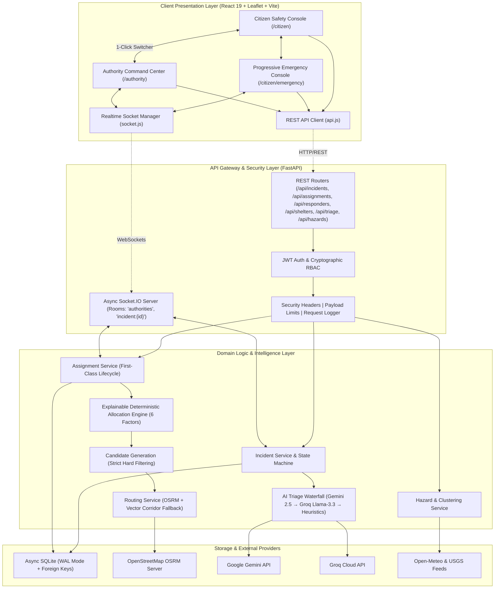

# SALVUS

### AI-Powered Disaster Intelligence & Emergency Rescue Coordination Platform

**Salvus is an operational disaster response platform that connects citizens in distress with emergency authorities through real-time geospatial intelligence, automated AI triage decision-support, explainable deterministic resource allocation, and a calm, state-focused emergency journey.**

[](https://github.com/pritesh-4/SIH-2026---SALVUS/actions)
[](#testing--verification)
[](LICENSE)
[](#tech-stack)
[](#tech-stack)

---

## The Problem

During major crises and flash disasters, response failures are rarely caused by a lack of physical rescue personnel. The primary breakdown is an acute **coordination gap** in the first crucial hours.

Emergency coordinators face overwhelming data fragmentation:

- **Fragmented Citizen Distress Reports:** Calls, SMS messages, and social media posts arrive without structure, severity classification, or reliable coordinates.
- **Uncertain Threat Severity:** Dispatchers lose critical minutes attempting to determine who requires immediate life-saving extraction versus who needs routine shelter transport.
- **Responder Availability & Capability Fit:** Matching the right specialized unit (e.g. inflatable rescue boat vs. advanced life support ambulance vs. heavy debris clearance crew) is manually slow and error-prone.
- **Geographic Coordination & Hazard Dynamics:** Dynamic flood inundation lines, impassable debris roads, and downed power lines obstruct standard transit routes.
- **Shelter Capacity Blind Spots:** Evacuees are frequently sent to facilities that have already exceeded bed capacity or run out of rations.
- **Communication Latency:** Citizens panic in the dark with zero visibility into rescue vehicle ETA or arrival milestones.

---

## The Solution

Salvus resolves the coordination gap through a synchronized, two-sided operational platform:

1. **Citizen Safety Console (`/citizen`):** A lightweight, low-bandwidth interface for citizens to broadcast geo-tagged distress beacons, report localized hazards in-app, inspect elevation-safe shelter routes, and follow a **State-Focused Progressive Disclosure Emergency Journey** from SOS to safe resolution.
2. **Authority Command Center (`/authority`):** A high-density operational cockpit for emergency coordinators to view real-time incident queues, inspect AI triage recommendations with confidence scores, calculate deterministic vehicle match rankings, dispatch specialized units with 1 click, and oversee shelter logistics.

```
Citizen Distress SOS
       ↓
Automated AI Triage & Entity Extraction
       ↓
Human Authority Verification & Approval
       ↓
Explainable Deterministic Resource Allocation
       ↓
Tactical Geospatial Routing (OSRM + Resilient Fallback)
       ↓
Realtime GPS Vessel Telemetry Sync (Socket.IO)
       ↓
Proximity Alert (<100m) & Safe Evacuation Handoff
       ↓
Evacuation Shelter Reception & Resolution
```

---

## What Makes Salvus Different

- **Deterministic & Explainable Allocation Engine:** Emergency dispatches use a mathematically transparent, auditable 6-factor formula (Capability 30%, Availability 20%, Proximity 15%, Transit ETA 15%, Workload 10%, Severity Fit 10% = Max 100). Zero LLM hallucinations dictate physical asset deployment.
- **Human-in-the-Loop Governance:** AI performs unstructured text extraction, urgency scoring, and capability recommendations, but **every dispatch order requires human dispatcher authorization**. AI never dispatches autonomously.
- **Multi-Tier AI Provider Waterfall:** AI triage degrades gracefully: **Gemini 2.5 Flash $\rightarrow$ Groq Llama-3.3-70b $\rightarrow$ Deterministic Local Heuristics**. The platform remains fully functional even during complete external AI provider outages.
- **Calm Intelligence During Chaos:** The Authority Command Center operates on an 85–90% neutral slate budget (`#080C12` base) where semantic colors communicate meaning only (Red = Critical Threat, Amber = Triage Warning, Blue = Active Selection, Green = Resolved / Safe).
- **State-Focused Progressive Disclosure:** The citizen emergency interface eliminates panic-induced cognitive overload by rendering only the single most actionable focal point per lifecycle state.
- **Cryptographic Security & RBAC:** Role-based access control (CITIZEN, AUTHORITY, RESPONDER, SYSTEM) enforced across REST endpoints and Socket.IO room subscriptions.
- **Resilient Real-time Synchronization:** Bi-directional Socket.IO WebSockets with automatic room re-subscription and state reconciliation upon reconnection.

---

## Key Features

### Citizen Experience (`/citizen`)

- **Instant Safety Status:** 2-second comprehension of personal safety level and municipal hazard advisories.
- **In-App 3-Step Hazard Reporting:** Structured hazard tickets with category tagging (Floods, Downed Lines, Debris, Trapped Persons), GPS coordinates, and deduplication locking.
- **Interactive Situational Map (`/citizen/map`):** Leaflet dark-theme radar with flood hydro-contours, emergency posts, and step-by-step shelter safe route guidance.
- **Categorized Advisories (`/citizen/alerts`):** Actionable safety guidance filtered by Critical, Warning, and Watch tiers.
- **Emergency Readiness Profile (`/citizen/profile`):** Verified identity, medical passport, speed-dial contacts, and siren tone testing.
- **8-State Progressive Emergency Journey (`/citizen/emergency`):** `SOS_ACTIVE` $\rightarrow$ `TRIAGING` $\rightarrow$ `VERIFIED` $\rightarrow$ `ASSIGNED` $\rightarrow$ `EN_ROUTE` $\rightarrow$ `NEARBY` (<100m proximity cue) $\rightarrow$ `ON_SCENE` $\rightarrow$ `RESOLVED`.

### Authority Command Center (`/authority`)

- **Operational Metrics Strip:** Live tracking of Active Incidents, Critical Threats, Fleet Deployed ratio, Available Beds, and Resolved Cases.
- **Priority Ingestion Queue:** Scan-friendly list with severity badges, category pills, elapsed time, and AI urgency indicators.
- **Tactical Geospatial Command Map:** Full-screen Leaflet OpenStreetMap surface with custom SVG vessel markers, route corridors, hazard zones, and spatial incident clusters.
- **Dedicated Incident Inspector:** Complete incident context, affected person counts, reporter notes, and lifecycle progression controls.
- **Fleet Matrix & Status Management:** Craft status (`AVAILABLE`, `ASSIGNED`, `EN_ROUTE`, `ON_SCENE`, `OFFLINE`), team leads, and VHF radio channels.
- **Shelter Logistics & Intake:** Bed capacity indicators, 72-hour supply ratings, and hazard proximity alerts.

---

## System Architecture



---

## Tech Stack

| Layer                   | Technology                           | Version                 | Purpose & Rationale                                                         |
| :---------------------- | :----------------------------------- | :---------------------- | :-------------------------------------------------------------------------- |
| **Frontend**            | React, Vite                          | `19.2.8`, `8.2.0`       | Ultra-fast rendering, instant HMR, component isolation                      |
| **Styling**             | Tailwind CSS v4, Vanilla CSS         | `4.3.3`                 | Custom design tokens, 85-90% slate neutral budget                           |
| **Backend**             | FastAPI, Python                      | `0.115+`, `3.11 / 3.12` | Asynchronous coroutines, OpenAPI schemas, Pydantic v2 validation            |
| **Database**            | SQLite via `aiosqlite`               | WAL Mode                | Zero-latency local/demo persistence, strict foreign key constraints         |
| **Realtime**            | Socket.IO (Python & JS client)       | `4.8.3`                 | Bi-directional events, room authorization (`authorities`, `incident:{id}`)  |
| **Maps & GIS**          | Leaflet, OpenStreetMap               | `1.9.4`                 | Dark-theme tactical radar, custom SVG markers, route polylines              |
| **Routing**             | OSRM Engine + Vector Fallback        | REST API                | Real-world road/corridor distance, duration, and geometry                   |
| **AI Decision Support** | Gemini 2.5 Flash, Groq Llama-3.3-70b | REST SDKs               | Unstructured parsing, urgency scoring, PII sanitization, heuristic fallback |
| **Auth & Security**     | PyJWT, Cryptography                  | HMAC-SHA256             | Cryptographic token minting, role-based access control, security headers    |
| **Code Quality**        | ESLint, Prettier, Ruff               | `10.8`, `3.9`, `0.9`    | Automated linting, code style enforcement, Git pre-commit hooks             |
| **Testing**             | Pytest, AnyIO                        | `9.1.1`                 | **204 passing automated tests** across 19 backend test suites               |

---

## Live vs. Simulated Data Provenance

Salvus maintains absolute architectural honesty regarding data sources:

| Capability                     | Classification    | Description                                                                                                                                       |
| :----------------------------- | :---------------- | :------------------------------------------------------------------------------------------------------------------------------------------------ |
| **Incident Lifecycle**         | **LIVE**          | Full database persistence, audit event logging, and WebSocket broadcast.                                                                          |
| **Assignment Lifecycle**       | **LIVE**          | Authoritative database entity with state synchronization across responder and incident.                                                           |
| **Deterministic Allocation**   | **LIVE**          | Real-time 6-factor mathematical calculation executed on live fleet coordinates.                                                                   |
| **AI Triage Evaluation**       | **HYBRID**        | **LIVE** when `GEMINI_API_KEY` or `GROQ_API_KEY` is configured; **FALLBACK** to deterministic rule-based heuristics when unconfigured or offline. |
| **OSRM Route Geometry**        | **HYBRID**        | **LIVE** real-world road routing with automatic fallback to calculated 15-waypoint vector corridors.                                              |
| **Responder GPS Movement**     | **SIMULATED**     | Deterministic GPS telemetry simulation advancing along computed route corridors.                                                                  |
| **Hazard Feed Ingestion**      | **LIVE / CACHED** | Normalized disaster signals from Open-Meteo and USGS with cached fallbacks.                                                                       |
| **Database Storage on Render** | **EPHEMERAL**     | Render Free tier SQLite resets on redeploy; `AUTO_SEED=true` populates baseline disaster grid. Persistent disk supported on Render Starter.       |

---

## Golden Demo Flow (3-Minute Script)

1. **Dual-Window Setup:** Open `/citizen` on the left and `/authority` on the right.
2. **Citizen Distress SOS:** Click **SEND SOS** on Citizen Home. Hold to confirm. Observe instant ticket creation (`#SV-2048`).
3. **Real-time Queue Arrival:** The incident appears instantly in the Authority Command Center queue and Leaflet tactical map with zero page reload.
4. **AI Triage & Verification:** Authority reviews AI situation intelligence (Urgency 9.4/10, Flash Flood, Flood Boat required) and clicks **Verify Triage**. The Citizen screen immediately updates to `VERIFIED`.
5. **Deterministic Allocation:** The system computes the top candidate unit (**NDRF Unit 4 — Alpha Team**, 94/100 score) with full explainable mathematical breakdown.
6. **Dispatch & Live Tracking:** Dispatcher clicks **Confirm Dispatch**. As the rescue vessel moves along the corridor, the citizen sees live animated vessel navigation, distance (850m), and dynamic ETA countdown (4m).
7. **Proximity Alert & Resolution:** When within 100 meters, citizen receives an urgent proximity beacon with torch signaling cues. Incident completes with safe evacuation to Salt Lake Stadium shelter.

---

## Project Structure

```
salvus/
├── .github/workflows/ci.yml       # GitHub Actions automated CI quality pipeline
├── backend/                       # Python FastAPI Backend
│   ├── app/
│   │   ├── auth/                  # JWT handler, role claims, RBAC dependencies
│   │   ├── db/                    # SQLite WAL database, migrations & seeders
│   │   ├── logging/               # Structured telemetry & request logger
│   │   ├── middleware/            # Security headers, payload limits, correlation ID
│   │   ├── models/                # Pydantic v2 schemas & domain models
│   │   ├── realtime/              # Socket.IO async server & room manager
│   │   ├── routes/                # REST endpoints (incidents, assignments, responders, etc.)
│   │   ├── services/              # Domain logic (allocation engine, routing, AI, triage)
│   │   └── main.py                # ASGI combined application entrypoint
│   ├── tests/                     # 19 test suites (204 automated tests)
│   ├── .env.example               # Backend environment variables template
│   └── requirements.txt           # Python dependencies
├── docs/                          # Comprehensive Technical Documentation System
│   ├── ARCHITECTURE.md            # System architecture & component design
│   ├── PRODUCT.md                 # Product strategy, personas & workflows
│   ├── API.md                     # REST & WebSocket API contracts
│   ├── DATABASE.md                # SQLite WAL schema, ER diagrams & migrations
│   ├── REALTIME.md                # Socket.IO room architecture & event catalogue
│   ├── AI_ARCHITECTURE.md         # 3-tier AI waterfall & human verification model
│   ├── SECURITY.md                # Cryptographic RBAC, headers & privacy controls
│   ├── DEPLOYMENT.md              # Vercel & Render production deployment guide
│   ├── GEO_AND_ROUTING.md         # Leaflet, OSRM routing & fallback corridors
│   ├── UX_GUIDELINES.md           # Calm intelligence design system & color budget
│   ├── TESTING.md                 # Quality verification benchmarks & test counts
│   ├── DEMO.md                    # Hackathon judging script & failure recovery
│   ├── ROADMAP.md                 # Project milestones & completed deliverables
│   └── DECISIONS.md               # Architecture Decision Records (ADR-001 to ADR-014)
├── src/                           # React 19 Frontend
│   ├── components/                # Authority, citizen & shared common components
│   ├── data/                      # Fixtures & reference data
│   ├── features/                  # Domain feature hooks (incidents, fleet, shelters, dispatch)
│   ├── layouts/                   # AuthorityLayout and CitizenLayout shells
│   ├── lib/                       # Realtime socket, geolocation & theme tokens
│   ├── pages/                     # SPA route views (Citizen & Authority pages)
│   └── services/                  # Frontend REST API client & OSRM routing service
├── package.json                   # Frontend dependencies and scripts
├── render.yaml                    # Render Blueprint (Infrastructure as Code)
├── vercel.json                    # Vercel SPA routing configuration
└── vite.config.js                 # Vite build configuration
```

---

## Local Development

### Prerequisites

- **Node.js:** `20.x LTS` or higher
- **npm:** `10.x` or higher
- **Python:** `3.11` or `3.12`

### 1. Frontend Setup

```bash
# 1. Install dependencies
npm ci

# 2. Configure environment
cp .env.example .env

# 3. Start Vite dev server
npm run dev

# 4. Run quality checks
npm run lint
npm run format:check
npm run build
```

### 2. Backend Setup

```bash
# 1. Navigate to backend directory
cd backend

# 2. Create and activate virtual environment
python -m venv venv
# On Windows:
.\venv\Scripts\activate
# On Linux/macOS:
source venv/bin/activate

# 3. Install dependencies
pip install -r requirements.txt

# 4. Configure environment
cp .env.example .env

# 5. Start the FastAPI + Socket.IO server
uvicorn app.main:combined_asgi_app --reload --host 0.0.0.0 --port 8000
```

---

## Environment Variables

### Frontend (`.env`)

| Variable            | Required | Default                 | Description                                    |
| :------------------ | :------- | :---------------------- | :--------------------------------------------- |
| `VITE_API_URL`      | Yes      | `http://localhost:8000` | Backend REST API endpoint URL                  |
| `VITE_WS_URL`       | Yes      | `http://localhost:8000` | Realtime Socket.IO server URL                  |
| `VITE_MAPBOX_TOKEN` | Optional | `""`                    | Optional Mapbox token for custom raster layers |

### Backend (`backend/.env`)

| Variable         | Required | Default                           | Security Level | Description                                        |
| :--------------- | :------- | :-------------------------------- | :------------- | :------------------------------------------------- |
| `ENVIRONMENT`    | Yes      | `development`                     | Public Config  | Server runtime mode (`development` / `production`) |
| `PORT`           | Yes      | `8000`                            | Public Config  | ASGI server listen port                            |
| `HOST`           | Yes      | `0.0.0.0`                         | Public Config  | Network bind interface                             |
| `CORS_ORIGIN`    | Yes      | `*`                               | Server Config  | Allowed CORS origins (comma-separated in prod)     |
| `DATABASE_PATH`  | Yes      | `data/salvus.db`                  | Server Config  | SQLite database file location                      |
| `AUTO_SEED`      | Yes      | `true`                            | Public Config  | Auto-seed disaster response baseline on fresh DB   |
| `SECRET_KEY`     | Optional | Auto-generated                    | Server Secret  | HMAC-SHA256 signing secret for JWT tokens          |
| `OSRM_BASE_URL`  | Yes      | `https://router.project-osrm.org` | Server Config  | OSRM routing engine API base URL                   |
| `GEMINI_API_KEY` | Optional | `""`                              | Server Secret  | Google Gemini API key for live AI triage           |
| `GROQ_API_KEY`   | Optional | `""`                              | Server Secret  | Groq Cloud API key for Llama-3.3 fallback          |
| `OPENAI_API_KEY` | Optional | `""`                              | Server Secret  | Optional OpenAI API key                            |

---

## Production Deployment

### Frontend $\rightarrow$ Vercel

1. Connect the Git repository to Vercel.
2. Framework preset: **Vite**.
3. Build command: `npm run build`, Output directory: `dist`.
4. Set environment variables: `VITE_API_URL` and `VITE_WS_URL` pointing to your Render backend URL.
5. SPA rewrites are automatically handled via [`vercel.json`](vercel.json).

### Backend $\rightarrow$ Render

1. Use the included [`render.yaml`](render.yaml) blueprint or create a Python Web Service.
2. Root directory: `backend`.
3. Build command: `pip install --upgrade pip && pip install -r requirements.txt`.
4. Start command: `uvicorn app.main:combined_asgi_app --host 0.0.0.0 --port $PORT --proxy-headers --forwarded-allow-ips='*'`.
5. Health check path: `/health`.

> [!IMPORTANT]
> **Database Persistence Notice:**
> On the Render Free tier, the filesystem is ephemeral and resets on service restarts. The `AUTO_SEED=true` flag automatically reseeds the active disaster response grid. For permanent production persistence, mount a Render Persistent Disk at `/var/data` and set `DATABASE_PATH=/var/data/salvus.db`.

---

## Testing & Verification

The codebase includes an extensive automated testing suite:

```bash
# Run full backend test suite (204 tests)
cd backend
pytest -v

# Run linting and code style checks
ruff check app tests
ruff format --check app tests
```

### Verified Test Benchmark:

- **Total Backend Tests:** **204 Passing** (0 failures, 0 errors)
  - `test_state_machine.py`: 64 tests (Complete finite state machine transitions)
  - `test_security_hardening.py`: 11 tests (JWT authentication & RBAC)
  - `test_allocation_engine.py`: 10 tests (Deterministic 6-factor scoring)
  - `test_candidate_generation.py`: 11 tests (Eligibility hard filtering)
  - `test_routing_service.py`: 14 tests (OSRM integration & fallback corridor)
  - `test_ai_triage.py`: 14 tests (Schema validation & PII sanitization)
  - `test_assignments_api.py`: 11 tests (Assignment domain REST endpoints)
  - `test_async_intelligence.py`: 10 tests (Async telemetry & worker tasks)
  - `test_phase5_intelligence.py`: 9 tests (Grounded situation summary)
  - `test_responders_api.py`: 8 tests (Fleet management & lifecycle)
  - `test_incident_api.py`: 14 tests (Distress beacon ingestion)
  - `test_shelters_api.py`: 6 tests (Shelter logistics & bed capacity)
  - `test_production_deployment.py`: 6 tests (Render health & CORS config)
  - `test_realtime_assignment_sync.py`: 4 tests (WebSocket assignment sync)
  - `test_realtime_dispatch_loop.py`: 3 tests (End-to-end realtime lifecycle)
  - `test_disaster_intelligence.py`: 5 tests (Normalized hazard feeds)
  - `test_assignment_flow.py`: 4 tests (Transactional state consistency)

---

## Technical Documentation Index

For complete in-depth architectural manuals, refer to the [`docs/`](docs/) directory:

- 📐 **[ARCHITECTURE.md](docs/ARCHITECTURE.md):** Layer boundaries, Mermaid flowcharts, and component design.
- 🎯 **[PRODUCT.md](docs/PRODUCT.md):** User personas, problem definition, and decision rationale.
- 🔌 **[API.md](docs/API.md):** Complete REST endpoints and WebSocket event specifications.
- 🗄️ **[DATABASE.md](docs/DATABASE.md):** SQLite WAL schema, ER diagrams, indexes, and migrations.
- ⚡ **[REALTIME.md](docs/REALTIME.md):** Socket.IO room architecture, event catalogue, and out-of-order guards.
- 🤖 **[AI_ARCHITECTURE.md](docs/AI_ARCHITECTURE.md):** 3-tier AI waterfall, schema validation, PII redaction, and human verification.
- 🛡️ **[SECURITY.md](docs/SECURITY.md):** Cryptographic JWT authentication, RBAC matrix, and security headers.
- 🚀 **[DEPLOYMENT.md](docs/DEPLOYMENT.md):** Production hosting guide for Vercel and Render.
- 🗺️ **[GEO_AND_ROUTING.md](docs/GEO_AND_ROUTING.md):** Geospatial engine, Leaflet radar, OSRM routing, and fallback corridors.
- 🎨 **[UX_GUIDELINES.md](docs/UX_GUIDELINES.md):** Calm intelligence design system, color budget, and accessibility.
- 🧪 **[TESTING.md](docs/TESTING.md):** Quality verification benchmarks and test execution guides.
- 🎬 **[DEMO.md](docs/DEMO.md):** Judge-ready Golden Demo presentation script and simulation controls.
- 🗺️ **[ROADMAP.md](docs/ROADMAP.md):** Milestone tracking from completed deliverables to future horizons.
- ⚖️ **[DECISIONS.md](docs/DECISIONS.md):** 14 Architecture Decision Records (ADRs).

---

## Team

- **Pritesh** — Lead Software & Systems Architect, Full-Stack Engineer, AI & Geospatial Integration Engineer
- _Salvus Emergency Engineering Team_

---

## License

This project is licensed under the terms of the **[MIT License](LICENSE)**.
