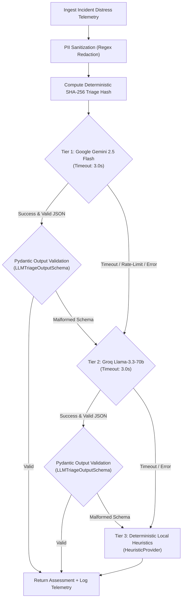

# AI_ARCHITECTURE.md — AI Decision Support & Triage Waterfall

This document specifies the operational role of Artificial Intelligence in Salvus, the 3-tier provider waterfall, PII sanitization protocols, strict output validation schemas, telemetry logging, and the mandatory human-in-the-loop verification model.

---

## 1. Core Principle: AI DOES NOT DISPATCH

In emergency rescue coordination, life-safety decisions require absolute predictability, transparency, and legal auditability.

```
┌─────────────────────────────────────────────────────────────────────────┐
│                      SALVUS OPERATIONAL BOUNDARY                        │
├─────────────────────────────────────────────────────────────────────────┤
│ 🤖 GENERATIVE AI LAYER     │ Extracts unstructured data, assesses threat│
│                            │ urgency, and suggests required capability. │
├────────────────────────────┼────────────────────────────────────────────┤
│ ⚖️ DETERMINISTIC ALLOCATION│ Calculates mathematically explainable      │
│                            │ craft match scores based on 6 factors.     │
├────────────────────────────┼────────────────────────────────────────────┤
│ 🛡️ HUMAN DISPATCHER        │ Retains 100% exclusive command authority   │
│                            │ to approve, adjust, or override dispatches.│
└────────────────────────────┴────────────────────────────────────────────┘
```

**Zero Autonomous Dispatch:** Under no circumstances does an AI model directly deploy rescue craft, mutate responder operational statuses, or close distress beacons.

---

## 2. Multi-Tier AI Provider Waterfall

Salvus implements a resilient 3-tier provider waterfall orchestrated by `AIService` (`backend/app/services/ai/service.py`):



### Waterfall Providers:

1. **Tier 1: `GeminiProvider` (Primary Cloud Engine)**
   - Model: `gemini-2.5-flash`
   - Role: High-speed multimodal understanding, rapid JSON generation, complex entity extraction.
   - Timeout: 3.0 seconds.
2. **Tier 2: `GroqProvider` (Secondary Cloud Fallback)**
   - Model: `llama-3.3-70b-versatile`
   - Role: Ultra-low latency LPU inference serving as resilient failover when Gemini API keys are unconfigured or rate-limited.
   - Timeout: 3.0 seconds.
3. **Tier 3: `HeuristicProvider` (Zero-Dependency Offline Baseline)**
   - Model: `deterministic-rule-v2`
   - Role: Local keyword extraction, regex threat mapping, and deterministic urgency scoring.
   - Characteristics: 100% offline uptime, zero external API keys required, zero latency.

---

## 3. PII Sanitization & Privacy Safeguards

Before any incident description is transmitted to external AI providers (Gemini or Groq), the payload passes through `sanitize_incident_for_ai` (`backend/app/services/ai/base.py`):

```python
# 1. Redact Government / Personal ID Numbers (12-digit grouped sequences)
sanitized = re.sub(r"\b\d{4}[-\s]\d{4}[-\s]\d{4}\b", "[ID REDACTED]", text)

# 2. Redact Email Addresses
sanitized = re.sub(r"[\w\.-]+@[\w\.-]+\.\w+", "[EMAIL REDACTED]", sanitized)

# 3. Redact Domestic and International Phone Numbers
sanitized = re.sub(
    r"(\+?\d{1,4}[-.\s]?)?\(?\d{2,4}\)?[-.\s]?\d{3,5}[-.\s]?\d{3,5}\b",
    "[PHONE REDACTED]",
    sanitized,
)
```

**Privacy Boundary:** Citizen names, phone numbers, exact residential unit addresses, and private medical identifiers are **never transmitted to external LLM APIs**.

---

## 4. Strict Pydantic Output Validation Contract

Generative models frequently output unpredictable keys or malformed structures. Salvus enforces a strict Pydantic v2 schema contract (`LLMTriageOutputSchema`). Any model output violating these rules is instantly rejected, triggering waterfall fallback to the next provider:

```python
class LLMTriageOutputSchema(BaseModel):
    severity_level: int = Field(ge=1, le=5)  # 1=LOW, 2=MODERATE, 3=HIGH, 4=CRITICAL, 5=LIFE_THREATENING
    recommended_capability: ResponderCapability  # FLOOD_BOAT, AMBULANCE, STRETCHER_TEAM, HAZMAT, DEBRIS_CLEAR
    priority_reasoning: str = Field(min_length=5, max_length=1500)
    confidence: float = Field(ge=0.0, le=1.0)
    uncertainty_flags: list[str] = Field(default_factory=list)
    incident_type: IncidentType = Field(default=IncidentType.OTHER)
    hazard_type: str | None = Field(default=None, max_length=200)
    key_signals: list[str] = Field(default_factory=list)
    affected_people: int | None = Field(default=None, ge=1, le=100000)
    damage_type: str | None = None
    hazard_detected: str | None = None
    water_depth_estimate: str | None = None
    image_assessment_hint: str | None = None
```

### Visual Multimodal Tagging Invariant:

Any visual estimate derived from attached imagery is strictly tagged with:
`AI ESTIMATE — UNVERIFIED: [Visual Damage Assessment]`
This ensures dispatchers never mistake visual AI predictions for verified ground surveys.

---

## 5. Deterministic Triage Hashing (`compute_triage_hash`)

To prevent redundant LLM invocations when an incident has not changed, the system computes a SHA-256 payload hash:

$$\text{Hash} = \text{SHA256}(\text{type} + \text{severity} + \text{description} + \text{affected\_count} + \text{is\_sos} + \text{latitude} + \text{longitude})[:16]$$

If an incoming evaluation request has a matching `triage_hash` in the database, the cached assessment is reused instantly.

---

## 6. Structured Telemetry Logging (`log_ai_telemetry`)

Every AI evaluation attempt writes structured telemetry for operational monitoring:

```json
{
  "timestamp": "2026-08-27T12:01:04.120Z",
  "event": "AI_TRIAGE_TELEMETRY",
  "incident_id": "909ec355-6bcf-46d4-a035-71fa2e022f42",
  "provider": "GeminiProvider",
  "model": "gemini-2.5-flash",
  "latency_ms": 412.5,
  "success": true,
  "fallback": false,
  "confidence": 0.94,
  "request_id": "req-89a1b2c3"
}
```

---

## 7. Human-in-the-Loop Verification Protocol

```
[Distress Report Ingested]
           │
           ▼
[AI Triage Assessment Generated (Urgency: 9.4/10, Capability: FLOOD_BOAT)]
           │
           ▼
[Authority Command Center Inspector Card Renders AI Assessment]
           ├── Dispatcher confirms: [POST /api/triage/verify/{id}] ──► Status: VERIFIED
           └── Dispatcher overrides: [POST /api/triage/adjust/{id}] ──► Status: VERIFIED (Adjusted)
```

1. **AI State Tagging:** Incidents display an `AI: AVAILABLE` badge when analysis completes.
2. **Review Flag:** If `confidence < 0.75` or `uncertainty_flags` contains items, the card displays a prominent `NEEDS HUMAN REVIEW` warning banner.
3. **Operator Overrides:** Operators can modify the recommended vehicle capability, adjust the severity tier, and add tactical notes before confirming verification.
4. **Audit Trail:** The decision, reviewing operator ID, and any adjustments are permanently logged to the `ai_triage_assessments` database table.
