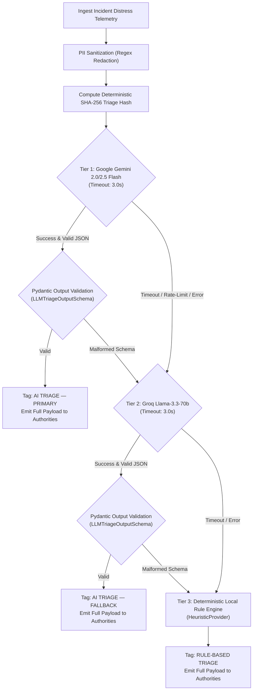

# AI_ARCHITECTURE.md — AI Decision Support & Triage Waterfall

This document specifies the operational role of Artificial Intelligence in Salvus, the 3-tier provider waterfall with formal provenance tagging, facts vs. inference separation, PII sanitization protocols, strict output validation schemas, concurrency safeguards, citizen privacy decoupling, and the mandatory human-in-the-loop verification model.

---

## 1. Core Principle: AI ACCELERATES UNDERSTANDING, AI NEVER DISPATCHES

In emergency rescue coordination, life-safety decisions require absolute predictability, transparency, and legal auditability.

```
┌─────────────────────────────────────────────────────────────────────────┐
│                      SALVUS OPERATIONAL BOUNDARY                        │
├─────────────────────────────────────────────────────────────────────────┤
│ 🤖 GENERATIVE AI LAYER     │ Extracts unstructured data, assesses threat│
│                            │ urgency, highlights reported evidence vs   │
│                            │ inference, and recommends craft capability.│
├────────────────────────────┼────────────────────────────────────────────┤
│ ⚖️ DETERMINISTIC SAFEGUARD │ Validates schemas, enforces coordinate     │
│                            │ immutability, and controls race conditions.│
├────────────────────────────┼────────────────────────────────────────────┤
│ 🛡️ HUMAN DISPATCHER        │ Retains 100% exclusive command authority   │
│                            │ to verify, adjust, or dispatch responders. │
└────────────────────────────┴────────────────────────────────────────────┘
```

**Zero Autonomous Dispatch Invariants:**

1. **AI never dispatches responders:** Recommendations are presented to authority dispatchers with clear disclaimer notices.
2. **AI never creates geographic truth:** Citizen GPS coordinates (`latitude`, `longitude`) are immutable and cannot be overwritten by LLM hallucinations.
3. **AI never invents casualties or conditions:** Headcount and physical distress reports are extracted strictly from citizen reports or marked as unconfirmed estimates.
4. **AI never overrides human authority:** Dispatcher adjustments permanently supersede AI suggestions.

---

## 2. Multi-Tier AI Provider Waterfall & Provenance Labels

Salvus implements a resilient 3-tier provider waterfall orchestrated by `AIService` (`backend/app/services/ai/service.py`) with formal operational provenance:



### Waterfall Tiers & Provenance Labels:

1. **Tier 1: `GeminiProvider` (`AI TRIAGE — PRIMARY`)**
   - Models: `gemini-2.0-flash` / `gemini-2.5-flash`
   - Role: High-speed multimodal understanding, rapid JSON generation, complex entity extraction.
   - Timeout: 3.0 seconds.
2. **Tier 2: `GroqProvider` (`AI TRIAGE — FALLBACK`)**
   - Model: `llama-3.3-70b-versatile`
   - Role: Ultra-low latency LPU inference serving as resilient failover when Gemini API keys are unconfigured or rate-limited.
   - Timeout: 3.0 seconds.
3. **Tier 3: `HeuristicProvider` (`RULE-BASED TRIAGE`)**
   - Model: `salvus-deterministic-rules-v1`
   - Role: Local keyword extraction, regex threat mapping, deterministic urgency scoring, and transparent uncertainty estimation.
   - Characteristics: 100% offline uptime, zero external API keys required, zero latency.

---

## 3. Facts vs. Inference Separation

To eliminate cognitive bias and prevent dispatchers from acting on ungrounded model hallucinations, Salvus strictly partitions the decision-support payload into two distinct components:

1. **Reported Conditions (Grounded Facts):** Concrete statements extracted directly from the caller's text or voice report (e.g., _"Ground floor inundated 1.2m"_, _"3 individuals reported trapped on roof"_, _"Elderly patient cannot walk"_).
2. **AI Inference & Reasoning:** The model's synthesis explaining why a specific severity and responder capability was recommended based on those grounded facts.

---

## 4. Honest Qualitative Confidence & Uncertainty Modeling

Rather than manufacturing false precision (such as arbitrary percentages like 97.4%), Salvus calibrates confidence into clear qualitative tiers:

| Confidence Tier         | Criteria              | Meaning to Operator                                                          |
| :---------------------- | :-------------------- | :--------------------------------------------------------------------------- |
| **High Confidence**     | $\ge 0.80$            | Clear signals, explicit hazard keywords, and corroborated ground indicators. |
| **Moderate Confidence** | $0.60 - 0.79$         | Partial context provided; standard dispatch verification recommended.        |
| **Low / Needs Review**  | $< 0.60$ or Ambiguous | Sparse report text or conflicting details; operator review required.         |

### Explicit Uncertainty Flags:

The system automatically attaches visible caveats, including:

- _"Water depth and flood extent are self-reported by caller"_
- _"Reported affected count is unconfirmed by field responders"_
- _"Location accuracy is approximate based on mobile GPS estimate"_
- _"Limited reporter text detail provided"_

---

## 5. Concurrency Control & Race Condition Safeguards

In asynchronous emergency workflows, incidents may be resolved, cancelled, or updated while an AI evaluation task is executing in the background. Salvus enforces strict concurrency guards in `backend/app/services/async_triage_task.py`:

1. **Per-Incident Async Locks:** `_incident_locks[incident_id]` guarantees only one triage calculation executes per incident at any moment.
2. **Resolution / Cancellation Race Guard:** Right before persisting results, the worker re-queries the database. If `status in ("RESOLVED", "CANCELLED")`, the AI assessment is safely discarded, avoiding resurrecting closed incidents.
3. **Stale Calculation Guard:** If the incident description was modified during evaluation (causing `current_hash` mismatch), the stale calculation is discarded without overwriting newer state.

---

## 6. Citizen Privacy & Realtime Socket Decoupling

Citizen distress interfaces and Authority command dashboards require completely different information architectures:

```
[emit_incident_triage_updated]
           │
           ├──► [room: "authorities"]
           │    └── Full Decision Support Payload (source_label, reasoning, confidence, signals, hints)
           │
           └──► [room: "incident:{id}"]
                └── Reassuring Operational Progress Only:
                    {"ticket_id": "SV-104", "ai_state": "AVAILABLE", "status_message": "Your emergency distress details are actively being reviewed by response dispatch."}
```

**Privacy Boundary:** Citizen rooms receive **zero raw AI internals**, zero internal model reasoning, and zero provider telemetry.

---

## 7. PII Sanitization & Privacy Safeguards

Before any incident description is transmitted to external cloud AI providers (Gemini or Groq), the payload passes through `sanitize_incident_for_ai` (`backend/app/services/ai/base.py`):

```python
# 1. Redact Government / Personal ID Numbers (12-digit grouped sequences)
sanitized = re.sub(r"\b\d{4}[-\s]\d{4}[-\s]\d{4}\b", "[ID REDACTED]", text)

# 2. Redact Email Addresses
sanitized = re.sub(r"[\w\.-]+@[\w\.-]+\.\w+", "[EMAIL REDACTED]", sanitized)

# 3. Redact Domestic and International Phone Numbers
sanitized = re.sub(
    r"(\+?\d{1,4}[-.\s]?)?\(?\d{2,4}\)?[-.\s]?\d{3,5}[-.\s]?\d{3,5}\b",
    "[PHONE REDACTED]",
    sanitized,
)
```

---

## 8. Strict Pydantic Output Validation Contract

Salvus enforces a strict Pydantic v2 schema contract (`LLMTriageOutputSchema`). Any model output violating these rules is instantly rejected, triggering waterfall fallback:

```python
class LLMTriageOutputSchema(BaseModel):
    severity_level: int = Field(ge=1, le=5)  # 1=LOW, 2=MODERATE, 3=HIGH, 4=CRITICAL, 5=LIFE_THREATENING
    recommended_capability: ResponderCapability  # FLOOD_BOAT, AMBULANCE, STRETCHER_TEAM, HAZMAT, DEBRIS_CLEAR
    priority_reasoning: str = Field(min_length=5, max_length=1500)
    confidence: float = Field(ge=0.0, le=1.0)
    uncertainty_flags: list[str] = Field(default_factory=list)
    incident_type: IncidentType = Field(default=IncidentType.OTHER)
    hazard_type: str | None = Field(default=None, max_length=200)
    key_signals: list[str] = Field(default_factory=list)
    reported_conditions: list[str] = Field(default_factory=list)
    affected_people: int | None = Field(default=None, ge=1, le=100000)
    damage_type: str | None = None
    hazard_detected: str | None = None
    water_depth_estimate: str | None = None
    image_assessment_hint: str | None = None
```

---

## 9. Human-in-the-Loop Verification Protocol

```
[Distress Report Ingested]
           │
           ▼
[AI Triage Assessment Generated (Urgency: CRITICAL, Capability: FLOOD_BOAT)]
           │
           ▼
[Authority Command Center Inspector Card Renders AI Assessment]
           ├── Dispatcher confirms: [POST /api/triage/verify/{id}] ──► Status: VERIFIED
           └── Dispatcher overrides: [POST /api/triage/adjust/{id}] ──► Status: VERIFIED (Adjusted)
```

1. **AI State Tagging:** Incidents display an `AI: AVAILABLE` badge when analysis completes.
2. **Review Flag:** If `confidence < 0.75` or `uncertainty_flags` contains items, the card displays a prominent `NEEDS HUMAN REVIEW` badge.
3. **Operator Overrides:** Operators can modify the recommended vehicle capability, adjust the severity tier, and add tactical justification notes before confirming verification.
4. **Audit Trail:** The decision, reviewing operator ID, and any adjustments are permanently logged to the `ai_triage_assessments` database table.
