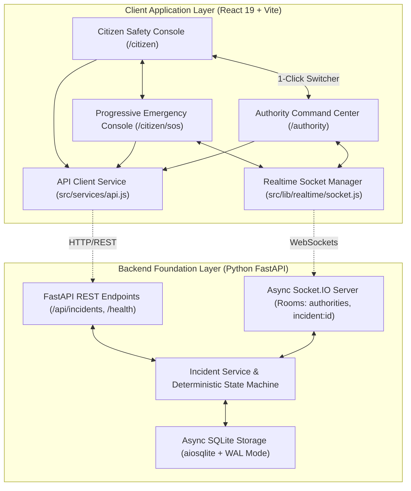

# ARCHITECTURE.md - System Architecture & Component Design

This document details the architectural layout, component boundaries, state management models, and backend foundation of the Salvus platform.

---

## 1. System Architecture Diagram



---

## 2. Realtime Pipeline Architecture

```
CITIZEN (Browser A)
  │
  ├── 1. POST /api/incidents (SOS or Hazard Report)
  │      │
  │      ▼
  │   FASTAPI BACKEND
  │      │
  │      ├── 2. Persist Incident & CREATED Audit Event in SQLite
  │      │
  │      └── 3. Broadcast `incident:new` over Socket.IO (Room: "authorities")
  │             │
  │             ▼
  │         AUTHORITY COMMAND CENTER (Browser B)
  │             │
  │             ├── 4. Incident Queue prepends item + updates counter
  │             ├── 5. Tactical Map adds live GPS marker
  │             └── 6. Operator inspects & clicks "Verify" or "Resolve"
  │                    │
  │                    ▼
  │                 PATCH /api/incidents/{id}/status
  │                    │
  │                    ├── 7. State Machine validates transition
  │                    ├── 8. Persist STATUS_CHANGE Event
  │                    └── 9. Broadcast `incident:status_changed`
  │                           (Rooms: "authorities" & "incident:{id}")
  │                           │
  │                           ├── Update Authority Dashboard
  │                           └── CITIZEN EMERGENCY (Browser A updates live without reload!)
```

---

## 3. Frontend Architecture

```
src/
├── layouts/
│   ├── CitizenLayout.jsx          # Top Navbar + Mobile BottomNav + Outlet
│   └── AuthorityLayout.jsx        # Command Bar + Grid Status + Portal Switcher + Outlet
├── pages/
│   ├── CitizenHome.jsx            # Safety status, live SOS trigger, hazard report modal
│   ├── CitizenMap.jsx             # Situational radar + Safe Route Briefing modal
│   ├── CitizenAlerts.jsx          # Categorized advisory stream & safety recommendations
│   ├── CitizenProfile.jsx         # Identity, medical passport, contacts, siren test
│   ├── CitizenEmergency.jsx       # State-focused progressive emergency experience with live sync
│   └── AuthorityCommandCenter.jsx # Realtime metrics, live incident queue, tactical map, inspector
├── components/citizen/
│   ├── IncidentReportModal.jsx    # Live in-app hazard reporting connected to backend API
│   ├── emergency/
│   │   ├── AiTriageCard.jsx       # AI classification & dispatcher approval stamp
│   │   ├── EmergencyCancelModal.jsx # Cancellation confirmation safeguard
│   │   ├── EmergencyConfirmationModal.jsx # SOS hold-to-confirm modal
│   │   ├── EmergencyDemoControls.jsx # Collapsible simulator dock + live backend SOS trigger
│   │   ├── EmergencyHeader.jsx    # Incident ID, phase badge, direct 112 trigger
│   │   ├── EmergencyInstructionCard.jsx # Context-aware safety guidance
│   │   ├── EmergencyStatusCard.jsx # Hero status & 3-part operational clarity grid
│   │   ├── EmergencyTimeline.jsx  # Live incident progression audit log
│   │   ├── LocationStatusBanner.jsx # GPS telemetry + Grid network health badges
│   │   ├── RescueRadarMap.jsx     # Tactical rescue radar + moving vessel vector
│   │   └── ResponderPreviewCard.jsx # Responder details, specs, ETA, radio link
├── features/
│   ├── authority/
│   │   └── useAuthorityIncidents.js # Realtime incident queue, selection, and socket sync
│   └── citizen/emergency/
│       └── useEmergencyState.js     # Live emergency lifecycle hook with Socket.IO room sync
├── lib/
│   ├── location.js                # Battery-conscious browser geolocation & emergency tracking
│   └── realtime/
│       └── socket.js              # Singleton Socket.IO connection and subscription manager
└── services/
    └── api.js                     # Centralized Axios REST client for incidents API
```

---

## 4. Emergency Lifecycle State Machine

The central state machine enforces deterministic, unidirectional progression across the complete emergency lifecycle:

$$\text{NEW} \rightarrow \text{TRIAGE\_PENDING} \rightarrow \text{VERIFIED} \rightarrow \text{RESOLVED}$$

- **Guarded Transitions:** Impossible backward jumps or state skipping are prevented and validated on both API and domain layers.
- **Cancellation Safe Harbor:** Any active non-terminal state can transition to `CANCELLED` via a confirmation safeguard, allowing the citizen/authority to stand down while recording the audit event.
- **Terminal States:** `RESOLVED` and `CANCELLED` lock the incident against further status mutations.
