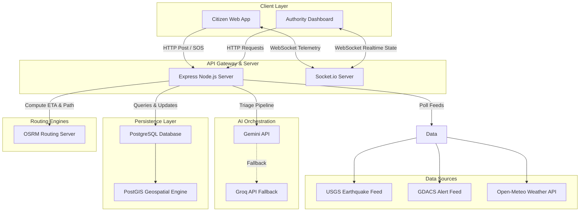

# ARCHITECTURE.md - System Architecture & Data Flow

This document details the architectural layout of the Salvus platform.

## 1. System Architecture Diagram

---

## 2. Component Designations

### Frontend App (Vite + React)
- **Role:** Interactive UI for citizens and authority users.
- **State Management:** Zustand manages application states (e.g. active incident feeds, responder tracks).
- **Caching:** React Query manages API caching and limits network congestion.

### Backend Server (Node.js + Express)
- **Role:** Implements HTTP routes and handles client requests.
- **WebSockets:** Socket.io handles continuous state synchronization, map overlays, and incident telemetry.

### Geospatial DB (Supabase/PostgreSQL + PostGIS)
- **Role:** Stores user records, shelter capacities, incident details, and coordinate indexes.
- **PostGIS:** Computes spatial queries like nearest-neighbor shelter lookup and responder distance metrics.

### AI Processing Node
- **Role:** Categorizes, ranks, and aggregates incoming notifications.
- **Fail-Safe Processing:** If Gemini times out, the server falls back to Groq, then to basic keyword match strings if both fail.
