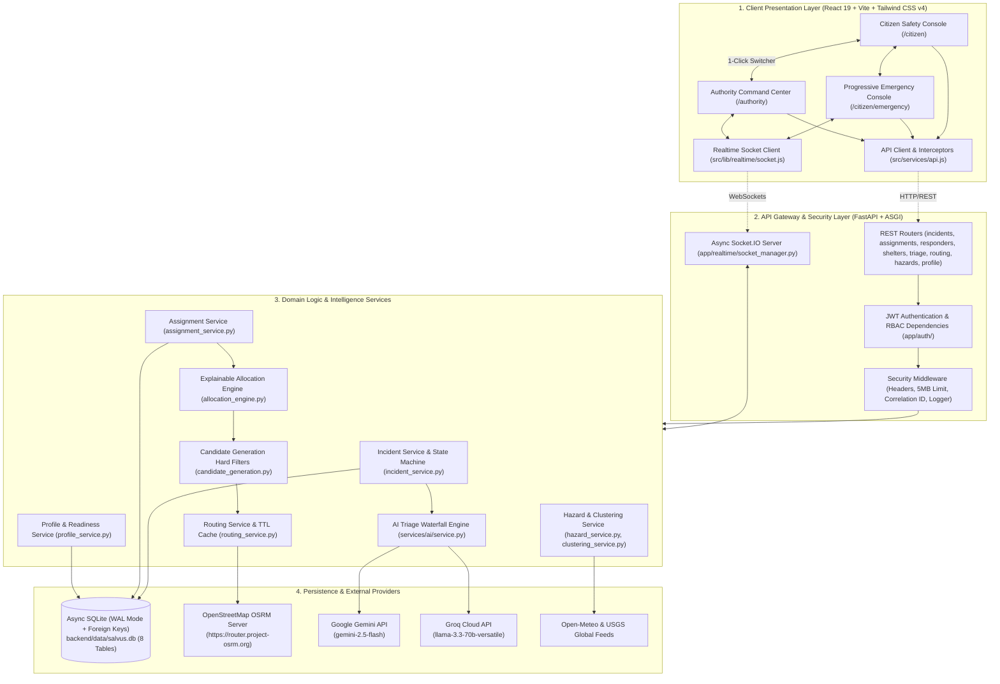
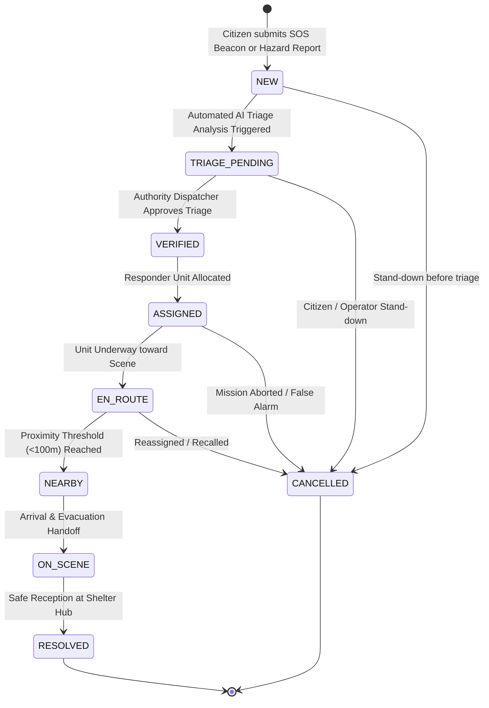
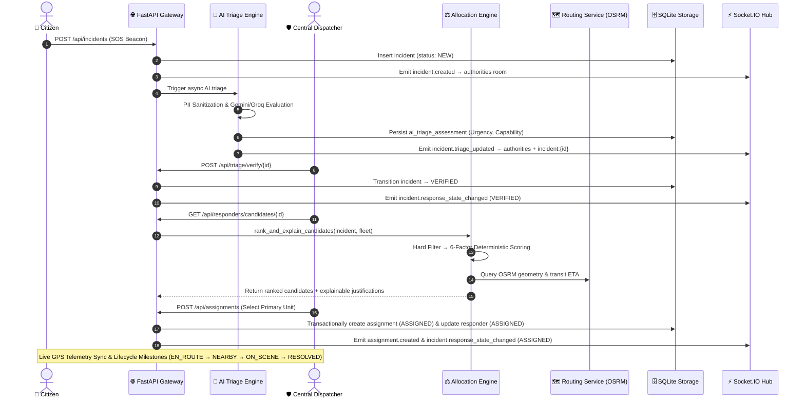
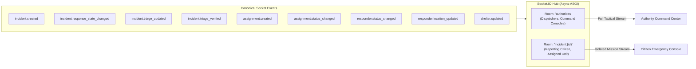

# ARCHITECTURE.md — System Architecture & Component Design

This document details the architectural layout, layer boundaries, domain models, finite state machines, realtime communication topologies, and verified code references for the Salvus platform.

---

## 1. System Architecture Overview

Salvus is organized as a decoupled, multi-tier disaster intelligence and rescue coordination platform.

---

## 2. Layer Responsibilities & Boundaries

### 2.1 Client Presentation Layer (`src/`)

- **Dual-Portal Orchestration:** Runs as a single-page React 19 application hosting both the Citizen Safety Console (`/citizen`, `/citizen/map`, `/citizen/alerts`, `/citizen/profile`, `/citizen/emergency`) and the Authority Command Center (`/authority`).
- **Emergency Readiness System (`/citizen/profile`):** Replaces static profiles with live persistent identity, single-primary emergency contact management, medical records, privacy controls, and a real Web Audio emergency siren test tone.
- **Offline Readiness & Emergency Pass Engine:** Caches minimal essential emergency data on device for zero-connectivity rescue desks with automated staleness detection (`SAVED`, `NEEDS_UPDATE`, `NOT_SAVED`).
- **Cross-System SOS Integration:** Seamlessly feeds citizen profile identity, medical alerts, and primary contacts into the live SOS distress pipeline (`useEmergencyState.js`).
- **Domain State Hooks:** Isolates remote server state, caching, and WebSocket subscriptions into clean feature modules (`src/features/authority/` and `src/features/citizen/`).
- **State-Focused Progressive Disclosure:** Elevates only the single most critical focal point per emergency lifecycle milestone, eliminating cognitive overload for panic-stricken citizens.
- **Strict Color Budget:** Authority Command Center adheres to an 85–90% neutral slate budget (`#080C12` base) with semantic colors reserved exclusively for operational meaning.

### 2.2 API Gateway & Security Layer (`backend/app/routes/`, `backend/app/auth/`, `backend/app/middleware/`)

- **Cryptographic RBAC:** Enforces HMAC-SHA256 JWT claims across four distinct roles: `CITIZEN`, `AUTHORITY`, `RESPONDER`, `SYSTEM`.
- **Defensive Middleware:**
  - `SecurityHeadersMiddleware`: Injects HSTS, CSP, `X-Frame-Options: DENY`, `X-Content-Type-Options: nosniff`.
  - `PayloadLimitMiddleware`: Strictly rejects requests $> 5\text{ MB}$ to prevent DoS attacks.
  - `CorrelationIdMiddleware`: Generates and propagates `X-Request-ID` across logs and responses.
  - `RequestLoggingMiddleware`: Logs request timing, status codes, and IP addresses.

### 2.3 Domain Services Layer (`backend/app/services/`)

- **Profile & Emergency Readiness Service:** Manages persistent citizen identity, emergency contacts with single-primary enforcement, medical records, and privacy preferences.
- **Incident Service:** Enforces finite state machine transitions, audit event history, and duplicate report deduplication (4-second window).
- **Assignment Service:** Manages responder-to-incident allocations as an authoritative first-class entity with synchronized state commits.
- **Explainable Allocation Engine:** Computes deterministic 6-factor scores (Max 100) with auditable justification bullets and multi-level tie-breaking.
- **Candidate Generation:** Partitions response fleet into Eligible and Excluded sets via strict capability matching rules.
- **Routing Service:** Queries OSRM for real-world road geometry with in-memory TTL caching (5 minutes) and offline 15-waypoint fallback vector corridors.
- **AI Triage Service:** Manages the 3-tier intelligence waterfall (Gemini $\rightarrow$ Groq $\rightarrow$ Heuristics) with PII sanitization and strict Pydantic output schema validation.

### 2.4 Storage Layer (`backend/app/db/`)

- **Async SQLite (`aiosqlite`):** High-performance local storage with Write-Ahead Logging (`PRAGMA journal_mode=WAL`) and foreign key enforcement (`PRAGMA foreign_keys=ON`).
- **8 Normalized Tables:** `incidents`, `incident_events`, `incident_attachments`, `responders`, `shelters`, `ai_triage_assessments`, `assignments`, `citizen_profiles`, `emergency_contacts`.
- **13 Performance Indexes:** Spatial, timestamp, foreign key, and identity indexes ensuring sub-millisecond query latency.

---

## 3. Incident Lifecycle Flow

### Incident State Invariants:

1. **Forward-Only Progression:** Statuses advance strictly in sequence; illegal skips are rejected with `400 Bad Request`.
2. **Terminal State Immutability:** `RESOLVED` and `CANCELLED` are immutable terminal states. Any mutation attempts return `400 Bad Request`.
3. **Actor Authorization:** Transitions to `TRIAGE_PENDING`, `VERIFIED`, and `RESOLVED` require `AUTHORITY` or `SYSTEM` roles. `CITIZEN` roles may only transition their own active incident to `CANCELLED`.
4. **Audit Trail Completeness:** Every status transition automatically appends an immutable record to `incident_events` with previous status, new status, actor, and timestamp.

---

## 4. Dispatch & Allocation Flow

---

## 5. Realtime Event Architecture

### Realtime Security & Synchronization Rules:

1. **Cryptographic Room Protection:** Joining `authorities` requires verified `AUTHORITY` or `SYSTEM` JWT claims. Anonymous connections are rejected.
2. **Citizen Data Isolation:** Citizens may only join the specific `incident:{id}` room matching their authenticated token scope. Cross-incident snooping is strictly blocked.
3. **Out-of-Order Guards:** Client state managers track numeric status ranks (`NEW: 1`, `TRIAGE_PENDING: 2`, `VERIFIED: 3`, `RESOLVED: 4`). Stale or out-of-order WebSocket packets with lower ranks are discarded.
4. **Clean Reconnection:** On network recovery, the client automatically re-subscribes to active rooms and triggers a silent REST refetch to reconcile missed updates.

---

## 6. Architectural Decision Rationale

| Decision                     | Why Chosen?                                                                                                                      | What Was Rejected?                                 | Key Trade-off                                                                            |
| :--------------------------- | :------------------------------------------------------------------------------------------------------------------------------- | :------------------------------------------------- | :--------------------------------------------------------------------------------------- |
| **FastAPI Backend**          | High-throughput async coroutines, automatic OpenAPI contracts, Pydantic v2 validation, native Python AI ecosystem compatibility. | Express.js, Django                                 | Managing dual Node.js/Python runtime environments.                                       |
| **Async SQLite (WAL)**       | Zero-configuration local startup, instant test suite execution, atomic transactions, foreign keys, single-file portability.      | Standalone PostgreSQL (for Phase 1)                | Ephemeral disk on free cloud tiers; resolved via auto-seeding and persistent disk paths. |
| **Socket.IO Realtime**       | Built-in room multiplexing, automatic reconnects, long-polling fallback, room authorization hooks.                               | Raw WebSockets, SSE                                | Slightly higher client bundle weight compared to raw WebSocket clients.                  |
| **Leaflet Mapping**          | Lightweight, open-source, highly performant custom canvas markers, zero API key lock-in, clean dark CSS tile filters.            | Mapbox GL JS, Google Maps                          | 2D tile rendering rather than 3D vector buildings (ideal for disaster radar).            |
| **OSRM Routing**             | Real-world road network distance and transit times without per-request API costs, decoupled from client.                         | Client-side straight lines, Google Distance Matrix | Public demo server rate limits; mitigated by 5-minute TTL cache and vector fallback.     |
| **Deterministic Allocation** | 100% mathematically auditable, zero hallucination risk, legal defensibility in emergency asset deployment.                       | Autonomous LLM Dispatch                            | Requires manual calibration of factor weights.                                           |
| **Decoupled AI Boundaries**  | Safety-critical design: AI assists with unstructured data triage; human dispatchers retain exclusive command authority.          | Fully autonomous agentic dispatch                  | Adds a single verification click for dispatchers (mandatory for life-safety).            |

---

## 7. Verified Code Reference Map

| Component / Domain          | Implementation File Path                                                                                                                                               | Key Classes / Functions                                                   |
| :-------------------------- | :--------------------------------------------------------------------------------------------------------------------------------------------------------------------- | :------------------------------------------------------------------------ |
| **Application Entrypoint**  | [`backend/app/main.py`](file:///c:/Users/HP/Documents/c_programm/Hackathon/Salvus/backend/app/main.py)                                                                 | `app`, `combined_asgi_app`, `lifespan`                                    |
| **Database Migrations**     | [`backend/app/db/migrations.py`](file:///c:/Users/HP/Documents/c_programm/Hackathon/Salvus/backend/app/db/migrations.py)                                               | `run_migrations`, Table DDL, Indexes                                      |
| **Database Seeder**         | [`backend/app/db/seed.py`](file:///c:/Users/HP/Documents/c_programm/Hackathon/Salvus/backend/app/db/seed.py)                                                           | `seed_database`, Kolkata Emergency Grid                                   |
| **Authentication & RBAC**   | [`backend/app/auth/jwt_handler.py`](file:///c:/Users/HP/Documents/c_programm/Hackathon/Salvus/backend/app/auth/jwt_handler.py)                                         | `create_access_token`, `verify_access_token`, `UserRole`                  |
| **Auth Dependencies**       | [`backend/app/auth/dependencies.py`](file:///c:/Users/HP/Documents/c_programm/Hackathon/Salvus/backend/app/auth/dependencies.py)                                       | `require_authority`, `require_responder`, `get_current_user`              |
| **Security Middleware**     | [`backend/app/middleware/security.py`](file:///c:/Users/HP/Documents/c_programm/Hackathon/Salvus/backend/app/middleware/security.py)                                   | `SecurityHeadersMiddleware`, `PayloadLimitMiddleware`                     |
| **Realtime Manager**        | [`backend/app/realtime/socket_manager.py`](file:///c:/Users/HP/Documents/c_programm/Hackathon/Salvus/backend/app/realtime/socket_manager.py)                           | `sio`, `connect`, `join_room`, `emit_*` helpers                           |
| **Incident Domain**         | [`backend/app/services/incident_service.py`](file:///c:/Users/HP/Documents/c_programm/Hackathon/Salvus/backend/app/services/incident_service.py)                       | `create_incident`, `transition_incident_status`, `verify_incident_triage` |
| **State Machine**           | [`backend/app/services/state_machine.py`](file:///c:/Users/HP/Documents/c_programm/Hackathon/Salvus/backend/app/services/state_machine.py)                             | `validate_incident_transition`, `validate_assignment_transition`          |
| **Assignment Service**      | [`backend/app/services/assignment_service.py`](file:///c:/Users/HP/Documents/c_programm/Hackathon/Salvus/backend/app/services/assignment_service.py)                   | `create_assignment`, `transition_assignment_status`                       |
| **Allocation Engine**       | [`backend/app/services/allocation_engine.py`](file:///c:/Users/HP/Documents/c_programm/Hackathon/Salvus/backend/app/services/allocation_engine.py)                     | `rank_and_explain_candidates`, `AllocationScoringWeights`                 |
| **Candidate Generation**    | [`backend/app/services/candidate_generation.py`](file:///c:/Users/HP/Documents/c_programm/Hackathon/Salvus/backend/app/services/candidate_generation.py)               | `generate_candidate_pool`, `evaluate_responder_eligibility`               |
| **Routing Service**         | [`backend/app/services/routing_service.py`](file:///c:/Users/HP/Documents/c_programm/Hackathon/Salvus/backend/app/services/routing_service.py)                         | `get_route`, `_generate_fallback_corridor`, `haversine_distance_km`       |
| **AI Waterfall Service**    | [`backend/app/services/ai/service.py`](file:///c:/Users/HP/Documents/c_programm/Hackathon/Salvus/backend/app/services/ai/service.py)                                   | `AIService.triage`, `compute_triage_hash`                                 |
| **AI Base & Validation**    | [`backend/app/services/ai/base.py`](file:///c:/Users/HP/Documents/c_programm/Hackathon/Salvus/backend/app/services/ai/base.py)                                         | `LLMTriageOutputSchema`, `sanitize_incident_for_ai`                       |
| **Hazard & Cluster Svc**    | [`backend/app/services/hazard_service.py`](file:///c:/Users/HP/Documents/c_programm/Hackathon/Salvus/backend/app/services/hazard_service.py)                           | `get_active_hazards`, `clustering_service.py`                             |
| **Authority Feature Hooks** | [`src/features/authority/`](file:///c:/Users/HP/Documents/c_programm/Hackathon/Salvus/src/features/authority/)                                                         | `useAuthorityIncidents`, `useAuthorityFleet`, `useAuthorityShelters`      |
| **Citizen Emergency Hook**  | [`src/features/citizen/emergency/useEmergencyState.js`](file:///c:/Users/HP/Documents/c_programm/Hackathon/Salvus/src/features/citizen/emergency/useEmergencyState.js) | `useEmergencyState`, Progressive disclosure lifecycle                     |
| **Socket Frontend**         | [`src/lib/realtime/socket.js`](file:///c:/Users/HP/Documents/c_programm/Hackathon/Salvus/src/lib/realtime/socket.js)                                                   | `getSocket`, `joinRoom`, `subscribeToEvent`, `simulateConnectionDrop`     |
| **API Client**              | [`src/services/api.js`](file:///c:/Users/HP/Documents/c_programm/Hackathon/Salvus/src/services/api.js)                                                                 | Axios instance, JWT token injection, REST methods                         |
