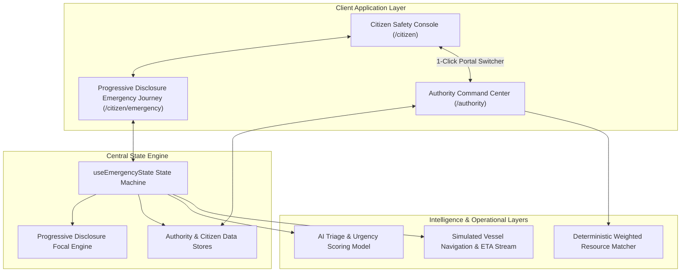

# ARCHITECTURE.md - System Architecture & Component Design

This document details the architectural layout, component boundaries, and state management models of the Salvus platform.

---

## 1. System Architecture Diagram



---

## 2. Frontend Component Hierarchy

```
src/
├── layouts/
│   ├── CitizenLayout.jsx          # Top Navbar + Mobile BottomNav + Outlet
│   └── AuthorityLayout.jsx        # Command Bar + Grid Status + Portal Switcher + Outlet
├── pages/
│   ├── CitizenHome.jsx            # Safety status, SOS trigger, Hazard reporting modal
│   ├── CitizenMap.jsx             # Situational radar + Safe Route Briefing modal
│   ├── CitizenAlerts.jsx          # Categorized advisory stream & safety recommendations
│   ├── CitizenProfile.jsx         # Identity, medical passport, contacts, siren test
│   ├── CitizenEmergency.jsx       # State-focused progressive emergency experience
│   └── AuthorityCommandCenter.jsx # Operational metrics, AI triage queue, tactical map, fleet
├── components/citizen/
│   ├── IncidentReportModal.jsx    # 3-step in-app hazard reporting drawer
│   ├── emergency/
│   │   ├── AiTriageCard.jsx       # AI classification & dispatcher approval stamp
│   │   ├── EmergencyCancelModal.jsx # Cancellation confirmation safeguard
│   │   ├── EmergencyConfirmationModal.jsx # SOS hold-to-confirm modal
│   │   ├── EmergencyDemoControls.jsx # Collapsible simulator dock + network health
│   │   ├── EmergencyHeader.jsx    # Incident ID, phase badge, direct 112 trigger
│   │   ├── EmergencyInstructionCard.jsx # Context-aware safety guidance
│   │   ├── EmergencyStatusCard.jsx # Hero status & 3-part operational clarity grid
│   │   ├── EmergencyTimeline.jsx  # 8-step incident progression audit log
│   │   ├── LocationStatusBanner.jsx # GPS telemetry + Grid network health badges
│   │   ├── RescueRadarMap.jsx     # Tactical rescue radar + moving vessel vector
│   │   └── ResponderPreviewCard.jsx # Responder details, specs, ETA, radio link
└── features/citizen/emergency/
    └── useEmergencyState.js       # Authoritative emergency lifecycle hook
```

---

## 3. Emergency Lifecycle State Machine

The central state machine enforces deterministic, unidirectional progression across the complete emergency lifecycle:

$$\text{SOS\_ACTIVE} \rightarrow \text{TRIAGING} \rightarrow \text{VERIFIED} \rightarrow \text{ASSIGNED} \rightarrow \text{EN\_ROUTE} \rightarrow \text{NEARBY} \rightarrow \text{ON\_SCENE} \rightarrow \text{RESOLVED}$$

- **Guarded Transitions:** Impossible backward jumps or state skipping are prevented.
- **Cancellation Safe Harbor:** Any active state can transition to `CANCELLED` via a confirmation modal safeguard, allowing the citizen to stand down responders while retaining instant re-activation.
- **Network Health Simulation:** Tracks `CONNECTED`, `LIMITED_CONNECTION` (SMS fallback), and `OFFLINE` (local caching).
