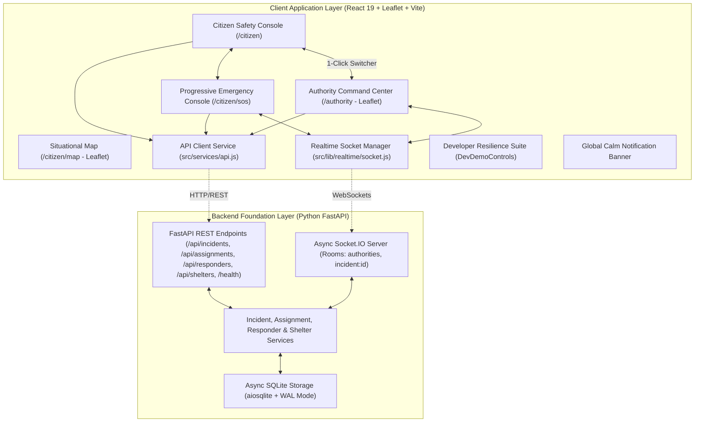

# ARCHITECTURE.md - System Architecture & Component Design

This document details the architectural layout, component boundaries, state management models, geospatial mapping engine, and backend domain models of the Salvus platform.

---

## 1. System Architecture Diagram



---

## 2. Dispatch & Assignment Domain Architecture (IMPLEMENTED ✅)

> **Architectural Boundary Notice:**
>
> - `ASSIGNMENT DOMAIN FOUNDATION` = **IMPLEMENTED & ACTIVE ✅**
> - `ROUTING SERVICE FOUNDATION (OSRM + Normalized Fallback)` = **IMPLEMENTED & ACTIVE ✅**
> - `SCORING = future` (Deterministic / Multi-factor ranking decoupled)
> - `AI = future` (Automated dispatch optimization decoupled)

Salvus establishes responder assignment as an explicit first-class domain entity:

$$\text{INCIDENT} \longleftrightarrow \text{ASSIGNMENT} \longleftrightarrow \text{RESPONDER}$$

### Assignment Controlled State Progression:

$$\text{PROPOSED} \longrightarrow \text{ASSIGNED} \longrightarrow \text{EN\_ROUTE} \longrightarrow \text{NEARBY} \longrightarrow \text{ON\_SCENE} \longrightarrow \text{COMPLETED}$$
$$\text{Active States } (\text{PROPOSED, ASSIGNED, EN\_ROUTE, NEARBY, ON\_SCENE}) \longrightarrow \text{CANCELLED}$$

- **Single Active Assignment Constraints:**
  - One active assignment per responder.
  - One active assignment per incident.
  - Active assignments encompass states: `PROPOSED`, `ASSIGNED`, `EN_ROUTE`, `NEARBY`, `ON_SCENE`.
  - Duplicate active assignment creation attempts are rejected with structured error codes (`RESPONDER_ALREADY_ASSIGNED`, `INCIDENT_ALREADY_ASSIGNED`).
- **Transactional Consistency:** Every assignment state change synchronously updates the linked responder and incident records, appending an auditable event to `incident_events`. Zero partial state commits occur upon failure.
- **Score Data Model Contract:** Includes structured factor storage (`capability`, `distance`, `eta`, `workload`, `severity_fit`) and assignment justification notes. Scoring and routing algorithms remain decoupled as future extensions.

---

## 3. Geospatial Foundation

- **Engine:** Leaflet (`L.map`, `L.tileLayer`, `L.divIcon`, `L.circle`).
- **Base Layer:** OpenStreetMap dark-mode filtered tiles.
- **Markers:**
  - Citizen distress beacons (pulsing red for Critical/NEW, sky for Verified, emerald for Resolved, slate for Cancelled).
  - Safe Evacuation Shelters (emerald assembly points with live bed availability).
  - Responder Fleet (sky rescue craft pins with team lead & vehicle class).
  - Citizen Current GPS location (pulsing blue dot with accuracy ring).
- **Auto-Centering:** Smooth programmatic camera panning when selecting queue items without disorienting zoom.

---

## 4. Data Provenance & Badging Architecture

- `<LiveBadge />`: Stamped on all genuine, database-backed records synced over WebSockets (`SQLITE WAL ENGINE`, `SQLITE FLEET`, `SQLITE SHELTERS`).
- `<SimulatedBadge />`: Stamped on mock background datasets (simulated weather models).

---

## 5. Frontend Component Hierarchy

```
src/
├── layouts/
│   ├── CitizenLayout.jsx          # Top Navbar + BottomNav + DevDemoControls + GlobalNotificationBanner
│   └── AuthorityLayout.jsx        # Command Bar + Status + DevDemoControls + GlobalNotificationBanner
├── pages/
│   ├── CitizenHome.jsx            # Safety status, live SOS trigger, hazard report modal
│   ├── CitizenMap.jsx             # Situational Leaflet map + Safe Route Briefing modal
│   ├── CitizenAlerts.jsx          # Categorized advisory stream & safety recommendations
│   ├── CitizenProfile.jsx         # Identity, medical passport, contacts, siren test
│   ├── CitizenEmergency.jsx       # State-focused progressive emergency experience
│   └── AuthorityCommandCenter.jsx # Thin orchestrator page wiring domain hooks and layout
├── components/
│   ├── common/
│   │   ├── SalvusLeafletMap.jsx        # Reusable dark-styled Leaflet map
│   │   ├── SimulatedBadge.jsx          # Visual data provenance badges
│   │   ├── DevDemoControls.jsx         # Developer demo & resilience control dock
│   │   └── GlobalNotificationBanner.jsx# Calm application-level notification banner
│   ├── authority/
│   │   ├── AuthorityHeader.jsx         # Top district status bar, dispatcher & VHF channel
│   │   ├── OperationalMetrics.jsx      # 5-card operational metric strip
│   │   ├── SituationBriefing.jsx       # Grounded AI situation intelligence & key priorities
│   │   ├── IncidentQueue.jsx           # Filter chips, priority queue cards & status badges
│   │   ├── AuthorityMap.jsx            # Tactical map container, layer switches & legend
│   │   ├── IncidentInspector.jsx       # Incident inspector, pathway corridor, actions & lifecycle
│   │   ├── ResponderPanel.jsx          # Fleet capability/status filters, cards & manual overrides
│   │   ├── ShelterPanel.jsx            # Evacuation hubs, hazard proximity alerts & quick intake
│   │   ├── AiTriageAssessmentCard.jsx  # Human-in-the-loop triage card (verify/adjust/reevaluate)
│   │   ├── DispatchRecommendationPanel.jsx # Deterministic recommendation breakdown & alternatives
│   │   └── AssignmentConfirmModal.jsx  # Consequential dispatch confirmation safeguard modal
│   └── citizen/
│       ├── IncidentReportModal.jsx     # Location confirmation, draft auto-save, deduplication
│       └── emergency/
│           ├── LocationStatusBanner.jsx# Emergency location & offline trust banner
│           ├── RescueRadarMap.jsx      # Tactical vector map with simulated badge
│           └── ResponderPreviewCard.jsx# Responder details with simulated badge
├── features/
│   ├── authority/
│   │   ├── index.js                    # Barrel export for authority feature hooks
│   │   ├── incidents/
│   │   │   ├── useAuthorityIncidents.js# Out-of-order guards, incident server state & socket sync
│   │   │   └── incidentUtils.js        # Badge styles, distance & filter utilities
│   │   ├── fleet/
│   │   │   └── useAuthorityFleet.js    # Responders state, filtering, socket sync & status actions
│   │   ├── shelters/
│   │   │   └── useAuthorityShelters.js # Shelters state, occupancy adjustment & hazard proximity
│   │   ├── intelligence/
│   │   │   └── useSituationIntelligence.js # Situation summary, hazards, clusters & provenance
│   │   └── dispatch/
│   │       ├── useDispatchRecommendation.js # Candidates ranking, fallback scoring & route vectors
│   │       ├── useMovementSimulation.js # GPS telemetry engine & milestone progression
│   │       └── useIncidentTriage.js    # AI triage verify, adjust & re-evaluate actions
│   └── citizen/emergency/
│       └── useEmergencyState.js        # Live emergency lifecycle hook with room sync
├── lib/
│   ├── location.js                     # Accuracy tier ratings, landmark catalog, privacy guards
│   ├── notifications.js                # Lightweight pub-sub for calm system notifications
│   └── realtime/
│       └── socket.js                   # Socket.IO client with room rejoining on reconnect
└── services/
    ├── api.js                          # Centralized REST client with dev tools, responders & shelters API
    └── routingService.js               # OSRM routing engine with fallback vector corridor calculation
```

### 5.1 Authority Command Center Domain Architecture (Phase 3 ✅)

The Authority Command Center adheres to strict state ownership boundaries:

- **Orchestrator Page (`AuthorityCommandCenter.jsx`)**: Manages high-level view layout, tab switching (`inspector` / `fleet` / `shelters`), layer toggles, and modal visibility.
- **Server State Hooks**: Dedicated hooks isolate API calls, caching, and WebSocket subscriptions (`useAuthorityIncidents`, `useAuthorityFleet`, `useAuthorityShelters`, `useSituationIntelligence`).
- **Dispatch & Route Computation**: Encapsulated in `useDispatchRecommendation` (candidate ranking, fallback deterministic scoring, OSRM routing) and `useMovementSimulation` (GPS movement simulation engine).
- **Presentation Layer**: Components in `src/components/authority/` are pure visual presentations consuming props and invoking typed callbacks without scattering direct Axios or socket calls.

---

## 6. Explainable Deterministic Allocation Engine (IMPLEMENTED ✅)

> **Architectural Boundary Notice:**
>
> - `ASSIGNMENT DOMAIN FOUNDATION` = **IMPLEMENTED & ACTIVE ✅**
> - `ROUTING SERVICE FOUNDATION (OSRM + Normalized Fallback)` = **IMPLEMENTED & ACTIVE ✅**
> - `TACTICAL ROUTE VISUALIZATION` = **IMPLEMENTED & ACTIVE ✅**
> - `RESPONDER CANDIDATE GENERATION (FILTERING)` = **IMPLEMENTED & ACTIVE ✅**
> - `EXPLAINABLE DETERMINISTIC ALLOCATION ENGINE` = **IMPLEMENTED & ACTIVE ✅**
> - `AI DISPATCH OPTIMIZATION` = **FUTURE ⏳**

The Allocation Engine evaluates eligible emergency response craft against distress incidents using mathematically auditable, deterministic scoring formulas:

$$S_{\text{total}} = S_{\text{capability}} + S_{\text{availability}} + S_{\text{distance}} + S_{\text{eta}} + S_{\text{workload}} + S_{\text{severity\_fit}}$$

### Centralized Auditable Weights (Max = 100):

| Component                    | Max Weight | Factor Meaning                                                         | Normalization Formula                                                    |
| ---------------------------- | ---------- | ---------------------------------------------------------------------- | ------------------------------------------------------------------------ |
| **Capability Match**         | 30         | Specialized equipment fit for hazard type                              | $\text{norm\_cap} \times 30$                                             |
| **Operational Availability** | 20         | Readiness state (`AVAILABLE` = 1.0, `NEARBY` = 0.75, `EN_ROUTE` = 0.4) | $\text{norm\_avail} \times 20$                                           |
| **Spatial Proximity**        | 15         | Distance decay within 25 km operational radius                         | $\max(0, 1 - (d / 25)) \times 15$                                        |
| **Transit ETA**              | 15         | Estimated arrival time within 35 min limit                             | $\max(0, 1 - (t / 35)) \times 15$                                        |
| **Workload Capacity**        | 10         | Remaining crew / vehicle capacity ratio                                | $(\frac{C_{\text{max}} - C_{\text{current}}}{C_{\text{max}}}) \times 10$ |
| **Severity Fit**             | 10         | Capacity & tier alignment with urgency tier                            | $\text{norm\_sev} \times 10$                                             |

### Deterministic Multi-Level Tie-Breaking:

1. `match_score DESC`
2. `distance_km ASC`
3. `eta_minutes ASC`
4. `current_load ASC`
5. `responder.id ASC` (strictly reproducible)

### Human-in-the-Loop Governance:

The engine designates the top choice as **`RECOMMENDED`**, never **`DISPATCHED`**. The human dispatcher retains complete authority to review the mathematical explanation bullets and manually confirm or override the dispatch.
