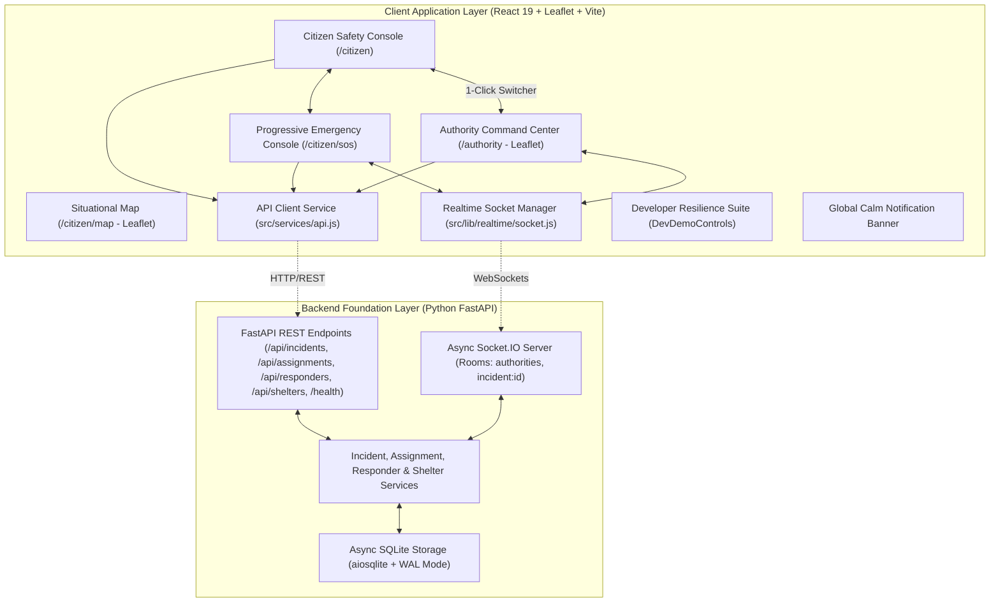

# ARCHITECTURE.md - System Architecture & Component Design

This document details the architectural layout, component boundaries, state management models, geospatial mapping engine, and backend domain models of the Salvus platform.

---

## 1. System Architecture Diagram



---

## 2. Dispatch & Assignment Domain Architecture (IMPLEMENTED ✅)

Salvus establishes responder assignment as an explicit first-class domain entity:

$$\text{INCIDENT} \longleftrightarrow \text{ASSIGNMENT} \longleftrightarrow \text{RESPONDER}$$

### Assignment Controlled State Progression:

$$\text{PROPOSED} \longrightarrow \text{ASSIGNED} \longrightarrow \text{EN\_ROUTE} \longrightarrow \text{NEARBY} \longrightarrow \text{ON\_SCENE} \longrightarrow \text{COMPLETED}$$
$$\text{Active States } (\text{PROPOSED, ASSIGNED, EN\_ROUTE, NEARBY, ON\_SCENE}) \longrightarrow \text{CANCELLED}$$

- **Single Active Assignment Rule:** A responder unit cannot belong to multiple active assignments concurrently.
- **Transactional Consistency:** Every assignment state change synchronously updates the linked responder and incident records, appending an auditable event to `incident_events`.
- **Score Data Model Contract:** Includes structured factor storage (`capability`, `distance`, `eta`, `workload`, `severity_fit`) and assignment justification notes. Dynamic routing and scoring calculations will be added in **NEXT PHASE**.

---

## 3. Geospatial Foundation

- **Engine:** Leaflet (`L.map`, `L.tileLayer`, `L.divIcon`, `L.circle`).
- **Base Layer:** OpenStreetMap dark-mode filtered tiles.
- **Markers:**
  - Citizen distress beacons (pulsing red for Critical/NEW, sky for Verified, emerald for Resolved, slate for Cancelled).
  - Safe Evacuation Shelters (emerald assembly points with live bed availability).
  - Responder Fleet (sky rescue craft pins with team lead & vehicle class).
  - Citizen Current GPS location (pulsing blue dot with accuracy ring).
- **Auto-Centering:** Smooth programmatic camera panning when selecting queue items without disorienting zoom.

---

## 4. Data Provenance & Badging Architecture

- `<LiveBadge />`: Stamped on all genuine, database-backed records synced over WebSockets (`SQLITE WAL ENGINE`, `SQLITE FLEET`, `SQLITE SHELTERS`).
- `<SimulatedBadge />`: Stamped on mock background datasets (simulated weather models).

---

## 5. Frontend Component Hierarchy

```
src/
├── layouts/
│   ├── CitizenLayout.jsx          # Top Navbar + BottomNav + DevDemoControls + GlobalNotificationBanner
│   └── AuthorityLayout.jsx        # Command Bar + Status + DevDemoControls + GlobalNotificationBanner
├── pages/
│   ├── CitizenHome.jsx            # Safety status, live SOS trigger, hazard report modal
│   ├── CitizenMap.jsx             # Situational Leaflet map + Safe Route Briefing modal
│   ├── CitizenAlerts.jsx          # Categorized advisory stream & safety recommendations
│   ├── CitizenProfile.jsx         # Identity, medical passport, contacts, siren test
│   ├── CitizenEmergency.jsx       # State-focused progressive emergency experience
│   └── AuthorityCommandCenter.jsx # Realtime metrics, live incident queue, Leaflet map, fleet & shelter matrix
├── components/
│   ├── common/
│   │   ├── SalvusLeafletMap.jsx        # Reusable dark-styled Leaflet map
│   │   ├── SimulatedBadge.jsx          # Visual data provenance badges
│   │   ├── DevDemoControls.jsx         # Developer demo & resilience control dock
│   │   └── GlobalNotificationBanner.jsx# Calm application-level notification banner
│   └── citizen/
│       ├── IncidentReportModal.jsx     # Location confirmation, draft auto-save, deduplication
│       └── emergency/
│           ├── LocationStatusBanner.jsx# Emergency location & offline trust banner
│           ├── RescueRadarMap.jsx      # Tactical vector map with simulated badge
│           └── ResponderPreviewCard.jsx# Responder details with simulated badge
├── features/
│   ├── authority/
│   │   └── useAuthorityIncidents.js    # Out-of-order guards & silent reconnect sync
│   └── citizen/emergency/
│       └── useEmergencyState.js        # Live emergency lifecycle hook with room sync
├── lib/
│   ├── location.js                     # Accuracy tier ratings, landmark catalog, privacy guards
│   ├── notifications.js                # Lightweight pub-sub for calm system notifications
│   └── realtime/
│       └── socket.js                   # Socket.IO client with room rejoining on reconnect
└── services/
    └── api.js                          # Centralized REST client with dev tools, responders & shelters API
```
