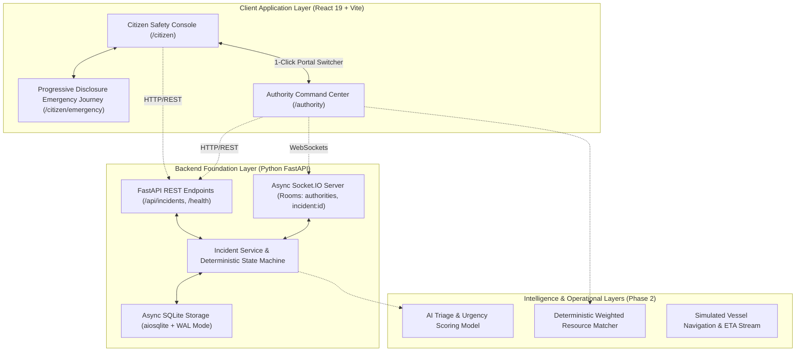

# ARCHITECTURE.md - System Architecture & Component Design

This document details the architectural layout, component boundaries, state management models, and backend foundation of the Salvus platform.

---

## 1. System Architecture Diagram



---

## 2. Backend Architecture (`backend/`)

The backend is built with **Python 3.12+ and FastAPI**, prioritizing asynchronous I/O, domain-driven design, and deterministic state transitions:

```
backend/
├── app/
│   ├── db/
│   │   ├── __init__.py        # Async SQLite connection lifecycle & WAL configuration
│   │   ├── migrations.py      # Schema definitions (incidents, incident_events)
│   │   └── seed.py            # Realistic Kolkata flood demo incident seeding
│   ├── models/
│   │   └── __init__.py        # Pydantic schemas (IncidentCreate, IncidentResponse, enums)
│   ├── services/
│   │   ├── __init__.py
│   │   ├── state_machine.py   # Deterministic incident lifecycle transitions & terminal checks
│   │   └── incident_service.py # Business logic, CRUD operations, ticket generation
│   ├── routes/
│   │   ├── __init__.py
│   │   ├── health.py          # Health check endpoint (/health)
│   │   └── incidents.py       # REST endpoints (/api/incidents)
│   ├── realtime/
│   │   ├── __init__.py
│   │   └── socket_manager.py  # python-socketio async server & typed event emitters
│   ├── middleware/
│   │   └── __init__.py        # Global validation & error handler middleware
│   └── main.py                # Lifespan manager, CORS, ASGI combined app mount
├── tests/
│   ├── conftest.py            # In-memory SQLite & async HTTP client fixtures
│   ├── test_state_machine.py  # Unit tests for transitions, ranking, terminals
│   └── test_incident_api.py   # Integration tests for all REST endpoints
├── pyproject.toml             # Ruff linter & Pytest configuration
└── requirements.txt           # Explicit version-pinned dependencies
```

---

## 3. Frontend Component Hierarchy

```
src/
├── layouts/
│   ├── CitizenLayout.jsx          # Top Navbar + Mobile BottomNav + Outlet
│   └── AuthorityLayout.jsx        # Command Bar + Grid Status + Portal Switcher + Outlet
├── pages/
│   ├── CitizenHome.jsx            # Safety status, SOS trigger, Hazard reporting modal
│   ├── CitizenMap.jsx             # Situational radar + Safe Route Briefing modal
│   ├── CitizenAlerts.jsx          # Categorized advisory stream & safety recommendations
│   ├── CitizenProfile.jsx         # Identity, medical passport, contacts, siren test
│   ├── CitizenEmergency.jsx       # State-focused progressive emergency experience
│   └── AuthorityCommandCenter.jsx # Operational metrics, AI triage queue, tactical map, fleet
├── components/citizen/
│   ├── IncidentReportModal.jsx    # 3-step in-app hazard reporting drawer
│   ├── emergency/
│   │   ├── AiTriageCard.jsx       # AI classification & dispatcher approval stamp
│   │   ├── EmergencyCancelModal.jsx # Cancellation confirmation safeguard
│   │   ├── EmergencyConfirmationModal.jsx # SOS hold-to-confirm modal
│   │   ├── EmergencyDemoControls.jsx # Collapsible simulator dock + network health
│   │   ├── EmergencyHeader.jsx    # Incident ID, phase badge, direct 112 trigger
│   │   ├── EmergencyInstructionCard.jsx # Context-aware safety guidance
│   │   ├── EmergencyStatusCard.jsx # Hero status & 3-part operational clarity grid
│   │   ├── EmergencyTimeline.jsx  # 8-step incident progression audit log
│   │   ├── LocationStatusBanner.jsx # GPS telemetry + Grid network health badges
│   │   ├── RescueRadarMap.jsx     # Tactical rescue radar + moving vessel vector
│   │   └── ResponderPreviewCard.jsx # Responder details, specs, ETA, radio link
└── features/citizen/emergency/
    └── useEmergencyState.js       # Authoritative emergency lifecycle hook
```

---

## 4. Emergency Lifecycle State Machine

The central state machine enforces deterministic, unidirectional progression across the complete emergency lifecycle:

$$\text{NEW} \rightarrow \text{TRIAGE\_PENDING} \rightarrow \text{VERIFIED} \rightarrow \text{RESOLVED}$$

_(Extended full responder pipeline: `ASSIGNED` $\rightarrow$ `EN_ROUTE` $\rightarrow$ `NEARBY` $\rightarrow$ `ON_SCENE` $\rightarrow$ `RESOLVED`)_

- **Guarded Transitions:** Impossible backward jumps or state skipping are prevented and validated on both API and domain layers.
- **Cancellation Safe Harbor:** Any active non-terminal state can transition to `CANCELLED` via a confirmation safeguard, allowing the citizen/authority to stand down while recording the audit event.
- **Terminal States:** `RESOLVED` and `CANCELLED` lock the incident against further status mutations.
