# DATABASE.md — Database Schema & Storage Architecture

This document details the database architecture, schema migrations, complete 8-table entity definitions, Mermaid Entity-Relationship (ER) model, performance indexes, transactional boundaries, and cloud persistence characteristics for Salvus.

---

## 1. Storage Architecture

Salvus uses asynchronous local SQLite powered by Python's `aiosqlite` driver as its primary operational storage engine:

- **Database File Location:** `backend/data/salvus.db` (configurable via `DATABASE_PATH` environment variable).
- **Write-Ahead Logging (`WAL`):** Configured with `PRAGMA journal_mode=WAL` to maximize concurrency, allowing simultaneous non-blocking reads while atomic write transactions are underway.
- **Foreign Key Integrity:** Strictly enforced on every connection with `PRAGMA foreign_keys=ON`.
- **Synchronous Mode:** Set to `PRAGMA synchronous=NORMAL` for optimal balance of disk write throughput and crash recovery safety.
- **Production Migration Target (Future):** PostgreSQL 16+ with PostGIS extension for distributed multi-region disaster coordination grids.

---

## 2. Mermaid Entity-Relationship (ER) Diagram

```mermaid
erDiagram
    INCIDENTS ||--o{ INCIDENT_EVENTS : "tracks audit history"
    INCIDENTS ||--o{ AI_TRIAGE_ASSESSMENTS : "evaluated by"
    INCIDENTS ||--o{ INCIDENT_ATTACHMENTS : "includes evidence"
    INCIDENTS ||--o| ASSIGNMENTS : "allocated via"
    RESPONDERS ||--o| ASSIGNMENTS : "dispatched via"
    INCIDENTS ||--o| RESPONDERS : "linked mission (assigned_incident_id)"
    CITIZEN_PROFILES ||--o{ EMERGENCY_CONTACTS : "designates"

    INCIDENTS {
        text id PK "UUIDv4 string"
        text ticket_id UK "e.g. SV-2048"
        text type "flood, fire, medical, hazard, etc."
        text severity "CRITICAL, HIGH, MEDIUM, LOW"
        text description "Detailed distress description"
        text reporter_name "Citizen name or 'Anonymous'"
        text reporter_phone "Contact phone number"
        text reporter_id "Authenticated user ID"
        real latitude "GPS Latitude [-90, 90]"
        real longitude "GPS Longitude [-180, 180]"
        integer affected_count "Victim count (default 1)"
        integer is_sos "1 for SOS beacon, 0 for report"
        text status "NEW, TRIAGE_PENDING, VERIFIED, etc."
        text ai_state "NOT_STARTED, AVAILABLE, FAILED"
        text triage_hash "SHA-256 payload fingerprint"
        text created_at "ISO 8601 UTC timestamp"
        text updated_at "ISO 8601 UTC timestamp"
    }

    INCIDENT_EVENTS {
        text id PK "UUIDv4 string"
        text incident_id FK "References incidents(id) ON DELETE CASCADE"
        text event_type "CREATED, STATUS_CHANGE, ASSIGNMENT"
        text previous_status "Status before transition"
        text new_status "Status after transition"
        text actor "Dispatcher ID or system"
        text metadata "JSON payload for audit context"
        text created_at "ISO 8601 UTC timestamp"
    }

    INCIDENT_ATTACHMENTS {
        text id PK "UUIDv4 string"
        text incident_id FK "References incidents(id) ON DELETE CASCADE"
        text file_url "Local or CDN static URL"
        text thumbnail_url "Optimized low-res thumbnail URL"
        text media_type "image/jpeg, image/png, image/webp"
        integer file_size "Size in bytes (max 5MB)"
        text checksum "SHA-256 integrity hash"
        text ai_analysis "JSON scene assessment & safety hazards"
        text created_at "ISO 8601 UTC timestamp"
    }

    RESPONDERS {
        text id PK "e.g. resp-101"
        text unit_name "e.g. NDRF Rescue Unit 4"
        text team_lead "e.g. Capt. A. Roy"
        text vehicle_type "e.g. Gemini Z-Craft Inflatable"
        text capability "FLOOD_BOAT, AMBULANCE, HAZMAT, etc."
        text status "AVAILABLE, ASSIGNED, EN_ROUTE, ON_SCENE, OFFLINE"
        real latitude "Current GPS Latitude"
        real longitude "Current GPS Longitude"
        text radio_channel "e.g. VHF Ch. 4 (156.2 MHz)"
        integer max_capacity "Passenger limit (default 6)"
        integer current_load "Current evacuees on board"
        text assigned_incident_id FK "References incidents(id) ON DELETE SET NULL"
        text last_seen "ISO 8601 timestamp of last ping"
        text created_at "ISO 8601 UTC timestamp"
        text updated_at "ISO 8601 UTC timestamp"
    }

    ASSIGNMENTS {
        text id PK "UUIDv4 string"
        text incident_id FK "References incidents(id) ON DELETE CASCADE"
        text responder_id FK "References responders(id) ON DELETE CASCADE"
        text status "PROPOSED, ASSIGNED, EN_ROUTE, NEARBY, ON_SCENE, COMPLETED, CANCELLED"
        text assigned_by "Dispatcher name or authority ID"
        text assigned_at "ISO 8601 creation timestamp"
        text accepted_at "ISO 8601 acceptance timestamp"
        text started_at "ISO 8601 en route timestamp"
        text nearby_at "ISO 8601 proximity timestamp"
        text arrived_at "ISO 8601 on scene timestamp"
        text completed_at "ISO 8601 resolution timestamp"
        text cancelled_at "ISO 8601 cancellation timestamp"
        real score "Total match score (0-100)"
        text score_breakdown "JSON {capability, availability, distance, eta, workload, severity_fit}"
        text assignment_reason "Explainable tactical justification"
        text created_at "ISO 8601 UTC timestamp"
        text updated_at "ISO 8601 UTC timestamp"
    }

    SHELTERS {
        text id PK "e.g. shl-01"
        text name "Facility name"
        text address "Street address or landmark"
        real latitude "GPS Latitude"
        real longitude "GPS Longitude"
        integer total_beds "Total facility bed capacity"
        integer available_beds "Unoccupied beds ready for intake"
        text occupancy_rate "Calculated percentage string"
        text supplies_status "Rations, generator & medical status"
        text status "OPEN, NEAR_CAPACITY, FULL, CLOSED"
        text amenities "JSON array of amenities"
        integer is_active "1 if active, 0 if closed"
        text created_at "ISO 8601 UTC timestamp"
        text updated_at "ISO 8601 UTC timestamp"
    }

    AI_TRIAGE_ASSESSMENTS {
        text id PK "UUIDv4 string"
        text incident_id FK "References incidents(id) ON DELETE CASCADE"
        text provider "GeminiProvider, GroqProvider, Heuristic"
        text model "gemini-2.5-flash, llama-3.3-70b-versatile"
        text assessment "Full validated JSON assessment"
        real confidence "Model confidence score [0.0, 1.0]"
        text review_status "PENDING, VERIFIED, ADJUSTED"
        text operator_adjustments "JSON override notes"
        text operator_id "Reviewing authority identity"
        text created_at "ISO 8601 UTC timestamp"
        text reviewed_at "ISO 8601 UTC timestamp"
    }

    CITIZEN_PROFILES {
        text id PK "Unique citizen ID (JWT sub)"
        text emergency_id UK "Protected ID e.g. SLV-CIT-7829"
        text full_name "Full citizen name"
        text phone "Contact phone number"
        text email "Verified email address"
        text registered_address "Residential address"
        text blood_group "Blood group with Rh factor"
        text avatar_initials "Initials string"
        text avatar_url "Avatar image URL"
        text medical_info "JSON conditions, allergies, mobility"
        text privacy_settings "JSON privacy preferences"
        text medications_note "Emergency medication notes"
        integer is_verified "1 for verified citizen"
        text created_at "ISO 8601 UTC timestamp"
        text updated_at "ISO 8601 UTC timestamp"
    }

    EMERGENCY_CONTACTS {
        text id PK "e.g. ec-101"
        text user_id FK "References citizen_profiles(id) ON DELETE CASCADE"
        text name "Contact full name"
        text relationship "Father, Spouse, Neighbor, etc."
        text phone "Contact phone number"
        integer priority "Priority order rank (1-10)"
        integer is_primary "1 if primary, 0 otherwise"
        integer notify_on_sos "1 if notified during SOS"
        text created_at "ISO 8601 UTC timestamp"
        text updated_at "ISO 8601 UTC timestamp"
    }
```



---

## 3. Table Specifications & Invariants

### 3.1 `incidents` (Authoritative Distress Domain)

- **Primary Key:** `id` (UUIDv4)
- **Unique Constraint:** `ticket_id` (e.g. `SV-2048`)
- **Key Invariant:** Status transitions follow strict forward-only finite state machine validation (`NEW` $\rightarrow$ `TRIAGE_PENDING` $\rightarrow$ `VERIFIED` $\rightarrow$ `ASSIGNED` $\rightarrow$ `EN_ROUTE` $\rightarrow$ `NEARBY` $\rightarrow$ `ON_SCENE` $\rightarrow$ `RESOLVED` / `CANCELLED`).
- **Deduplication:** Inserts check for matching `(type, description, latitude, longitude)` in the preceding 4 seconds to eliminate double-tap duplicate records.

### 3.2 `incident_events` (Immutable Audit Trail)

- **Primary Key:** `id` (UUIDv4)
- **Foreign Key:** `incident_id` $\rightarrow$ `incidents(id)` with `ON DELETE CASCADE`.
- **Key Invariant:** Records in this table are append-only. Zero updates or manual deletes are permitted, ensuring strict legal auditability for emergency operations.

### 3.3 `incident_attachments` (Cryptographic Media Evidence)

- **Primary Key:** `id` (UUIDv4)
- **Foreign Key:** `incident_id` $\rightarrow$ `incidents(id)` with `ON DELETE CASCADE`.
- **Integrity Guarantee:** Includes SHA-256 `checksum` fingerprint to guarantee forensic evidence integrity.

### 3.4 `responders` (Fleet Inventory & Telemetry)

- **Primary Key:** `id` (e.g. `resp-101`)
- **Foreign Key:** `assigned_incident_id` $\rightarrow$ `incidents(id)` with `ON DELETE SET NULL`.
- **Key Invariant:** A responder can only be linked to at most one active incident at any given time.

### 3.5 `assignments` (First-Class Dispatch Coordination)

- **Primary Key:** `id` (UUIDv4)
- **Foreign Keys:**
  - `incident_id` $\rightarrow$ `incidents(id)` with `ON DELETE CASCADE`
  - `responder_id` $\rightarrow$ `responders(id)` with `ON DELETE CASCADE`
- **Key Invariant:** Only one active assignment (`PROPOSED`, `ASSIGNED`, `EN_ROUTE`, `NEARBY`, `ON_SCENE`) is permitted per responder and per incident.

### 3.6 `shelters` (Evacuation Logistics)

- **Primary Key:** `id` (e.g. `shl-01`)
- **Key Invariant:** `available_beds` $\le$ `total_beds`. `occupancy_rate` is dynamically derived and formatted.

### 3.7 `ai_triage_assessments` (Decision Support Audit)

- **Primary Key:** `id` (UUIDv4)
- **Foreign Key:** `incident_id` $\rightarrow$ `incidents(id)` with `ON DELETE CASCADE`.
- **Key Invariant:** Persists complete model outputs, provider names, latency telemetry, and subsequent human operator adjustment records.

### 3.8 `citizen_profiles` (Persistent Identity & Emergency Readiness)

- **Primary Key:** `id` (e.g. `cit-default` or JWT `sub` user ID).
- **Unique Constraint:** `emergency_id` (e.g. `SLV-CIT-7829`).
- **Key Invariants:**
  - User identity is server-authoritative and bound to cryptographic JWT claims.
  - Medical records are bounded and protected with citizen-only access rules.
  - Privacy settings separate user preferences from system-locked safety requirements.

### 3.9 `emergency_contacts` (Designated Emergency Roster)

- **Primary Key:** `id` (e.g. `ec-101`).
- **Foreign Key:** `user_id` $\rightarrow$ `citizen_profiles(id)` with `ON DELETE CASCADE`.
- **Key Invariants:**
  - Single-Primary Enforcement: Exactly one contact per citizen is designated as Primary.
  - Setting a contact as primary demotes all other contacts of that user.
  - Deleting the primary contact promotes the next highest priority contact to primary.
  - Maximum limit of 5 designated contacts per citizen.

---

## 4. Performance Indexes

```sql
-- High-throughput status and temporal queries
CREATE INDEX IF NOT EXISTS idx_incidents_status ON incidents(status);
CREATE INDEX IF NOT EXISTS idx_incidents_created_at ON incidents(created_at DESC);
CREATE INDEX IF NOT EXISTS idx_incidents_coords ON incidents(latitude, longitude);

-- Foreign key lookup and event history joins
CREATE INDEX IF NOT EXISTS idx_incident_events_incident_id ON incident_events(incident_id);
CREATE INDEX IF NOT EXISTS idx_ai_triage_incident_id ON ai_triage_assessments(incident_id);
CREATE INDEX IF NOT EXISTS idx_incident_attachments_incident_id ON incident_attachments(incident_id);
CREATE INDEX IF NOT EXISTS idx_incident_attachments_checksum ON incident_attachments(checksum);

-- Fleet status and mission tracking
CREATE INDEX IF NOT EXISTS idx_responders_status ON responders(status);
CREATE INDEX IF NOT EXISTS idx_responders_assigned ON responders(assigned_incident_id);

-- Assignment joins and status filters
CREATE INDEX IF NOT EXISTS idx_assignments_incident ON assignments(incident_id);
CREATE INDEX IF NOT EXISTS idx_assignments_responder ON assignments(responder_id);
CREATE INDEX IF NOT EXISTS idx_assignments_status ON assignments(status);

-- Shelter status filtering
CREATE INDEX IF NOT EXISTS idx_shelters_status ON shelters(status);

-- Citizen Profile & Emergency Contact indexes
CREATE INDEX IF NOT EXISTS idx_citizen_profiles_emergency_id ON citizen_profiles(emergency_id);
CREATE INDEX IF NOT EXISTS idx_emergency_contacts_user_id ON emergency_contacts(user_id);
```

---

## 5. Transaction Boundaries & Atomicity

All mission-critical operations execute inside atomic SQLite transactions (`async with db.transaction()`):

1. **Assignment Creation Transaction:**

   ```
   BEGIN TRANSACTION;
   1. Insert record into 'assignments' (status: 'ASSIGNED').
   2. Update 'responders' SET status = 'ASSIGNED', assigned_incident_id = incident_id.
   3. Update 'incidents' SET status = 'ASSIGNED'.
   4. Append record to 'incident_events' (event_type: 'ASSIGNMENT_CREATED').
   COMMIT;
   ```

   If any step fails (e.g. duplicate assignment constraint violation), the entire transaction rolls back cleanly.

2. **Primary Contact Promotion Transaction:**

   ```
   BEGIN TRANSACTION;
   1. Update 'emergency_contacts' SET is_primary = 0 WHERE user_id = :user_id.
   2. Update 'emergency_contacts' SET is_primary = 1 WHERE id = :contact_id.
   COMMIT;
   ```

3. **Triage Verification Transaction:**
   ```
   BEGIN TRANSACTION;
   1. Update 'ai_triage_assessments' SET review_status = 'VERIFIED', operator_id = actor.
   2. Update 'incidents' SET status = 'VERIFIED', ai_state = 'AVAILABLE'.
   3. Append record to 'incident_events' (event_type: 'TRIAGE_VERIFIED').
   COMMIT;
   ```

---

## 6. Cloud Deployment Persistence (Render)

- **Render Free Tier (Ephemeral Storage):**
  - Web services on Render's Free tier run on ephemeral containers. Local database files stored at `data/salvus.db` reset upon container restart, deployment, or spin-down.
  - The `AUTO_SEED=true` environment variable detects an empty database on startup and automatically seeds the complete Kolkata disaster response grid (NDRF Unit 4, Salt Lake Stadium Shelter, active flood beacons, citizen profiles, and emergency contacts).
- **Render Starter Tier (Persistent Disk):**
  - For permanent production persistence, mount a Render Persistent Disk at `/var/data` (1 GB) and configure `DATABASE_PATH=/var/data/salvus.db`. All records permanently persist across redeploys.
