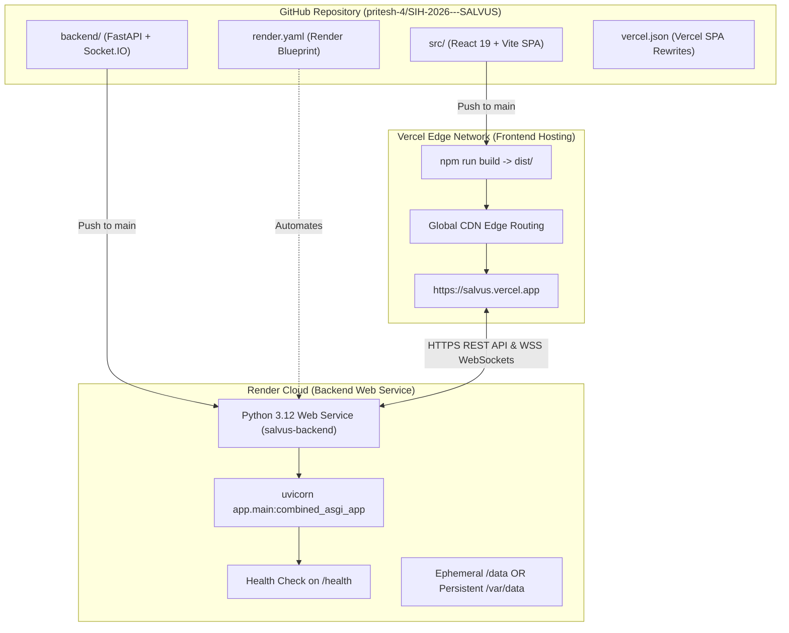
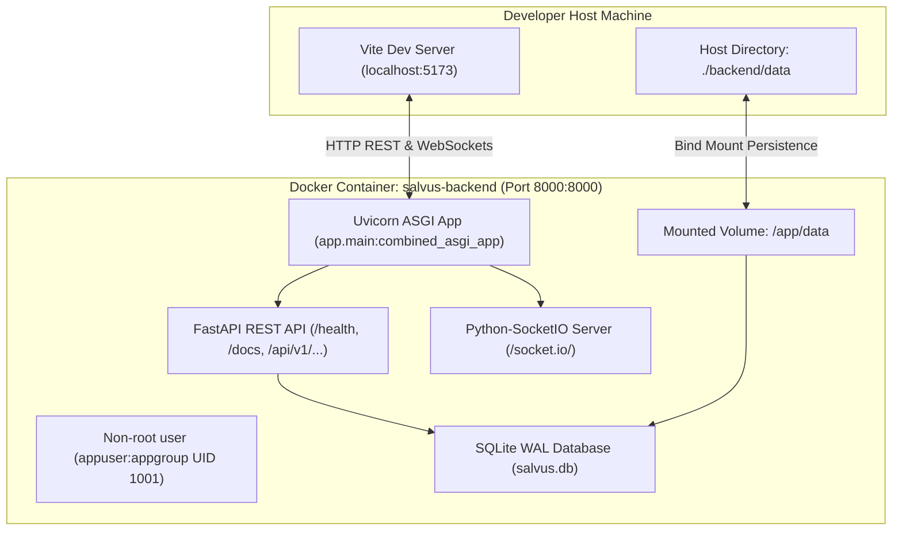

# DEPLOYMENT.md — Production Deployment & Infrastructure

This guide details the production deployment architecture, Infrastructure as Code (IaC) blueprints, environment configurations, and database persistence strategies for Salvus across **Vercel** and **Render**.

---

## 1. Production Architecture Overview



---

## 2. Fast-Track Deployment via Render Blueprint

The repository provides a complete Infrastructure as Code blueprint in [`render.yaml`](../render.yaml).

### Setup Steps:

1. Push repository changes to GitHub.
2. Navigate to the [Render Dashboard](https://dashboard.render.com/).
3. Click **New +** $\rightarrow$ **Blueprint**.
4. Select your Salvus repository.
5. Render reads `render.yaml` and initializes:
   - **`salvus-backend`**: Python ASGI web service.
   - **`salvus-frontend`**: Static web application (optional fallback).
6. Fill in any optional AI API keys (`GEMINI_API_KEY`, `GROQ_API_KEY`).
7. Click **Apply**.

---

## 3. Backend Deployment on Render (Manual Walkthrough)

### 3.1 Web Service Configuration:

| Setting               | Recommended Value                                                                                          | Notes                                      |
| :-------------------- | :--------------------------------------------------------------------------------------------------------- | :----------------------------------------- |
| **Service Type**      | Web Service                                                                                                | Python ASGI Application                    |
| **Name**              | `salvus-backend`                                                                                           | Or any unique identifier                   |
| **Region**            | `Oregon (US West)`                                                                                         | Select closest region                      |
| **Branch**            | `main`                                                                                                     | Production branch                          |
| **Root Directory**    | `backend`                                                                                                  | **Crucial:** Points to backend subfolder   |
| **Runtime**           | `Python 3`                                                                                                 | Uses Python 3.12 via `runtime.txt`         |
| **Build Command**     | `pip install --upgrade pip && pip install -r requirements.txt`                                             | Installs dependencies                      |
| **Start Command**     | `uvicorn app.main:combined_asgi_app --host 0.0.0.0 --port $PORT --proxy-headers --forwarded-allow-ips='*'` | Starts combined FastAPI + Socket.IO        |
| **Plan**              | `Free` or `Starter`                                                                                        | Free spins down on idle; Starter runs 24/7 |
| **Health Check Path** | `/health`                                                                                                  | Zero-downtime health verification          |

### 3.2 Backend Environment Variables:

```env
ENVIRONMENT=production
PYTHON_VERSION=3.12.9
PORT=8000
HOST=0.0.0.0
CORS_ORIGIN=https://salvus.vercel.app,http://localhost:5173
DATABASE_PATH=data/salvus.db
AUTO_SEED=true
OSRM_BASE_URL=https://router.project-osrm.org

# Optional AI Triage Keys:
GEMINI_API_KEY=your_gemini_api_key_here
GROQ_API_KEY=your_groq_api_key_here
SECRET_KEY=generate_random_32_char_string
```

---

## 4. Frontend Deployment on Vercel

Deploy the React 19 + Vite frontend to Vercel for global edge CDN distribution:

### 4.1 Vercel Project Settings:

- **Framework Preset:** `Vite`
- **Root Directory:** `./` (Repository root)
- **Build Command:** `npm run build`
- **Output Directory:** `dist`
- **Install Command:** `npm install`

### 4.2 Frontend Environment Variables:

```env
VITE_API_URL=https://salvus-backend.onrender.com
VITE_WS_URL=https://salvus-backend.onrender.com
```

### 4.3 SPA Client-Side Routing:

Vercel requires rewrite rules so direct navigations or page refreshes on routes like `/authority` or `/citizen/emergency` do not return HTTP 404. This is pre-configured in [`vercel.json`](../vercel.json):

```json
{
  "rewrites": [
    {
      "source": "/(.*)",
      "destination": "/index.html"
    }
  ]
}
```

---

## 5. SQLite Persistence & Render Disk Strategies

Salvus utilizes SQLite in Write-Ahead Logging (`WAL`) mode. Understanding the storage lifecycle is critical:

### Option A: Render Free Tier (Ephemeral Storage)

- **Disk Nature:** Ephemeral container disk. Files stored at `data/salvus.db` reset whenever the container spins down due to inactivity or redeployment.
- **Auto-Seeding Safeguard:** When `AUTO_SEED=true`, the backend detects a clean/empty database on boot and automatically populates active Kolkata disaster response infrastructure (NDRF Unit 4, Salt Lake Stadium Shelter, active flood distress beacons).

### Option B: Render Starter Tier (Persistent Disk)

- **Disk Nature:** Persistent SSD mounted to container.
- **Mount Configuration:**
  1. Add a **Persistent Disk** in Render Dashboard.
  2. Mount Path: `/var/data`
  3. Size: `1 GB`
  4. Environment Variable: `DATABASE_PATH=/var/data/salvus.db`
- **Result:** All incidents, audit logs, and coordinates permanently persist across restarts and deploys.

---

## 6. Post-Deployment Verification Runbook

1. **Verify Backend Health:**
   ```bash
   curl -i https://salvus-backend.onrender.com/health
   # Expected: HTTP/1.1 200 OK {"status":"healthy","service":"Salvus API","version":"0.1.0"}
   ```
2. **Verify OpenAPI Docs:**
   Open `https://salvus-backend.onrender.com/docs` in a browser.
3. **Verify Frontend Connectivity:**
   Open `https://salvus.vercel.app/authority` and observe the bottom-right connection badge displays `LIVE` (green indicator).
4. **Trigger End-to-End Test Beacon:**
   Open `/citizen` in one window and `/authority` in another; trigger an SOS beacon and confirm instant WebSocket appearance.

---

## 7. Local Docker Architecture & Containerization

Salvus provides a minimal, secure Docker runtime (`backend/Dockerfile` and `docker-compose.yml`) for instant local environment reproducibility:



### Docker Quickstart:

```bash
# Build and start the backend container
docker compose up --build

# Run in background (detached mode)
docker compose up -d

# Verify health endpoint
curl http://localhost:8000/health

# Stop the container
docker compose down
```

---

## 8. Future Infrastructure Extension Points

The containerization layer is designed to remain intentionally simple and lightweight, while preparing Salvus for modular scaling when required:

1. **Dedicated Worker Nodes:** Background processing containers can inherit `backend/Dockerfile` using entrypoint overrides (e.g., `CMD ["python", "-m", "app.workers.feed_ingest"]`).
2. **State & Cache Backing:** Easy addition of Redis / Dragonfly services into `docker-compose.yml` for distributed Socket.IO adapters or rate-limiting.
3. **Relational Database Migration:** Clean migration path from SQLite to PostgreSQL via `DATABASE_URL` without altering application code.
4. **AI Inference & Disaster Feeds:** Containerized sandbox execution for async satellite / telemetry feed ingestion.
