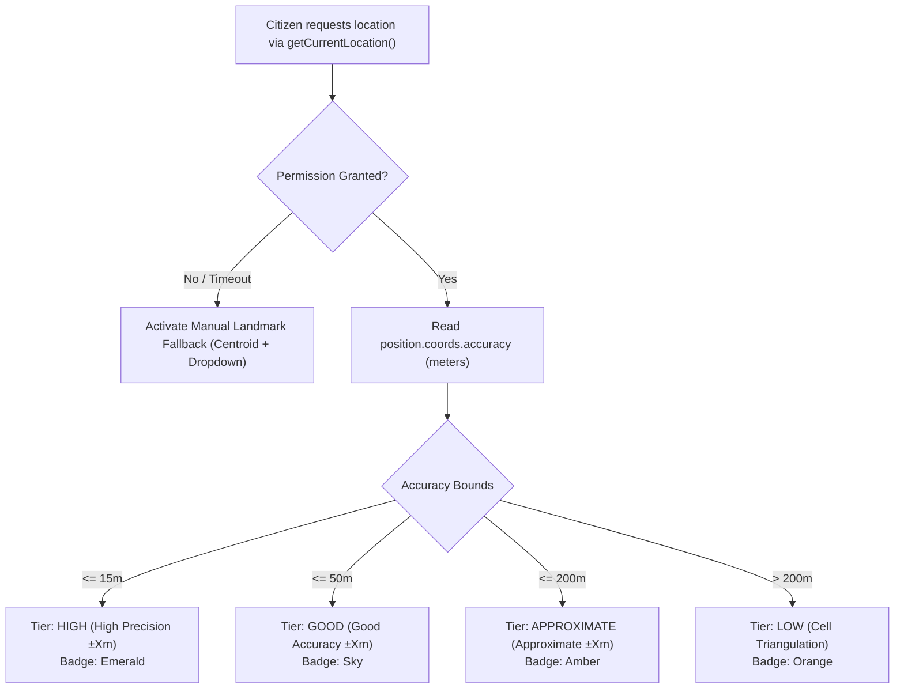

# GEO_AND_ROUTING.md — Geospatial Intelligence & Navigational Routing

This document details the geospatial mapping engine, browser geolocation safeguards, landmark fallbacks, OSRM routing architecture, TTL caching, resilient vector corridors, and shelter hazard proximity analysis in Salvus.

---

## 1. Geospatial Stack Overview

Salvus combines lightweight open-source mapping libraries with robust backend routing services:

- **Mapping Canvas:** Leaflet v1.9.4 (`L.map`, `L.tileLayer`, `L.divIcon`, `L.circle`)
- **Tile Base Layer:** OpenStreetMap dark-mode filtered raster tiles
- **Routing Engine:** Open Source Routing Machine (OSRM) HTTP API (`/route/v1/{profile}`)
- **Routing Service:** `backend/app/services/routing_service.py` with in-memory TTL caching and offline fallback corridor generation
- **Client Geolocation Library:** `src/lib/location.js`

---

## 2. Browser Geolocation & Accuracy Handling

Citizen coordinates are acquired through the browser Geolocation API with defensive tier ratings:



### Manual Landmark Catalog Fallback:

If geolocation is blocked or unavailable in deep basements, citizens can select from pre-calibrated regional landmark centroids:

- **Sector 12 Community Hub:** `22.5726° N, 88.3639° E`
- **Karunamoyee Bus Terminus:** `22.5867° N, 88.4178° E`
- **Salt Lake Stadium Evacuation Gate:** `22.5680° N, 88.4060° E`
- **Sector 5 Electronics Complex:** `22.5800° N, 88.4350° E`
- **Eastern Metropolitan Bypass Junction:** `22.5510° N, 88.3980° E`
- **Ultadanga Transit Hub:** `22.5960° N, 88.3880° E`

---

## 3. Dark Tactical Leaflet Surface

Salvus renders a unified tactical map interface (`src/components/common/SalvusLeafletMap.jsx`):

- **High-Contrast Dark Filter:** Tiles are styled via CSS filters (`brightness(0.6) invert(1) contrast(3) hue-rotate(200deg) saturate(0.3)`) to maintain the 85-90% slate neutral budget and eliminate blinding white light in dark command centers.
- **Custom HTML DivIcons:** Responsive vector SVG pins with animated pulsing radar halos for active distress beacons and vehicle headings.
- **Auto-Pan & Viewport Locking:** Smooth programmatic camera panning when selecting queue items without disorienting zoom snaps.

---

## 4. OSRM Routing Engine & Profiles

The routing layer provides normalized distance, duration, ETA, and coordinate arrays:

```
[Origin Lat/Lon] ───► [backend/app/services/routing_service.py] ───► [OSRM API]
                                    │                                      │
                                    ├── (Cache Hit: 5-min TTL)             ▼
                                    └── (Network Failure / Timeout) ──► [Fallback Vector Corridor]
```

### Supported Navigational Profiles:

1. **`driving` (Car / Ambulance / Truck):** Standard urban road network routing. Average operational response speed: $35\text{ km/h}$.
2. **`walking` (Citizen Evacuation Route):** Pedestrian pathways, alleys, and footpaths. Average speed: $4.8\text{ km/h}$.
3. **`boat` (Watercraft in Flood Inundation Zones):** Waterways and submerged urban zones where road networks are impassable. Uses specialized water corridor generation with an average speed of $24\text{ km/h}$.

---

## 5. In-Memory TTL Route Caching

To prevent redundant HTTP requests to public OSRM servers during high-frequency dispatch evaluations:

- **Cache Key:** `(round(origin_lat, 4), round(origin_lon, 4), round(dest_lat, 4), round(dest_lon, 4), profile)`
- **Precision:** Coordinates are rounded to 4 decimals ($\sim 11\text{ meters}$ precision).
- **TTL Duration:** 300 seconds (5 minutes).

---

## 6. Resilient 15-Waypoint Fallback Vector Corridor

If OSRM is unreachable, times out ($> 3.0\text{s}$), or returns an empty route (e.g. coordinates outside road grids), the system automatically calculates a realistic 15-waypoint curved corridor polyline using quadratic Bézier curve interpolation:

$$\mathbf{B}(t) = (1-t)^2 \mathbf{P}_0 + 2(1-t)t \mathbf{P}_{\text{ctrl}} + t^2 \mathbf{P}_1, \quad t \in [0, 1]$$

Where:

- $\mathbf{P}_0 = (\text{lat}_1, \text{lon}_1)$
- $\mathbf{P}_1 = (\text{lat}_2, \text{lon}_2)$
- $\mathbf{P}_{\text{ctrl}} = \text{Midpoint} + \text{Perpendicular Offset (8\% arc height)}$

### Result:

- Route status tagged as `FALLBACK_CORRIDOR`
- `is_fallback = true`
- Accurate Haversine distance and profile-adjusted ETA calculation
- Smooth, non-linear polyline rendered on tactical maps without jagged discontinuities

---

## 7. Shelter Hazard Proximity Analysis

To prevent directing citizens or responders to compromised evacuation facilities:

1. **Hazard Distance Check:** `haversine_distance_km` computes spatial distance between each shelter and all active hazard signals.
2. **Warning Threshold:** If an active hazard (e.g. severe surge inundation or downed high-voltage lines) is within $1.5\text{ km}$ of a shelter, `useAuthorityShelters.js` raises a prominent `HAZARD PROXIMITY ALERT` on the shelter card.
3. **Evacuation Rerouting:** Coordinators are warned to pause new intakes and divert upcoming ambulances to secondary shelter hubs.
