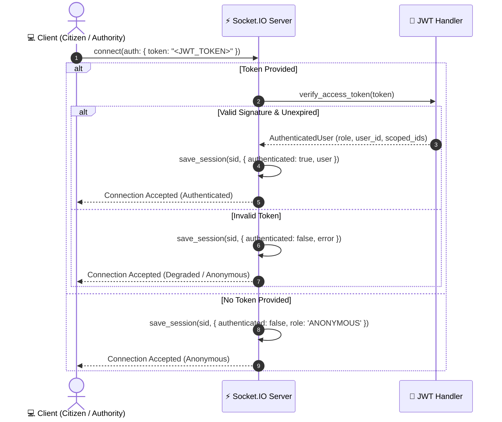

# REALTIME.md — Real-Time State & Socket.IO Engine

This document details the Socket.IO architecture, cryptographic authentication handshakes, room authorization boundaries, canonical event catalogs, out-of-order guards, and reconnection state reconciliation for Salvus.

---

## 1. Socket.IO Architecture Overview

Salvus runs an asynchronous Socket.IO engine (`python-socketio`) on the same ASGI server alongside FastAPI:

- **Server Instance:** `app.realtime.socket_manager.sio`
- **Transport Protocols:** WebSocket primary with automatic HTTP Long-Polling fallback
- **Frontend Client:** `src/lib/realtime/socket.js` (Singleton `socket.io-client` instance)
- **Multiplexing:** Single persistent connection per browser tab handling multiple room subscriptions.

---

## 2. Connection Lifecycle & Cryptographic Authentication

When a client initiates a Socket.IO connection, the server inspects the authentication handshake:



---

## 3. Room Management & RBAC Authorization

Clients join rooms by emitting `join_room` with a `{ "room": "..." }` payload. The server strictly enforces role-based room access:

```mermaid
flowchart TD
    JoinReq["Client emits join_room({ room })"] --> CheckRoom{"Room Type?"}

    CheckRoom -->|room == 'authorities'| CheckAuth{"Is Role AUTHORITY or SYSTEM?"}
    CheckAuth -->|Yes| JoinAuth["Enter room 'authorities' ✅"]
    CheckAuth -->|No| RejectAuth["Emit 'error' (403 FORBIDDEN) ❌"]

    CheckRoom -->|room == 'incident:{id}'| CheckCitizen{"Is Authenticated?"}
    CheckCitizen -->|No| RejectCitizen["Emit 'error' (401 UNAUTHORIZED) ❌"]
    CheckCitizen -->|Yes| CheckScope{"Is CITIZEN?"}
    CheckScope -->|Authority / Responder / System| JoinInc["Enter room 'incident:{id}' ✅"]
    CheckScope -->|Citizen Role| MatchScope{"scoped_incident_id == {id}?"}
    MatchScope -->|Yes| JoinInc
    MatchScope -->|No (Cross-Incident)| RejectCross["Emit 'error' (403 FORBIDDEN) ❌"]
```

### Room Descriptions:

- **`authorities`:** Subscribed by central command dispatchers. Receives the complete operational stream of all incidents, fleet movements, triage updates, and shelter metrics across all sectors.
- **`incident:{id}`:** Isolated per-incident channel. Subscribed by the reporting citizen and the specific responder unit assigned to that mission. Guarantees complete data privacy between different citizens.

---

## 4. Canonical Event Catalogue

All realtime events in Salvus use standardized **dot-notation** naming:

| Event Name                        | Target Rooms                            | Payload Structure                                                                                              | Trigger & Purpose                                                                                                                                           |
| :-------------------------------- | :-------------------------------------- | :------------------------------------------------------------------------------------------------------------- | :---------------------------------------------------------------------------------------------------------------------------------------------------------- |
| `incident.created`                | `authorities`                           | `{ ...IncidentResponse }`                                                                                      | Emitted when a citizen triggers a new SOS beacon or reports a hazard.                                                                                       |
| `incident.response_state_changed` | `authorities`, `incident:{id}`          | `{ id, incident_id, ticket_id, status, incident, assignment?, responder?, events }`                            | Emitted on every incident lifecycle state transition (`TRIAGE_PENDING`, `VERIFIED`, `ASSIGNED`, `EN_ROUTE`, `NEARBY`, `ON_SCENE`, `RESOLVED`, `CANCELLED`). |
| `incident.triage_updated`         | `authorities`, `incident:{id}`          | `{ incident_id, ticket_id, ai_state, assessment, ai_triage }`                                                  | Emitted when AI triage completes evaluation, broadcasting urgency score and recommended capability.                                                         |
| `incident.triage_verified`        | `authorities`                           | `{ incident_id, incident, actor }`                                                                             | Emitted when a dispatcher approves and locks in the AI triage recommendation.                                                                               |
| `assignment.created`              | `authorities`, `incident:{id}`          | `{ id, assignment_id, incident_id, responder_id, status, responder?, incident? }`                              | Emitted when an authority operator links a rescue craft to an incident.                                                                                     |
| `assignment.status_changed`       | `authorities`, `incident:{id}`          | `{ id, assignment_id, incident_id, responder_id, previous_status, status, assignment, responder?, incident? }` | Emitted when responder mission milestones advance (`EN_ROUTE`, `NEARBY`, `ON_SCENE`, `COMPLETED`, `CANCELLED`).                                             |
| `assignment.updated`              | `authorities`, `incident:{id}`          | `{ id, assignment_id, incident_id, responder_id, status, assignment }`                                         | Emitted when assignment tactical notes or metadata are updated.                                                                                             |
| `responder.status_changed`        | `authorities`, `incident:{assigned_id}` | `{ ...ResponderResponse }`                                                                                     | Emitted when responder operational readiness changes (`AVAILABLE`, `ASSIGNED`, `EN_ROUTE`, `ON_SCENE`, `OFFLINE`).                                          |
| `responder.location_updated`      | `authorities`, `incident:{assigned_id}` | `{ ...ResponderResponse }`                                                                                     | Emitted when live or simulated GPS telemetry coordinates are updated.                                                                                       |
| `shelter.updated`                 | `authorities`                           | `{ ...ShelterResponse }`                                                                                       | Emitted when shelter bed availability or supply levels change.                                                                                              |

---

## 5. Event Ordering & Out-of-Order Guards

In chaotic disaster networks, cellular packet reordering or delayed socket delivery could cause an outdated event (e.g. `TRIAGE_PENDING`) to arrive _after_ a newer event (e.g. `VERIFIED`).

To prevent state regressions, both frontend state hooks (`useAuthorityIncidents.js`, `useEmergencyState.js`) and backend state machines enforce a **monotonic status rank**:

$$\text{NEW (1)} \longrightarrow \text{TRIAGE\_PENDING (2)} \longrightarrow \text{VERIFIED (3)} \longrightarrow \text{ASSIGNED (4)} \longrightarrow \text{EN\_ROUTE (5)} \longrightarrow \text{NEARBY (6)} \longrightarrow \text{ON\_SCENE (7)} \longrightarrow \text{RESOLVED (8)} \text{ and } \text{CANCELLED (8)}$$

### Guard Rule:

```javascript
const STATUS_RANK = {
  NEW: 1,
  TRIAGE_PENDING: 2,
  VERIFIED: 3,
  ASSIGNED: 4,
  EN_ROUTE: 5,
  NEARBY: 6,
  ON_SCENE: 7,
  RESOLVED: 8,
  CANCELLED: 8,
}

if (STATUS_RANK[incomingStatus] < STATUS_RANK[currentStatus]) {
  console.warn(
    `[Socket.IO Guard] Discarded stale out-of-order event: ${incomingStatus} < ${currentStatus}`
  )
  return // Discard state regression
}
```

---

## 6. Connection Resilience & Reconnection State Recovery

When network connectivity is disrupted during a crisis:

1. **Client Disconnect Notification:** `onSocketStatusChange` transitions state from `CONNECTED` $\rightarrow$ `RECONNECTING` $\rightarrow$ `OFFLINE`.
2. **Citizen Reassurance Banner:** The emergency interface displays: _"Emergency request remains active in dispatcher queue. Live updates reconnecting."_
3. **Automatic Reconnection:** `socket.io-client` attempts exponential backoff reconnection (`reconnectionDelay: 1000ms`, `reconnectionDelayMax: 4000ms`, `reconnectionAttempts: 100`).
4. **Room Re-subscription:** On the `'connect'` / `'reconnect'` event, the client iterates over `activeRooms` and immediately re-emits `join_room` for all active channels (`authorities`, `incident:{id}`).
5. **Silent REST Catch-Up:** The authority queue and citizen emergency hook execute a silent REST refetch (`refetch(true)`) to pull any status transitions that occurred during the outage window.

---

## 7. Developer Resilience Simulator (`simulateConnectionDrop`)

To test socket drop resilience during demonstrations without disabling physical Wi-Fi:

```javascript
import { simulateConnectionDrop } from '@/lib/realtime/socket'

// Disconnects socket for 4 seconds, triggers RECONNECTING state, then cleanly reconnects
simulateConnectionDrop(4000)
```

This capability is integrated into the floating `🛠️ DEV DEMO CONTROLS` drawer present on all pages.
