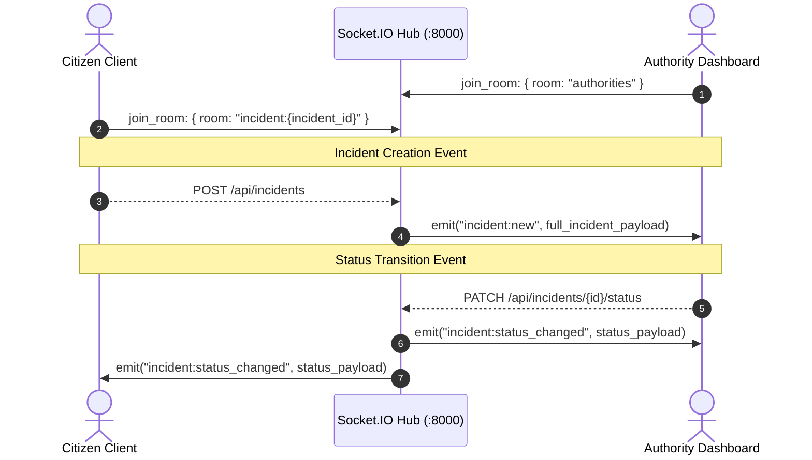

# REALTIME.md - Real-time State & WebSockets

This document describes the real-time communication layer in Salvus for live incident synchronization across citizen clients and authority dashboards.

---

## 1. Socket.IO Architecture (IMPLEMENTED ✅)

The backend exposes an asynchronous Socket.IO engine (`python-socketio`) running on the same ASGI server alongside FastAPI:

- **Server Instance:** `app.realtime.socket_manager.sio`
- **Transport:** Async ASGI with WebSockets + Long-Polling fallback
- **CORS:** Configured for cross-origin local and cloud clients
- **Frontend Client:** `src/lib/realtime/socket.js` (Singleton `socket.io-client` with auto-reconnection and room management)

---

## 2. Channels, Rooms & Events



---

### Room: `authorities` (IMPLEMENTED ✅)

- **Subscribers:** Emergency dispatchers, coordinators, command center dashboards.
- **Events Received:**
  - `incident:new`: Emitted whenever a citizen submits a new SOS beacon or hazard report.
    ```json
    {
      "id": "e5cffddc-318c-4a1f-b69e-ba4bfc5e0faa",
      "incident_id": "e5cffddc-318c-4a1f-b69e-ba4bfc5e0faa",
      "ticket_id": "SV-2048",
      "type": "flood",
      "severity": "CRITICAL",
      "description": "Water entering ground floor rapidly.",
      "reporter_name": "Aditi Roy",
      "reporter_phone": "+91 98301 24890",
      "latitude": 22.5726,
      "longitude": 88.3639,
      "affected_count": 3,
      "is_sos": true,
      "status": "NEW",
      "created_at": "2026-08-23T12:59:26.520142+00:00",
      "updated_at": "2026-08-23T12:59:26.520142+00:00",
      "events": [...]
    }
    ```
  - `incident:status_changed`: Emitted when any incident advances its lifecycle state.

---

### Room: `incident:{incident_id}` (IMPLEMENTED ✅)

- **Subscribers:** The stranded citizen who created the ticket and assigned responders.
- **Events Received:**
  - `incident:status_changed`: Live progression update (e.g. `NEW` $\rightarrow$ `TRIAGE_PENDING` $\rightarrow$ `VERIFIED` $\rightarrow$ `RESOLVED` / `CANCELLED`).
    ```json
    {
      "id": "e5cffddc-318c-4a1f-b69e-ba4bfc5e0faa",
      "incident_id": "e5cffddc-318c-4a1f-b69e-ba4bfc5e0faa",
      "ticket_id": "SV-2048",
      "status": "VERIFIED",
      "updated_at": "2026-08-23T13:05:12.104210+00:00",
      "incident": { ... },
      "events": [...]
    }
    ```

---

## 3. Client Reconnection & Offline Resilience

1. **Auto Reconnect:** Client attempts reconnection with exponential backoff (up to 50 attempts).
2. **Rejoining Rooms:** When connection drops and resumes, room memberships (`authorities`, `incident:{id}`) are automatically re-established.
3. **Connectivity UX:** The UI maintains existing data and displays subtle indicator badges:
   - `CONNECTED`: Green dot, full real-time grid active.
   - `RECONNECTING`: Amber pulse, non-destructive reconnect attempts.
   - `OFFLINE`: Amber banner "Live updates temporarily unavailable. Cached operational data displayed."

---

## 4. High-Frequency Telemetry Ingestion (PLANNED 🔮)

Planned for responder vessel tracking in Phase 3:

```
 Responder GPS updates (5s Interval)
   │
   ├── Sockets ingest telemetry ping
   ├── Push coordinates to `authorities` room (updates admin map)
   ├── Push to `incident:<id>` room (updates citizen rescue radar)
   └── Batch write to DB every 15s
```
